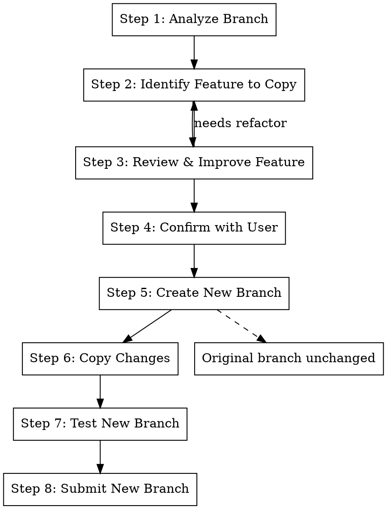

# Extract Copy

## Overview

Copy specific changes from a branch into a new, independent branch WITHOUT modifying the original. Useful when you want
to land a subset of changes early while keeping the full branch intact for continued development.

**Core principle:** Identify Feature → Review & Improve → Create New Branch → Copy Changes → Original Unchanged

**Announce at start:** "I'm using the extract-copy skill to copy a feature into a new branch (original will not be
modified)."

## When to Use

- Want to land a subset of changes early without modifying the original branch
- Creating a "preview" branch with partial functionality
- Need to share part of a feature for review while continuing work on the full feature
- Testing a subset of changes in isolation

## Difference from /gt:extract

| Aspect          | /gt:extract                      | /gt:extract-copy                   |
| --------------- | -------------------------------- | ---------------------------------- |
| Original branch | Modified (features removed)      | Unchanged                          |
| Result          | Two branches with different code | Two branches with overlapping code |
| Use case        | Split features permanently       | Copy subset for early landing      |
| After merge     | Clean separation                 | Need to handle overlap             |

## The Process



## Step 1: Analyze Branch

```bash
# Get current branch
BRANCH=$(git branch --show-current)

# See all changes in this branch
git diff main..HEAD --stat
git diff main..HEAD --name-only

# Get commit history
git log main..HEAD --oneline
```

## Step 2: Identify Feature to Copy

**Group changes by feature:**

```
## Feature Analysis

### Feature A: User Authentication (COPY THIS)
Files:
- src/auth/login.py (+120 lines)
- src/auth/logout.py (+45 lines)
- tests/test_auth.py (+200 lines)

### Feature B: Dashboard UI (KEEP IN ORIGINAL)
Files:
- src/components/Dashboard.tsx (+300 lines)
- tests/test_dashboard.py (+100 lines)
```

## Step 3: Review & Improve Feature

**Before copying, review the feature for quality.** Improvements should be made in the ORIGINAL branch first, then
copied.

### 3a: Code Quality Review

**Ask these questions about the feature's implementation:**

| Question                             | If No                    | Action                     |
| ------------------------------------ | ------------------------ | -------------------------- |
| Is this the cleanest implementation? | Consider refactoring     | Simplify in original first |
| Are there any code smells?           | Identify issues          | Fix in original first      |
| Is the API/interface well-designed?  | Rethink public interface | Improve in original first  |
| Are edge cases handled?              | Missing handling         | Add in original first      |

**Make improvements in the original branch**, then copy the improved version.

### 3b: Test Coverage Review

**Check for missing tests:**

```bash
# See what tests exist for the feature
grep -l "def test_" tests/*.py | xargs grep -l "{feature_name}"
```

| Test Type            | Present? | If Missing            |
| -------------------- | -------- | --------------------- |
| Happy path tests     | ?        | Add to original first |
| Edge case tests      | ?        | Add to original first |
| Error handling tests | ?        | Add to original first |

**Write missing tests in the original branch** before copying.

### 3c: Check for Redundant Tests

**Look for tests that:**

- Test the same thing multiple ways
- Test implementation details that may change
- Are duplicated from other test files

**Remove redundant tests from original branch** before copying.

### 3d: Make Improvements in Original

**Important:** Since we're NOT modifying the original after copying, make all improvements BEFORE copying:

```bash
# Make improvements in original branch
# (code cleanup, add tests, remove redundant tests)

# Run tests to verify
metta pytest --changed -v

# Stage and amend
git add -A
gt modify --no-interactive
```

**Now the improved version is ready to copy.**

### 3e: Document What Was Improved

Note improvements for the PR description:

```
## Pre-copy Improvements (made in original branch)

- Refactored login() to extract validate_credentials()
- Added test_login_with_expired_token()
- Removed duplicate test_login_basic()
```

## Step 4: Confirm with User

Present the copy plan:

```
## Copy Plan

**Source branch:** {current-branch} (will NOT be modified)

**Feature to copy:** {feature-name}

**Files to copy to new branch:**
- src/auth/login.py
- src/auth/logout.py
- tests/test_auth.py

**New branch name:** {suggested-name}

**Note:** Original branch will remain unchanged. Both branches will contain
the copied files. When original lands later, git will handle the overlap.
```

**Use AskUserQuestion** to confirm.

## Step 5: Create New Branch

```bash
# Record current branch
ORIGINAL_BRANCH=$(git branch --show-current)

# Find the parent of the current branch
PARENT_BRANCH=$(gt state 2>/dev/null | jq -r --arg branch "$ORIGINAL_BRANCH" '.[$branch].parents[0].ref')

# Checkout the parent branch (don't touch original!)
git checkout "$PARENT_BRANCH"

# Create new branch for copied feature
gt create -m "feat: {copied feature description}

Copied from $ORIGINAL_BRANCH for early landing.

Note: Original branch will land separately with full feature set.

Changes:
- {bullet points}"
```

## Step 6: Copy Changes

```bash
# Copy files from original branch to new branch
git checkout "$ORIGINAL_BRANCH" -- path/to/file1.py
git checkout "$ORIGINAL_BRANCH" -- path/to/file2.py
git checkout "$ORIGINAL_BRANCH" -- tests/test_feature.py

# For partial file changes, use patch
git diff "$PARENT_BRANCH".."$ORIGINAL_BRANCH" -- path/to/file.py | git apply

# Stage the changes
git add -A

# Amend into the new branch
gt modify --no-interactive
```

**Important:** We're copying FROM the original branch, not modifying it.

## Step 7: Test New Branch

```bash
# Run tests on new branch
metta pytest --changed -v

# Verify the copied feature works independently
```

**If tests fail:**

- May need to copy additional dependencies
- Check for missing imports or shared code

## Step 8: Submit New Branch

```bash
# Submit the new branch
/gt:submit
```

**Original branch is untouched** - no need to test or submit it.

**Report:**

- URL for new PR
- Summary of what was copied
- Note that original branch still contains these changes

## Step 9: Return to Original Branch

```bash
# Go back to original branch to continue working
git checkout "$ORIGINAL_BRANCH"
```

## Quick Reference

| Step            | Command                         | Purpose                    |
| --------------- | ------------------------------- | -------------------------- |
| Analyze         | `git diff main..HEAD`           | See all changes            |
| Identify        | Group files by feature          | Decide what to copy        |
| Review          | Check code quality & tests      | Improve before copying     |
| Find parent     | `gt state \| jq ...`            | Get parent branch          |
| Checkout parent | `git checkout "$PARENT"`        | Start point for new branch |
| Create new      | `gt create -m "..."`            | Branch for copied feature  |
| Copy files      | `git checkout original -- file` | Copy (not move) changes    |
| Test            | `metta pytest --changed`        | Verify copy works          |
| Submit          | `/gt:submit`                    | Push new branch only       |
| Return          | `git checkout "$ORIGINAL"`      | Continue original work     |

## Handling the Overlap

When both branches eventually land:

### If new branch lands first (common case):

```
1. New branch merges → changes are in main
2. Original branch rebases → git sees changes already exist
3. Git auto-resolves most overlapping changes
4. Minor conflicts may need manual resolution
```

### If changes diverged:

If you modified the copied code differently in each branch:

- Manual merge conflict resolution will be needed
- Document expected conflicts in PR descriptions

### Best practice:

Add to original branch's PR description:

```
Note: A subset of this feature was landed early in PR #XXX.
Some files may show as "already exists" after rebase.
```

## Branch Naming Convention

```
{original-branch}-{feature}-preview
{original-branch}-{feature}-early
```

**Examples:**

- `dashboard-v2-auth-preview` (auth copied for early review)
- `user-management-api-early` (API landed early)

## Common Mistakes

**Modifying original branch accidentally**

- **Problem:** Made changes to original instead of just copying
- **Fix:** Always `git checkout "$ORIGINAL_BRANCH" -- file` to copy, never edit in place

**Not handling future conflicts**

- **Problem:** Branches diverge, painful merge later
- **Fix:** Document the relationship in both PR descriptions

**Copying too much**

- **Problem:** New branch is almost as big as original
- **Fix:** Only copy what's needed for early landing; if >50%, reconsider

## Red Flags

**Stop and reconsider if:**

- Copied feature can't work without remaining code
- Copying would require duplicating >50% of the branch
- Features are too tightly coupled to separate
- No clear benefit to landing early

## Integration

**Uses:**

- **/gt:submit** - For submitting the new branch

**Pairs with:**

- **/gt:extract** - When you want to remove from original (destructive)
- **/gt:make-stack** - For sequential splitting
- **/gt:fix-branch** - Fix issues in the copied branch
