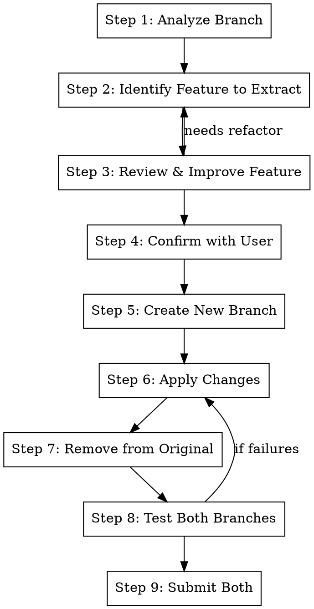

# Extract

## Overview

Extract specific changes from a branch into a new, independent branch. Useful when a branch has grown to include
multiple features and you want to split one out for separate review or to unblock other work.

**Core principle:** Identify Feature → Review & Improve → Create New Branch → Move Changes → Clean Up Original

**Announce at start:** "I'm using the extract skill to extract a feature into a new branch."

## When to Use

- A branch has multiple unrelated features mixed together
- You want to land one feature before another is ready
- A feature should be reviewed separately
- You need to unblock dependent work by extracting a subset

## The Process



## Step 1: Analyze Branch

```bash
# Get current branch
BRANCH=$(git branch --show-current)

# See all changes in this branch
git diff main..HEAD --stat
git diff main..HEAD --name-only

# Get commit history
git log main..HEAD --oneline

# See the full diff
git diff main..HEAD
```

**Understand:**

- What distinct features/changes are in this branch?
- Which files belong to which feature?
- Are there shared dependencies between features?

## Step 2: Identify Feature to Extract

**Group changes by feature:**

```
## Feature Analysis

### Feature A: User Authentication
Files:
- src/auth/login.py (+120 lines)
- src/auth/logout.py (+45 lines)
- tests/test_auth.py (+200 lines)

### Feature B: Dashboard UI
Files:
- src/components/Dashboard.tsx (+300 lines)
- src/styles/dashboard.css (+50 lines)
- tests/test_dashboard.py (+100 lines)

### Shared/Infrastructure
Files:
- src/utils/helpers.py (+30 lines) - Used by both
```

**Identify which feature to extract:**

- Which is more independent?
- Which is ready for review first?
- Which is blocking other work?

## Step 3: Review & Improve Feature

**Before extracting, review the feature for quality.** This is the perfect time to clean up since the code is being
moved anyway.

### 3a: Code Quality Review

**Ask these questions about the feature's implementation:**

| Question                             | If No                    | Action                              |
| ------------------------------------ | ------------------------ | ----------------------------------- |
| Is this the cleanest implementation? | Consider refactoring     | Simplify before extracting          |
| Are there any code smells?           | Identify issues          | Fix duplication, long methods, etc. |
| Is the API/interface well-designed?  | Rethink public interface | Improve before others depend on it  |
| Are edge cases handled?              | Missing handling         | Add proper error handling           |
| Is it properly documented?           | Missing docs             | Add docstrings/comments             |

**Common improvements to make:**

- Extract helper functions for repeated logic
- Rename unclear variables/functions
- Remove dead code or unused parameters
- Simplify complex conditionals
- Add type hints if missing

### 3b: Test Coverage Review

**Check for missing tests:**

```bash
# See what tests exist for the feature
ls tests/ | grep -i "{feature_name}"

# Check test coverage of the files
grep -l "def test_" tests/*.py | xargs grep -l "{module_name}"
```

**Test checklist:**

| Test Type            | Present? | If Missing                           |
| -------------------- | -------- | ------------------------------------ |
| Happy path tests     | ?        | Add basic functionality tests        |
| Edge case tests      | ?        | Add boundary condition tests         |
| Error handling tests | ?        | Add tests for failure modes          |
| Integration tests    | ?        | Add if feature interacts with others |

**Write missing tests BEFORE extracting** - easier to verify they work with the full context.

### 3c: Check for Redundant Tests

**Look for tests that:**

- Test the same thing multiple ways
- Test implementation details that may change
- Were written for old code that's been refactored
- Are duplicated from other test files

```bash
# Find similar test names
grep -h "def test_" tests/test_{feature}*.py | sort | uniq -d

# Look for duplicate assertions
grep -h "assert" tests/test_{feature}*.py | sort | uniq -c | sort -rn | head -10
```

**Remove or consolidate redundant tests** before extracting.

### 3d: Make Improvements

**If improvements are needed:**

1. Make the changes in the current branch first
2. Run tests to verify nothing broke
3. Then proceed with extraction

**If major refactoring is needed:**

- Consider whether extraction is still the right approach
- May be better to refactor first, then extract in a follow-up

### 3e: Document Decisions

Note any improvements made or deliberately deferred:

```
## Pre-extraction Review

### Improvements Made:
- Refactored login() to extract validate_credentials()
- Added test_login_with_expired_token()
- Removed duplicate test_login_basic() (same as test_login_success())

### Deferred (out of scope):
- Full rewrite of session handling (separate task)
- Performance optimization (not needed yet)
```

## Step 4: Confirm with User

Present the extraction plan:

```
## Extraction Plan

**Branch:** {current-branch}

**Feature to extract:** {feature-name}

**Files to move to new branch:**
- src/auth/login.py
- src/auth/logout.py
- tests/test_auth.py

**Files staying in original branch:**
- src/components/Dashboard.tsx
- src/styles/dashboard.css
- tests/test_dashboard.py

**Shared files (will exist in both):**
- src/utils/helpers.py

**New branch name:** {suggested-name}

**Stack position:** New branch will be based on {parent}, parallel to original
```

**Use AskUserQuestion** to confirm:

1. Is this the right feature to extract?
2. Are the file groupings correct?
3. Is the branch name appropriate?

## Step 5: Create New Branch

```bash
# Record current branch for later
ORIGINAL_BRANCH=$(git branch --show-current)

# Find the parent of the current branch
PARENT_BRANCH=$(gt state 2>/dev/null | jq -r --arg branch "$ORIGINAL_BRANCH" '.[$branch].parents[0].ref')

# Stash current state (safety)
git stash push -m "extract: safety backup"

# Checkout the parent branch
git checkout "$PARENT_BRANCH"

# Create new branch for extracted feature
gt create -m "feat: {extracted feature description}

Extracted from $ORIGINAL_BRANCH for independent review.

Changes:
- {bullet points}"
```

**New branch is now parallel to original, both based on same parent.**

## Step 6: Apply Changes to New Branch

```bash
# Get the files for the extracted feature from original branch
git checkout "$ORIGINAL_BRANCH" -- path/to/file1.py
git checkout "$ORIGINAL_BRANCH" -- path/to/file2.py
git checkout "$ORIGINAL_BRANCH" -- tests/test_feature.py

# For partial file changes (only some hunks), use patch:
git diff "$PARENT_BRANCH".."$ORIGINAL_BRANCH" -- path/to/shared/file.py | git apply

# Stage the changes
git add -A

# Amend into the new branch
gt modify --no-interactive
```

**For shared files that both features need:**

- Include in BOTH branches
- Or extract shared code to a third "foundation" branch first

## Step 7: Remove from Original Branch

```bash
# Go back to original branch
git checkout "$ORIGINAL_BRANCH"

# Remove the extracted files
git checkout "$PARENT_BRANCH" -- path/to/extracted/file1.py
git checkout "$PARENT_BRANCH" -- path/to/extracted/file2.py

# Or delete if files are new (not in parent)
git rm path/to/new/extracted/file.py

# For partial removals, manually edit and stage
# Remove only the extracted code from shared files

# Stage changes
git add -A

# Amend original branch
gt modify --no-interactive
```

## Step 8: Test Both Branches

**Test the new (extracted) branch:**

```bash
# Checkout new branch
git checkout "{new-branch-name}"

# Run tests
metta pytest --changed -v

# Verify the extracted feature works independently
```

**Test the original branch:**

```bash
# Checkout original branch
git checkout "$ORIGINAL_BRANCH"

# Run tests
metta pytest --changed -v

# Verify remaining features still work
```

**If tests fail:**

- Identify missing dependencies
- May need to include more files in one branch or the other
- May need a shared "foundation" branch

## Step 9: Submit Both Branches

```bash
# Submit new branch
git checkout "{new-branch-name}"
gt submit --no-interactive

# Submit original branch
git checkout "$ORIGINAL_BRANCH"
gt submit --no-interactive
```

**Report:**

- URLs for both PRs
- Summary of what was extracted
- Any shared dependencies to be aware of

## Quick Reference

| Step         | Command                       | Purpose                      |
| ------------ | ----------------------------- | ---------------------------- |
| Analyze      | `git diff main..HEAD`         | See all changes              |
| Identify     | Group files by feature        | Decide what to extract       |
| Review       | Check code quality & tests    | Improve before moving        |
| Find parent  | `gt state \| jq ...`          | Get parent branch            |
| Create new   | `gt create -m "..."`          | Branch for extracted feature |
| Copy files   | `git checkout branch -- file` | Move changes                 |
| Remove files | `git checkout parent -- file` | Remove from original         |
| Test         | `metta pytest --changed`      | Verify both work             |
| Submit       | `/gt:submit`                  | Push both branches           |

## Handling Shared Dependencies

### Option 1: Duplicate in Both Branches

If shared code is small (<50 lines):

- Include it in both branches
- When both merge, git will reconcile

### Option 2: Extract Foundation Branch First

If shared code is significant:

```bash
# Create foundation branch first
gt create -m "refactor: extract shared utilities"

# Add shared code
git checkout "$ORIGINAL_BRANCH" -- src/utils/shared.py
gt modify --no-interactive
gt submit --no-interactive

# Now create extracted feature branch ON TOP of foundation
gt create -m "feat: extracted feature"
# ... add extracted feature files

# Update original branch to also be on top of foundation
git checkout "$ORIGINAL_BRANCH"
gt onto "{foundation-branch}"
gt restack
```

**Result:**

```
parent
  └── foundation (shared code)
      ├── extracted-feature
      └── original-branch (remaining features)
```

### Option 3: Accept Merge Conflict Later

If shared code will be modified differently:

- Include in both branches
- Handle merge conflict when second one lands
- Document the expected conflict in PR description

## Branch Naming Convention

```
{original-branch}-{extracted-feature}
```

**Examples:**

- `user-management` → `user-management-auth` (extracted auth)
- `dashboard-v2` → `dashboard-v2-charts` (extracted charts)

## Common Mistakes

**Extracting without testing**

- **Problem:** Extracted feature doesn't work independently
- **Fix:** Always run tests on both branches before submitting

**Forgetting shared dependencies**

- **Problem:** Extracted branch fails because it needs code still in original
- **Fix:** Carefully identify shared files, include in both or extract foundation

**Breaking original branch**

- **Problem:** Removing too much from original breaks remaining features
- **Fix:** Test original branch after removal before submitting

**Wrong parent for new branch**

- **Problem:** New branch based on wrong point in stack
- **Fix:** Always create from the same parent as original

## Red Flags

**Stop and reconsider if:**

- Features are tightly coupled and can't be cleanly separated
- Shared code is extensive (consider foundation branch)
- Tests require both features to pass
- Extraction would require significant refactoring

## Integration

**Uses:**

- **/gt:submit** - For submitting both branches after extraction

**Called by:**

- **/gt:make-stack** - When independent features should be parallel, not stacked

**Pairs with:**

- **/gt:make-stack** - For further splitting either branch into a sequential stack
- **/gt:cool** - Clean up after extraction
- **/gt:fix-branch** - Fix issues in extracted branches
