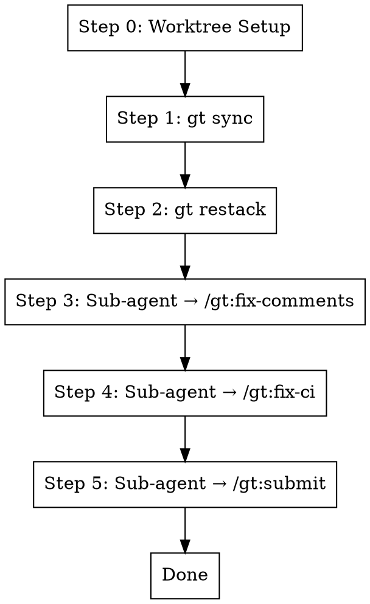

# Fix Branch

## Overview

Sync and fix the current Graphite branch by syncing with trunk, restacking, addressing PR review comments, and fixing CI
failures. **Always works in a git worktree** for isolation (unless user explicitly opts out).

**Core principle:** Worktree → Sync → Restack → Fix Comments (sub-agent) → Fix CI (sub-agent) → Submit (sub-agent)

**Announce at start:** "I'm using the fix-branch skill to sync and fix this branch."

## Sub-Agent Architecture

Steps 3-5 are dispatched as **sub-agents** using the Task tool to reduce context churn. Each sub-agent runs
independently with a focused prompt and returns a summary. The orchestrator (this skill) only tracks high-level
success/failure.

```
Orchestrator (this skill)
├── Step 0-2: Direct (lightweight git commands)
├── Step 3: Task(subagent_type="Bash", prompt="fix-comments for <branch>")
├── Step 4: Task(subagent_type="Bash", prompt="fix-ci for <branch>")
└── Step 5: Task(subagent_type="Bash", prompt="submit <branch>")
```

## The Process



**Key principle:** Push each branch immediately after fixing, don't wait for the entire stack to be complete.

### Step 0: Worktree Setup (Always)

**Always** work in an isolated git worktree unless the user explicitly said not to. Do NOT ask - just set it up.

**Check if already in a worktree for this branch:**

```bash
BRANCH=$(git branch --show-current)
WORKTREE_PATH=$(git worktree list --porcelain | grep -B2 "branch refs/heads/$BRANCH" | grep "worktree " | cut -d' ' -f2)

# If we're already in that worktree, skip setup
if [ "$(pwd)" = "$WORKTREE_PATH" ]; then
  echo "Already in worktree for $BRANCH"
fi
```

**If not in a worktree, set one up automatically:**

Follow the `using-git-worktrees` skill to:

1. Find or create worktree directory (`.worktrees/` or `worktrees/`)
2. Verify directory is git-ignored
3. Create worktree: `git worktree add <path> $BRANCH` (or reuse existing)
4. `cd` into the worktree
5. Run project setup (npm install, etc.)

**Worktree reuse:** If a worktree already exists for this branch, just `cd` into it:

```bash
# Check for existing worktree
EXISTING=$(git worktree list --porcelain | grep -B2 "branch refs/heads/$BRANCH" | grep "worktree " | cut -d' ' -f2)
if [ -n "$EXISTING" ]; then
  cd "$EXISTING"
else
  # Create new worktree
  git worktree add .worktrees/$BRANCH $BRANCH
  cd .worktrees/$BRANCH
fi
```

**Only skip worktrees if** the user explicitly passed `--no-worktree` or said "don't use worktrees".

### Step 1: Sync with Trunk

```bash
gt sync --no-interactive
```

This pulls latest trunk and rebases all open PRs/stacks on top.

### Step 2: Restack

```bash
gt restack
```

Ensures the current stack has latest changes from downstack branches.

### Step 3: Fix Comments (Sub-Agent)

Dispatch a sub-agent to handle PR review comments. Use the Task tool:

```
Task(
  subagent_type="general-purpose",
  description="Fix PR comments on <branch>",
  prompt="""
  You are fixing PR review comments on branch '<branch>' in directory '<worktree_path>'.

  Run the /gt:fix-comments skill:
  1. Fetch GitHub and Graphite review comments for the current branch's PR
  2. Address each unresolved comment by making code changes
  3. Resolve addressed threads
  4. Run tests to verify fixes: metta pytest --changed
  5. Stage and commit: git add -A && gt modify --no-interactive

  Working directory: <worktree_path>
  Branch: <branch>

  Report back: number of comments addressed, any that couldn't be resolved, test results.
  """
)
```

**If sub-agent reports no comments:** Continue to Step 3b. **If sub-agent reports failures:** Review the summary and
decide whether to retry or escalate.

### Step 3b: Verify All Comments Addressed

After the fix-comments sub-agent completes, **verify that every comment has been responded to and resolved**. This
catches any comments the sub-agent may have missed, **including threads that were resolved without a reply**.

```bash
# Re-fetch ALL threads (both resolved and unresolved) with full comment history
OWNER=$(gh repo view --json owner -q '.owner.login')
REPO=$(gh repo view --json name -q '.name')
PR_NUMBER=$(gh pr view --json number -q '.number')
BOT_LOGIN=$(gh api user -q '.login')

ALL_THREADS=$(gh api graphql -f query='
  query($owner: String!, $repo: String!, $pr: Int!) {
    repository(owner: $owner, name: $repo) {
      pullRequest(number: $pr) {
        reviewThreads(first: 250) {
          nodes {
            id
            isResolved
            path
            comments(first: 100) {
              nodes {
                body
                author { login }
              }
              pageInfo {
                hasNextPage
              }
            }
          }
          pageInfo {
            hasNextPage
          }
        }
      }
    }
  }
' -f owner=$OWNER -f repo=$REPO -F pr=$PR_NUMBER)

# Verify we fetched all threads and comments (fail if pagination needed)
THREADS_HAS_NEXT=$(echo "$ALL_THREADS" | jq -r '.data.repository.pullRequest.reviewThreads.pageInfo.hasNextPage')
COMMENTS_HAS_NEXT=$(echo "$ALL_THREADS" | jq -r '
  [.data.repository.pullRequest.reviewThreads.nodes[].comments.pageInfo.hasNextPage] | any')
if [ "$THREADS_HAS_NEXT" = "true" ] || [ "$COMMENTS_HAS_NEXT" = "true" ]; then
  echo "WARNING: PR has more threads/comments than fetched. Manual review needed."
fi

# Check 1: Unresolved threads (comments missed entirely)
UNRESOLVED=$(echo "$ALL_THREADS" | jq -r '
  .data.repository.pullRequest.reviewThreads.nodes[]
  | select(.isResolved == false)
  | "UNRESOLVED: \(.path) - \(.comments.nodes[0].body[0:80])"')

# Check 2: Resolved threads without a reply from the bot/author
# (resolved-without-response — violates the "always respond" requirement)
RESOLVED_NO_REPLY=$(echo "$ALL_THREADS" | jq -r --arg bot "$BOT_LOGIN" '
  .data.repository.pullRequest.reviewThreads.nodes[]
  | select(.isResolved == true)
  | select((.comments.nodes | length) > 0)
  | select((.comments.nodes | map(.author.login) | any(. == $bot)) | not)
  | "RESOLVED-NO-REPLY: \(.path) - \(.comments.nodes[0].body[0:80])"')
```

**If unresolved threads remain:**

1. Log which comments are still unresolved
2. Re-dispatch the fix-comments sub-agent for the remaining threads, OR
3. If they are design disagreements, report them to the user

**If resolved-without-reply threads exist:**

1. Log which threads were resolved without a response
2. Re-dispatch the fix-comments sub-agent to add replies to those threads (the thread may need to be unresolved first,
   replied to, then re-resolved)

**Only proceed to Step 4 when all actionable comments have been addressed and responded to.**

### Step 4: Fix CI (Sub-Agent)

Dispatch a sub-agent to check and fix CI failures:

```
Task(
  subagent_type="general-purpose",
  description="Fix CI failures on <branch>",
  prompt="""
  You are fixing CI failures on branch '<branch>' in directory '<worktree_path>'.

  Run the /gt:fix-ci skill:
  1. Check CI status using commit SHA (NEVER use `gh pr checks` - it returns stale data):
     HEAD_SHA=$(git rev-parse HEAD)
     OWNER=$(gh repo view --json owner -q '.owner.login')
     REPO=$(gh repo view --json name -q '.name')
     gh api repos/$OWNER/$REPO/commits/$HEAD_SHA/check-runs \
       --jq '.check_runs[] | "\(.name): \(.conclusion // .status)"'
  2. If all passing, report success and stop
  3. If failures: get logs with `gh run view <run_id> --log-failed`
  4. Fix each failure
  5. Verify locally: metta pytest --changed
  6. Stage and commit: git add -A && gt modify --no-interactive

  Working directory: <worktree_path>
  Branch: <branch>

  Report back: CI status before/after, what was fixed, local test results.
  """
)
```

**If sub-agent reports CI already passing:** Continue to Step 5. **If sub-agent reports fixes made:** Continue to
Step 5. **If sub-agent reports unfixable failures:** Escalate to user.

### Step 5: Submit Branch (Sub-Agent)

Dispatch a sub-agent to run the full submit flow (lint → submit → test locally in parallel with CI):

```
Task(
  subagent_type="general-purpose",
  description="Submit <branch> to Graphite",
  prompt="""
  You are submitting branch '<branch>' to Graphite from directory '<worktree_path>'.

  Run the /gt:submit skill:
  1. Run /gt:cool to clean up backwards compat code
  2. Check for disabled tests (@pytest.mark.skip etc) - fix or remove them
  3. Run lint: metta lint (fix any errors)
  4. Stage and commit: git add -A && gt modify --no-interactive
  5. Submit: gt submit --no-interactive (CI starts running remotely)
  6. Run tests locally (parallel with CI): metta pytest --changed -v
  7. If local tests fail: fix, re-lint, re-commit (gt modify), re-submit
  8. Loop step 6-7 until local tests pass

  Working directory: <worktree_path>
  Branch: <branch>

  Report back: Graphite PR URL (format: https://app.graphite.dev/github/pr/OWNER/REPO/PR_NUMBER), test results, summary of changes, any issues.
  To get the PR number: gh pr view --json number -q '.number'
  To get owner/repo: gh repo view --json owner,name -q '.owner.login + "/" + .name'
  """
)
```

**After the submit sub-agent completes**, print the Graphite URL for the user:

```
https://app.graphite.dev/github/pr/<OWNER>/<REPO>/<PR_NUMBER>
```

## Quick Reference

| Step | Action                     | Method    | Purpose                          |
| ---- | -------------------------- | --------- | -------------------------------- |
| 0    | Worktree setup             | Direct    | Isolation                        |
| 1    | `gt sync --no-interactive` | Direct    | Pull trunk, rebase stacks        |
| 2    | `gt restack`               | Direct    | Rebase current stack             |
| 3    | Fix comments               | Sub-agent | Address PR review comments       |
| 3b   | Verify comments addressed  | Direct    | Ensure all comments responded to |
| 4    | Fix CI                     | Sub-agent | Fix any CI failures              |
| 5    | Submit                     | Sub-agent | Test, clean, submit branch       |

## Why Sub-Agents?

Each sub-step (fix-comments, fix-ci, submit) involves:

- Reading lots of CI logs, PR comments, test output
- Multiple fix-verify cycles
- Significant context accumulation

By dispatching these as sub-agents:

- The orchestrator stays lightweight (just tracks success/failure)
- Each sub-agent starts fresh with focused context
- Failed sub-agents can be retried without replaying the whole conversation
- The user sees high-level progress without scrolling through logs

## Common Mistakes

**Skipping sync/restack**

- **Problem:** Merge conflicts later, out of sync with trunk
- **Fix:** Always start with sync and restack

**Running fix-comments before restack**

- **Problem:** May fix issues that would be resolved by restack
- **Fix:** Always restack first to get latest downstack changes

**Skipping fix-ci**

- **Problem:** PR comments fixed but CI still failing
- **Fix:** Always run fix-ci after fix-comments

**Waiting to submit until stack is complete**

- **Problem:** Delays CI feedback, other branches wait unnecessarily
- **Fix:** Submit each branch immediately after fixing (Step 5)

## Red Flags

**Stop and investigate if:**

- Sync fails with conflicts → Resolve conflicts manually before continuing
- Restack fails → Check if downstack branches need attention first
- CI failures in code you didn't touch → May be flaky tests or trunk issues
- Sub-agent reports repeated failures → May need manual intervention

## CRITICAL: Check CI Status Correctly

**Use the commit SHA to get fresh CI data** - `gh pr checks` returns stale/cached results:

```bash
# WRONG - Returns cached/stale data
gh pr checks <pr_number>  # DON'T use this!

# RIGHT - Get fresh CI status for the actual HEAD commit
HEAD_SHA=$(git rev-parse HEAD)
OWNER=$(gh repo view --json owner -q '.owner.login')
REPO=$(gh repo view --json name -q '.name')
gh api repos/$OWNER/$REPO/commits/$HEAD_SHA/check-runs \
  --jq '.check_runs[] | "\(.name): \(.conclusion // .status)"'
```

## Worktree Cleanup

After the branch is fixed and submitted:

- The worktree remains for future work on this branch
- To remove: `git worktree remove .worktrees/$BRANCH`
- Or use `finishing-a-development-branch` skill when branch is merged

## Integration

**Uses:**

- **using-git-worktrees** - For worktree setup (Step 0)
- **gt:fix-comments** - Addresses PR review comments (via sub-agent)
- **gt:fix-ci** - Fixes CI failures (via sub-agent)
- **gt:submit** - Final quality gate (via sub-agent)

**Called by:**

- **gt:fix-stack** - Runs this on each branch in a stack (each branch is submitted immediately after fixing)

**Pairs with:**

- **systematic-debugging** - For non-trivial test failures
- **finishing-a-development-branch** - For cleanup after merge
