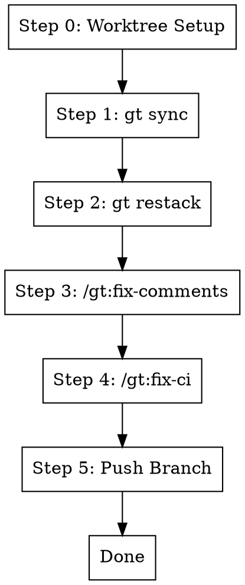

# Fix Branch

## Overview

Sync and fix the current Graphite branch by syncing with trunk, restacking, addressing PR review comments, and fixing CI
failures. **Works in a git worktree by default** for isolation.

**Core principle:** Worktree → Sync → Restack → Fix Comments → Fix CI

**Announce at start:** "I'm using the fix-branch skill to sync and fix this branch."

## The Process



**Key principle:** Push each branch immediately after fixing, don't wait for the entire stack to be complete. This
ensures:

- Other team members see progress incrementally
- CI runs start immediately for each branch
- If something fails later, earlier branches are already submitted

### Step 0: Worktree Setup (Default)

By default, work in an isolated git worktree to avoid disrupting the main workspace.

**Check if already in a worktree for this branch:**

```bash
BRANCH=$(git branch --show-current)
WORKTREE_PATH=$(git worktree list --porcelain | grep -B2 "branch refs/heads/$BRANCH" | grep "worktree " | cut -d' ' -f2)

# If we're already in that worktree, skip setup
if [ "$(pwd)" = "$WORKTREE_PATH" ]; then
  echo "Already in worktree for $BRANCH"
fi
```

**If not in a worktree, ask user:**

Use AskUserQuestion with options:

1. **Yes, use worktree (Recommended)** - Create/use worktree for isolation
2. **No, work in current directory** - Skip worktree, work in place

**If using worktree:**

Follow the `using-git-worktrees` skill to:

1. Find or create worktree directory (`.worktrees/` or `worktrees/`)
2. Verify directory is git-ignored
3. Create worktree: `git worktree add <path> $BRANCH` (or reuse existing)
4. `cd` into the worktree
5. Run project setup (npm install, etc.)

**Worktree reuse:** If a worktree already exists for this branch, just `cd` into it:

```bash
# Check for existing worktree
EXISTING=$(git worktree list --porcelain | grep -B2 "branch refs/heads/$BRANCH" | grep "worktree " | cut -d' ' -f2)
if [ -n "$EXISTING" ]; then
  cd "$EXISTING"
else
  # Create new worktree
  git worktree add .worktrees/$BRANCH $BRANCH
  cd .worktrees/$BRANCH
fi
```

### Step 1: Sync with Trunk

```bash
gt sync --no-interactive
```

This pulls latest trunk and rebases all open PRs/stacks on top.

### Step 2: Restack

```bash
gt restack
```

Ensures the current stack has latest changes from downstack branches.

### Step 3: Fix Comments

Invoke the fix-comments skill to handle all PR review comments:

```
/gt:fix-comments
```

This will:

- Fetch GitHub and Graphite review comments
- Address each unresolved comment
- Resolve addressed threads
- Run tests until they pass
- Submit the update

### Step 4: Fix CI

After comments are addressed, check and fix any CI failures:

```
/gt:fix-ci
```

This will:

- Check CI status using the commit SHA (not `gh pr checks`)
- Get failure logs if any checks failed
- Fix each failure
- Verify locally

**Note:** If CI is already passing, this step completes quickly.

### Step 5: Push Branch

**Push immediately after fixing** - don't wait for the entire stack:

```bash
gt submit --no-interactive
```

This pushes the current branch to remote immediately. Benefits:

- CI starts running right away
- Other branches in the stack can be fixed in parallel
- Progress is visible to reviewers
- If later branches have issues, earlier ones are already submitted

**If there are uncommitted changes from fix-ci:**

```bash
git add -A
git commit -m "fix: address CI failures"
gt submit --no-interactive
```

## Quick Reference

| Step | Command                      | Purpose                    |
| ---- | ---------------------------- | -------------------------- |
| 1    | `gt sync --no-interactive`   | Pull trunk, rebase stacks  |
| 2    | `gt restack`                 | Rebase current stack       |
| 3    | `/gt:fix-comments`           | Address PR review comments |
| 4    | `/gt:fix-ci`                 | Fix any CI failures        |
| 5    | `gt submit --no-interactive` | Push branch immediately    |

## Common Mistakes

**Skipping sync/restack**

- **Problem:** Merge conflicts later, out of sync with trunk
- **Fix:** Always start with sync and restack

**Running fix-comments before restack**

- **Problem:** May fix issues that would be resolved by restack
- **Fix:** Always restack first to get latest downstack changes

**Skipping fix-ci**

- **Problem:** PR comments fixed but CI still failing
- **Fix:** Always run fix-ci after fix-comments

**Waiting to push until stack is complete**

- **Problem:** Delays CI feedback, other branches wait unnecessarily
- **Fix:** Push each branch immediately after fixing (Step 5)

## Red Flags

**Stop and investigate if:**

- Sync fails with conflicts → Resolve conflicts manually before continuing
- Restack fails → Check if downstack branches need attention first
- CI failures in code you didn't touch → May be flaky tests or trunk issues

## CRITICAL: Check CI Status Correctly

**Use the commit SHA to get fresh CI data** - `gh pr checks` returns stale/cached results:

```bash
# WRONG - Returns cached/stale data
gh pr checks <pr_number>  # DON'T use this!

# RIGHT - Get fresh CI status for the actual HEAD commit
HEAD_SHA=$(git rev-parse HEAD)
OWNER=$(gh repo view --json owner -q '.owner.login')
REPO=$(gh repo view --json name -q '.name')
gh api repos/$OWNER/$REPO/commits/$HEAD_SHA/check-runs \
  --jq '.check_runs[] | "\(.name): \(.conclusion // .status)"'
```

## Worktree Cleanup

After the branch is fixed and submitted:

- The worktree remains for future work on this branch
- To remove: `git worktree remove .worktrees/$BRANCH`
- Or use `finishing-a-development-branch` skill when branch is merged

## Integration

**Uses:**

- **using-git-worktrees** - For worktree setup (Step 0)
- **gt:fix-comments** - Addresses PR review comments with regression tests
- **gt:fix-ci** - Fixes CI failures

**Called by:**

- **gt:fix-stack** - Runs this on each branch in a stack (each branch is pushed immediately after fixing)

**Pairs with:**

- **systematic-debugging** - For non-trivial test failures
- **finishing-a-development-branch** - For cleanup after merge
