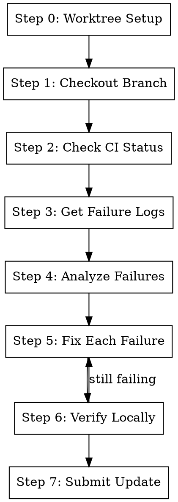

# Fix CI

## Overview

Find CI failures on a branch, fix them, verify locally, and submit the update. **Works in a git worktree by default**
for isolation.

**Core principle:** Worktree → Check CI → Get Logs → Fix Failures → Verify Locally → Submit

**Announce at start:** "I'm using the fix-ci skill to fix CI failures on this branch."

## The Process



### Step 0: Worktree Setup (Default)

By default, work in an isolated git worktree. **Skip if already in worktree** (e.g., called from /gt:fix-branch).

```bash
BRANCH=$(git branch --show-current)
WORKTREE_PATH=$(git worktree list --porcelain | grep -B2 "branch refs/heads/$BRANCH" | grep "worktree " | cut -d' ' -f2)

# Check if already in a worktree for this branch
if [ "$(pwd)" = "$WORKTREE_PATH" ]; then
  echo "Already in worktree for $BRANCH - skipping setup"
else
  # Ask user (with worktree as default)
  # If yes: create/reuse worktree, cd into it
  # If no: continue in current directory
fi
```

**If using worktree:** Follow `using-git-worktrees` skill - find/create `.worktrees/$BRANCH`, verify ignored, run
project setup.

### Step 1: Checkout Branch (if not current)

```bash
# Check current branch
CURRENT=$(git branch --show-current)

# If different branch specified, checkout
gt checkout <branch-name>
```

### Step 2: Check CI Status

**CRITICAL: Use commit SHA, not `gh pr checks`** - `gh pr checks` returns stale/cached data.

```bash
# Get fresh CI status for HEAD commit
HEAD_SHA=$(git rev-parse HEAD)
OWNER=$(gh repo view --json owner -q '.owner.login')
REPO=$(gh repo view --json name -q '.name')

# Get all check runs
gh api repos/$OWNER/$REPO/commits/$HEAD_SHA/check-runs \
  --jq '.check_runs[] | "\(.name): \(.conclusion // .status) - \(.html_url)"'
```

**Identify failed checks:**

```bash
# Get only failed checks
gh api repos/$OWNER/$REPO/commits/$HEAD_SHA/check-runs \
  --jq '.check_runs[] | select(.conclusion == "failure") | {name: .name, url: .html_url, id: .id}'
```

### Step 3: Get Failure Logs

**For GitHub Actions:**

```bash
# Get the workflow run ID from the check run
RUN_ID=$(gh api repos/$OWNER/$REPO/commits/$HEAD_SHA/check-runs \
  --jq '.check_runs[] | select(.conclusion == "failure") | .id' | head -1)

# Get failed job logs
gh run view $RUN_ID --log-failed
```

**Alternative - view in browser:**

```bash
# Open the failed check in browser
gh api repos/$OWNER/$REPO/commits/$HEAD_SHA/check-runs \
  --jq '.check_runs[] | select(.conclusion == "failure") | .html_url' | head -1 | xargs open
```

**For other CI systems (Jenkins, CircleCI, etc.):**

- Use the `html_url` from the check run to access logs
- May need to use WebFetch or browser automation

### Step 4: Analyze Failures

**Common CI failure types:**

| Type          | Indicators                           | Action                     |
| ------------- | ------------------------------------ | -------------------------- |
| Test failures | `FAILED`, `AssertionError`, `pytest` | Fix the test or code       |
| Lint errors   | `flake8`, `eslint`, `ruff`           | Run `metta lint` and fix   |
| Type errors   | `mypy`, `pyright`, `tsc`             | Fix type annotations       |
| Build errors  | `ImportError`, `ModuleNotFound`      | Fix imports/dependencies   |
| Timeout       | `timed out`, `exceeded`              | Optimize or increase limit |

**Parse the failure:**

1. Find the first error message
2. Identify the file and line number
3. Understand the root cause before fixing

### Step 5: Fix Each Failure

**For test failures:**

```bash
# Run the specific failing test locally first
uv run pytest tests/path/to/test.py::test_name -v

# Fix the issue
# Re-run to verify
```

**For lint errors:**

```bash
# Run linter to see all issues
metta lint

# Or for specific tools
uv run ruff check --fix .
uv run black .
```

**For type errors:**

```bash
# Run type checker
uv run mypy path/to/file.py

# Fix the annotations
```

**For each fix:**

1. Make the minimal change needed
2. Stage the change: `git add <file>`
3. Verify locally before moving to next failure

### Step 6: Verify Locally

```bash
# Run the same checks that CI runs
metta pytest --changed  # Tests
metta lint              # Linting

# For full verification, run what CI runs
uv run pytest tests/ -v
```

**If tests still fail:** Return to Step 5. **If tests pass:** Continue to Step 7.

### Step 7: Submit Update

Invoke the submit skill to stage, commit, and push:

```
/gt:submit
```

This will stage all changes, run tests, clean up compat code, lint, commit (amend), and submit to Graphite.

## Quick Reference

| Step | Command                    | Purpose                  |
| ---- | -------------------------- | ------------------------ |
| 1    | `gt checkout <branch>`     | Switch to branch         |
| 2    | `gh api .../check-runs`    | Get CI status (use SHA!) |
| 3    | `gh run view --log-failed` | Get failure logs         |
| 4    | Analyze logs               | Identify root cause      |
| 5    | Fix code                   | Address each failure     |
| 6    | `metta pytest --changed`   | Verify locally           |
| 7    | `/gt:submit`               | Test, clean, submit fix  |

## CRITICAL: Never Use `gh pr checks`

```bash
# WRONG - Returns cached/stale data
gh pr checks <pr_number>  # DON'T use this!

# RIGHT - Always use commit SHA
HEAD_SHA=$(git rev-parse HEAD)
gh api repos/$OWNER/$REPO/commits/$HEAD_SHA/check-runs
```

## Common Mistakes

**Trusting `gh pr checks`**

- **Problem:** Shows stale data, may say "passing" when actually failing
- **Fix:** Always use `gh api` with the actual HEAD SHA

**Fixing without understanding**

- **Problem:** Wrong fix, or fix that breaks something else
- **Fix:** Read the full error, understand root cause first

**Not verifying locally**

- **Problem:** Submit fix, CI fails again, wasted cycle
- **Fix:** Always run the same checks locally before submitting

**Fixing symptoms not causes**

- **Problem:** Test passes but underlying bug remains
- **Fix:** Use `/systematic-debugging` for complex failures

## Red Flags

**Stop and investigate if:**

- CI failure is in code you didn't touch → May be a flaky test or infrastructure issue
- Multiple unrelated failures → May need to sync with trunk first
- Failure only happens in CI, not locally → Environment difference (check CI config)
- Same failure persists after fix → Root cause not addressed

## Debugging CI-Only Failures

If a test passes locally but fails in CI:

1. **Check environment differences:**
   - Python version
   - OS (Linux in CI vs macOS locally)
   - Environment variables
   - Dependencies/versions

2. **Check for flakiness:**
   - Run test multiple times locally
   - Look for timing-dependent code
   - Check for test isolation issues

3. **Reproduce CI environment:**
   ```bash
   # Run in CI-like conditions
   CI=true uv run pytest tests/path/to/test.py -v
   ```

## Integration

**Uses:**

- **using-git-worktrees** - For worktree setup (Step 0, when called standalone)
- **gt:submit** - Final quality gate: tests, /gt:cool, lint, commit, submit

**Called by:**

- **gt:fix-branch** - After /gt:fix-comments (worktree already set up)

**Pairs with:**

- **systematic-debugging** - For complex or unclear failures
- **gt:cool** - May introduce failures that need fixing
