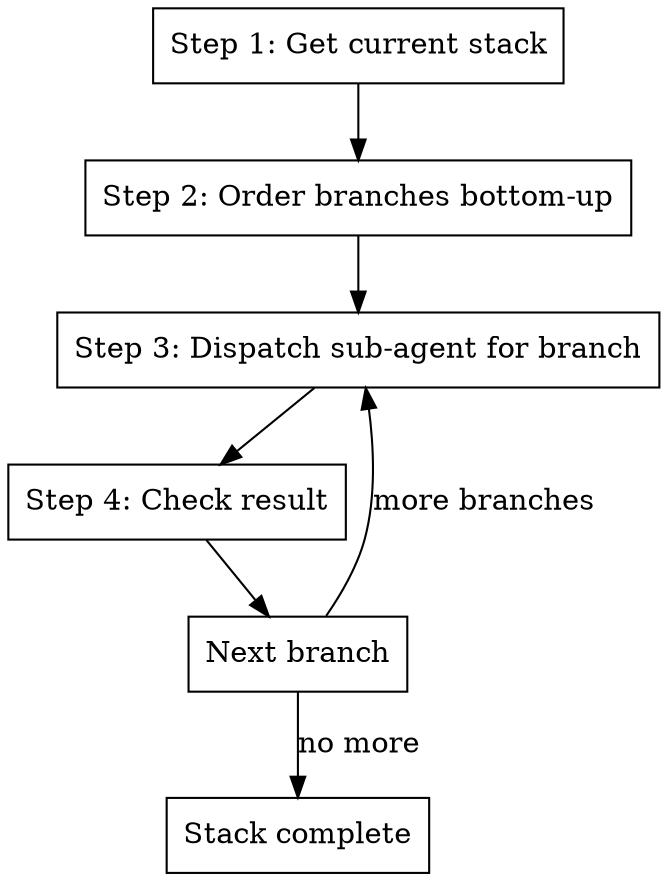

# Fix Stack

## Overview

Fix an entire Graphite stack by dispatching a **sub-agent for each branch**, starting from the bottom (closest to trunk)
and working up to the top. **Always uses git worktrees** - each branch gets its own isolated worktree (unless user
explicitly opts out).

**Core principle:** Get stack → Order bottom-up → Dispatch sub-agent per branch (sequentially)

**Announce at start:** "I'm using the fix-stack skill to fix all branches in this stack."

## Sub-Agent Architecture

Each branch fix is dispatched as a **sub-agent** using the Task tool. This keeps the orchestrator lightweight - it only
tracks which branches succeeded/failed without accumulating CI logs, test output, and fix attempts in context.

```
Orchestrator (this skill)
├── Step 1-2: Direct (get stack, determine order)
├── Branch 1: Task(subagent_type="general-purpose", prompt="fix-branch <branch-1>")
├── Branch 2: Task(subagent_type="general-purpose", prompt="fix-branch <branch-2>")
└── Branch N: Task(subagent_type="general-purpose", prompt="fix-branch <branch-N>")
```

**Sequential execution:** Each branch must complete before the next starts, because lower branch changes affect upper
branches.

## The Process



### Step 1: Get the Current Stack

```bash
# Get current branch
git branch --show-current

# Get stack state as JSON
gt state
```

Parse the JSON to find all branches in the current stack by following parent relationships.

### Step 2: Order Branches Bottom-Up

Starting from the current branch, trace parents back to trunk to get the full stack. Then reverse to process bottom-up:

1. Current branch
2. Find its parent (from `gt state` JSON)
3. Continue until reaching trunk (main)
4. Reverse the list so trunk's direct child is first

**Example stack order:**

```
main (trunk - skip)
  └── branch-1 (fix first)
      └── branch-2 (fix second)
          └── branch-3 (fix third - current)
```

**Extracting stack from gt state:**

```bash
# First, find the root of the stack (branch whose parent is main)
current=$(git branch --show-current)
root=$(gt state 2>/dev/null | jq -r --arg branch "$current" '
  def get_root($b):
    if .[$b].parents[0].ref == "main" then $b
    else get_root(.[$b].parents[0].ref)
    end;
  get_root($branch)
')

# Then get all branches from root to top of stack
gt state 2>/dev/null | jq -r --arg root "$root" '
  def children($branch):
    to_entries | map(select(.value.parents and (.value.parents | map(.ref) | contains([$branch])))) | map(.key);

  def get_upstack($branch):
    children($branch) as $kids |
    if ($kids | length) == 0 then [$branch]
    else [$branch] + get_upstack($kids[0])
    end;

  get_upstack($root) | .[]
'
```

This gives you the full stack in bottom-up order, ready to process.

### Step 3: Dispatch Sub-Agent for Each Branch

For each branch in bottom-up order, dispatch a sub-agent:

```
Task(
  subagent_type="general-purpose",
  description="Fix branch <branch-name>",
  prompt="""
  You are fixing Graphite branch '<branch-name>' in repository at '<repo_path>'.

  Run the /gt:fix-branch skill on this branch:

  1. Set up worktree:
     - Check for existing worktree: git worktree list --porcelain | grep -B2 "branch refs/heads/<branch>"
     - If exists, cd into it. If not: git worktree add .worktrees/<branch> <branch>
     - cd into the worktree directory

  2. Sync and restack:
     - gt sync --no-interactive
     - gt restack

  3. Fix PR review comments:
     - Get PR number: gh pr list --head <branch> --json number -q '.[0].number'
     - Fetch comments and address unresolved ones
     - Run tests after fixes: metta pytest --changed

  4. Fix CI failures:
     - Check CI using commit SHA (NEVER use gh pr checks):
       HEAD_SHA=$(git rev-parse HEAD)
       OWNER=$(gh repo view --json owner -q '.owner.login')
       REPO=$(gh repo view --json name -q '.name')
       gh api repos/$OWNER/$REPO/commits/$HEAD_SHA/check-runs \
         --jq '.check_runs[] | "\(.name): \(.conclusion // .status)"'
     - If failures, get logs and fix them
     - Verify locally: metta pytest --changed

  5. Submit (lint first, then submit, then test in parallel with CI):
     - Run /gt:cool to clean up compat code
     - Check for disabled tests - fix or remove them
     - Run lint: metta lint (fix any errors)
     - Stage and commit: git add -A && gt modify --no-interactive
     - Submit: gt submit --no-interactive (CI starts remotely)
     - Run tests locally: metta pytest --changed -v
     - If local tests fail: fix, re-lint, re-commit, re-submit, re-test

  Repository: <repo_path>
  Branch: <branch-name>

  Report back: success/failure, PR URL, summary of changes made, any unresolved issues.
  """
)
```

### Step 4: Check Result and Continue

After each sub-agent completes:

- **Success:** Record the branch as fixed, move to next branch
- **Partial success:** Note what wasn't resolved, move to next branch (upper branches may still be fixable)
- **Failure:** Stop and report to user which branch failed and why

**Report progress** after each branch:

```
Branch 1/3 (feature-base): ✓ Fixed - 2 comments addressed, CI passing
Branch 2/3 (feature-api): ✓ Fixed - 1 lint error fixed
Branch 3/3 (feature-ui): ✓ Fixed - no issues found
```

## Quick Reference

| Step | Action          | Method    | Purpose                |
| ---- | --------------- | --------- | ---------------------- |
| 1    | `gt state`      | Direct    | Get stack structure    |
| 2    | Parse JSON      | Direct    | Determine branch order |
| 3    | Fix each branch | Sub-agent | Full fix-branch flow   |
| 4    | Check result    | Direct    | Track progress         |

## Why Sub-Agents?

Fixing a full stack involves:

- Multiple branches, each with their own PR comments, CI failures, and test issues
- Massive context accumulation (CI logs × branches = context explosion)
- Independent fix cycles per branch

By dispatching each branch as a sub-agent:

- The orchestrator stays tiny (just tracks branch order and success/failure)
- Each branch fix starts with clean context
- Failed branches can be retried independently
- The user sees a clear progress summary per branch
- No risk of hitting context limits on large stacks

## Important Notes

- **Always process bottom-up**: Lower branches must be fixed first because upper branches depend on them
- **Sequential, not parallel**: Each fix may change code that affects branches above
- **Restack propagates**: When you modify and submit a lower branch, upper branches may need restacking
- **Skip trunk**: Never run fix-branch on main/trunk
- **Worktrees per branch**: Each branch in the stack gets its own worktree (e.g., `.worktrees/branch-1`,
  `.worktrees/branch-2`)
- **CRITICAL: Check CI correctly** - Use `gh api repos/{owner}/{repo}/commits/$(git rev-parse HEAD)/check-runs` instead
  of `gh pr checks` which returns stale data

## Red Flags

**Stop and investigate if:**

- A branch in the middle of the stack has merge conflicts that can't be auto-resolved
- CI failures in a lower branch that sub-agent can't fix
- The stack structure is unclear or circular
- Sub-agent repeatedly fails on the same branch

## Worktree Cleanup

After the stack is fixed:

- Worktrees remain for each branch for future work
- To remove all: `git worktree list | grep .worktrees | awk '{print $1}' | xargs -I{} git worktree remove {}`
- Or use `finishing-a-development-branch` skill as each branch is merged

## Integration

**Uses:**

- **using-git-worktrees** - For worktree setup (via sub-agent's /gt:fix-branch)
- **gt:fix-branch** - Called for each branch via sub-agent (which in turn handles fix-comments, fix-ci, submit)

**Pairs with:**

- **systematic-debugging** - For complex test failures
- **gt:make-stack** - Creates stacks that this skill later fixes
- **finishing-a-development-branch** - For cleanup after branches are merged
