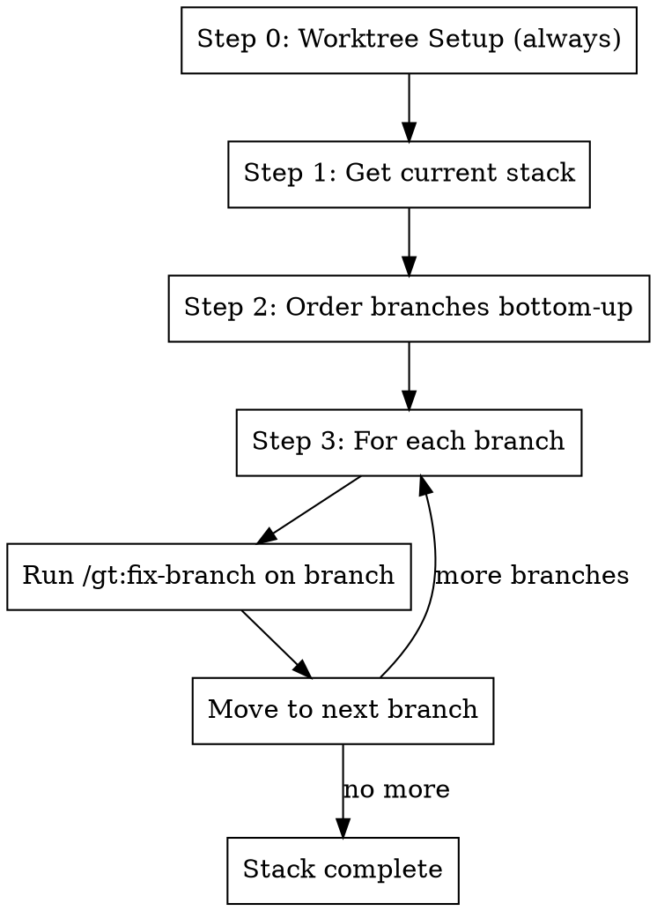

# Fix Stack

## Overview

Fix an entire Graphite stack by running `/gt:fix-branch` on each branch, starting from the bottom (closest to trunk) and
working up to the top. **Always uses git worktrees** - each branch gets its own isolated worktree (unless user
explicitly opts out).

**Core principle:** Worktree (always) → Get stack → Fix bottom-up → Each branch gets full fix-branch treatment

**Announce at start:** "I'm using the fix-stack skill to fix all branches in this stack."

## The Process



### Step 0: Worktree Setup (Always)

**Always** use worktrees for all branches unless the user explicitly said not to. Do NOT ask - each branch automatically
gets its own worktree in `.worktrees/<branch>`.

**Only skip worktrees if** the user explicitly passed `--no-worktree` or said "don't use worktrees".

Since `/gt:fix-branch` also always uses worktrees, no preference needs to be passed.

### Step 1: Get the Current Stack

```bash
# Get current branch
git branch --show-current

# Get stack state as JSON
gt state
```

Parse the JSON to find all branches in the current stack by following parent relationships.

### Step 2: Order Branches Bottom-Up

Starting from the current branch, trace parents back to trunk to get the full stack. Then reverse to process bottom-up:

1. Current branch
2. Find its parent (from `gt state` JSON)
3. Continue until reaching trunk (main)
4. Reverse the list so trunk's direct child is first

**Example stack order:**

```
main (trunk - skip)
  └── branch-1 (fix first)
      └── branch-2 (fix second)
          └── branch-3 (fix third - current)
```

### Step 3: Fix Each Branch

For each branch in bottom-up order, invoke the fix-branch skill:

```
/gt:fix-branch <branch-name>
```

This will:

- Sync and restack
- Address PR review comments
- Fix failing tests
- Submit changes

**Wait for each branch to complete before moving to the next.** Changes in lower branches may affect upper branches.

## Quick Reference

| Step | Command                     | Purpose                     |
| ---- | --------------------------- | --------------------------- |
| 1    | `git branch --show-current` | Get current branch          |
| 2    | `gt state`                  | Get stack structure as JSON |
| 3    | `/gt:fix-branch <branch>`   | Fix each branch             |

## Extracting Stack from gt state

The `gt state` command outputs JSON. Use this jq command to get the full stack:

```bash
# First, find the root of the stack (branch whose parent is main)
current=$(git branch --show-current)
root=$(gt state 2>/dev/null | jq -r --arg branch "$current" '
  def get_root($b):
    if .[$b].parents[0].ref == "main" then $b
    else get_root(.[$b].parents[0].ref)
    end;
  get_root($branch)
')

# Then get all branches from root to top of stack
gt state 2>/dev/null | jq -r --arg root "$root" '
  def children($branch):
    to_entries | map(select(.value.parents and (.value.parents | map(.ref) | contains([$branch])))) | map(.key);

  def get_upstack($branch):
    children($branch) as $kids |
    if ($kids | length) == 0 then [$branch]
    else [$branch] + get_upstack($kids[0])
    end;

  get_upstack($root) | .[]
'
```

This gives you the full stack in bottom-up order, ready to process.

## Important Notes

- **Always process bottom-up**: Lower branches must be fixed first because upper branches depend on them
- **One at a time**: Don't parallelize - each fix may change code that affects branches above
- **Restack propagates**: When you modify and submit a lower branch, upper branches may need restacking
- **Skip trunk**: Never run fix-branch on main/trunk
- **Worktrees per branch**: Each branch in the stack gets its own worktree (e.g., `.worktrees/branch-1`,
  `.worktrees/branch-2`)
- **CRITICAL: Check CI correctly** - Use `gh api repos/{owner}/{repo}/commits/$(git rev-parse HEAD)/check-runs` instead
  of `gh pr checks` which returns stale data

## Red Flags

**Stop and investigate if:**

- A branch in the middle of the stack has merge conflicts that can't be auto-resolved
- CI failures in a lower branch that you can't fix
- The stack structure is unclear or circular

## Worktree Cleanup

After the stack is fixed:

- Worktrees remain for each branch for future work
- To remove all: `git worktree list | grep .worktrees | awk '{print $1}' | xargs -I{} git worktree remove {}`
- Or use `finishing-a-development-branch` skill as each branch is merged

## Integration

**Uses:**

- **using-git-worktrees** - For worktree setup (via /gt:fix-branch)
- **gt:fix-branch** - Called for each branch in the stack (which in turn calls /gt:fix-comments, /gt:fix-ci, /gt:submit)

**Pairs with:**

- **systematic-debugging** - For complex test failures
- **gt:make-stack** - Creates stacks that this skill later fixes
- **finishing-a-development-branch** - For cleanup after branches are merged
