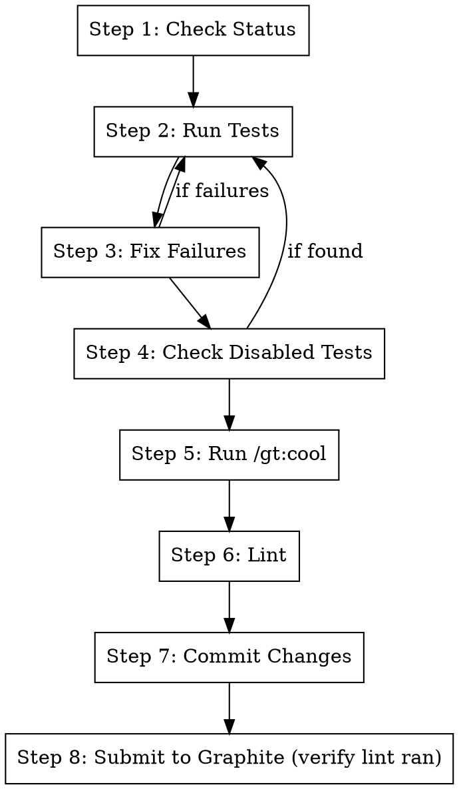

# Submit

## Overview

Prepare and submit the current branch to Graphite. Runs tests, fixes any failures, cleans up backwards compatibility
code, and submits.

**Core principle:** Test → Fix → No Disabled Tests → Clean → Lint → Submit

**Announce at start:** "I'm using the submit skill to test, clean up, and submit this branch."

## The Process



## Step 1: Check Status

```bash
# Get current branch
git branch --show-current

# Check for uncommitted changes
git status --short

# See what's changed vs main
git diff main..HEAD --stat
```

**If on main:** Stop and ask user which branch to work on.

## Step 2: Run Tests

```bash
# Run tests for changed files
metta pytest --changed

# If no changed files detected, run tests related to the branch
metta pytest tests/ --tb=short
```

**Capture output** - you'll need it if tests fail.

## Step 3: Fix Failures

**If all tests pass:** Skip to Step 4.

**If tests fail:**

For each failing test:

1. **Read the full error** including traceback
2. **Understand the root cause:**
   - Is it a bug in the new code?
   - Is it a test that needs updating?
   - Is it a missing import or dependency?

3. **Fix the issue:**
   - If bug in code → fix the code
   - If test needs updating → update the test
   - If unclear → use `/systematic-debugging`

4. **Re-run the specific test:**

   ```bash
   metta pytest tests/path/to/test_file.py::test_name
   ```

5. **Loop until passing**

6. **Re-run full test suite:**
   ```bash
   metta pytest --changed
   ```

## Step 4: Check for Disabled Tests

**No tests should be disabled/skipped.** If a test is broken, fix it or fix the code.

### 4a: Find Disabled Tests

```bash
# Search for skip decorators in changed files
git diff main..HEAD --name-only -- "*.py" | xargs grep -l "@pytest.mark.skip\|@unittest.skip\|pytest.skip\|@pytest.mark.xfail" 2>/dev/null

# Search more broadly in test files
grep -rn "@pytest.mark.skip\|@unittest.skip\|pytest.skip(\|@pytest.mark.xfail" tests/ --include="*.py"

# Also check for commented-out tests
grep -rn "# def test_\|#def test_\|# async def test_" tests/ --include="*.py"
```

### 4b: Common Skip Patterns to Find

| Pattern                           | Meaning                 |
| --------------------------------- | ----------------------- |
| `@pytest.mark.skip`               | Unconditionally skipped |
| `@pytest.mark.skip(reason="...")` | Skipped with reason     |
| `@pytest.mark.skipif(...)`        | Conditionally skipped   |
| `@pytest.mark.xfail`              | Expected to fail        |
| `@unittest.skip`                  | unittest skip           |
| `pytest.skip()`                   | Skip inside test        |
| `# def test_...`                  | Commented out test      |

### 4c: Fix Each Disabled Test

**For each disabled test found:**

1. **Understand why it was disabled:**
   - Read the skip reason if provided
   - Look at git blame to see when/why it was added
   - Check if it was disabled in this branch or earlier

2. **Decide the fix:**

| Situation                          | Action                                      |
| ---------------------------------- | ------------------------------------------- |
| Test is flaky                      | Fix the flakiness (timing, isolation, etc.) |
| Test tests removed feature         | Delete the test                             |
| Test has wrong assertion           | Fix the assertion                           |
| Code has a bug                     | Fix the code, not the test                  |
| Test needs update for new behavior | Update the test                             |
| Environment-specific skip          | OK to keep (e.g., `skipif(not CI)`)         |

3. **Make the fix:**
   - Remove the skip decorator
   - Fix the test or code
   - Run the test to verify it passes

4. **Re-run tests:**
   ```bash
   metta pytest --changed
   ```

### 4d: Acceptable Skips

**These are OK to keep:**

```python
# Environment-specific (can't run locally)
@pytest.mark.skipif(not os.environ.get("CI"), reason="Only runs in CI")

# Platform-specific
@pytest.mark.skipif(sys.platform != "linux", reason="Linux only")

# Dependency-specific
@pytest.mark.skipif(not HAS_GPU, reason="Requires GPU")
```

**These are NOT OK:**

```python
# Lazy skip
@pytest.mark.skip(reason="TODO: fix this")
@pytest.mark.skip(reason="Broken")
@pytest.mark.skip  # No reason at all

# Expected failure without plan to fix
@pytest.mark.xfail(reason="Known bug")

# Commented out
# def test_something():
#     ...
```

## Step 5: Run /gt:cool

Invoke the `/gt:cool` skill to clean up backwards compatibility code:

- Remove class/function aliases, fix callsites
- Replace defensive fallbacks with assertions
- Remove compatibility shims

```
Use Skill tool: skill="gt:cool"
```

**After /gt:cool completes:** Re-run tests to ensure cleanup didn't break anything.

```bash
metta pytest --changed -v
```

## Step 6: Lint (Mandatory)

```bash
# Run linting
metta lint

# Or if that's not available:
ruff check . --fix
ruff format .
```

**Fix any lint errors** before proceeding.

**Do not skip this step.** Even if you plan to run `gt submit` directly, run `metta lint` first.

## Step 7: Commit Changes

```bash
# Check what changed
git status --short
git diff --stat

# Stage all changes
git add -A
```

**If this is a new branch (no commits yet):**

```bash
gt create -m "feat: <description of changes>

- <bullet point 1>
- <bullet point 2>

Co-Authored-By: Claude <noreply@anthropic.com>"
```

**If amending existing branch:**

```bash
gt modify --no-interactive
```

## Step 8: Submit to Graphite (and verify lint ran)

```bash
# Submit to Graphite
gt submit --no-interactive
```

**Verify lint actually ran.** If the submit output doesn’t show lint (or if you skipped Step 6), run:

```bash
metta lint
```

Then re-run:

```bash
gt submit --no-interactive
```

**After submit, report:**

- PR URL
- Number of tests passing
- Summary of changes made

## Quick Reference

| Step           | Command                        | On Failure       |
| -------------- | ------------------------------ | ---------------- |
| Test           | `metta pytest --changed`       | Go to Step 3     |
| Fix failures   | Fix code/tests                 | Re-run test      |
| Check disabled | `grep -rn "@pytest.mark.skip"` | Fix test or code |
| Cool           | `/gt:cool` skill               | Fix callsites    |
| Lint           | `metta lint`                   | Fix lint errors  |
| Commit         | `gt modify --no-interactive`   | -                |
| Submit         | `gt submit --no-interactive`   | Check auth       |

## Handling Common Issues

### Tests fail after /gt:cool

The `/gt:cool` skill may remove fallbacks that tests depended on:

```python
# /gt:cool changed this:
value = config.get("key", "default")  # BEFORE
value = config["key"]                  # AFTER

# Test that now fails:
def test_something():
    config = {}  # Missing "key"!
    result = func(config)  # Now raises KeyError
```

**Fix:** Update the test to provide required values:

```python
def test_something():
    config = {"key": "test_value"}  # Provide required key
    result = func(config)
```

### Found disabled tests

```python
# If test was disabled because of a bug:
# 1. Remove the skip
# 2. Run the test to see what fails
# 3. Fix the underlying code
# 4. Verify test passes

# If test was disabled because test itself is wrong:
# 1. Remove the skip
# 2. Fix the test assertions/setup
# 3. Verify test passes

# If test is for a removed feature:
# 1. Delete the entire test
# 2. Remove any related test fixtures
```

### Lint errors after fixes

```bash
# Auto-fix what's possible
ruff check . --fix
ruff format .

# For remaining errors, fix manually
```

### Graphite submit fails

```bash
# Check if logged in
gt auth status

# If not logged in
gt auth login

# If branch not tracked
gt track
```

## Red Flags

**Stop and ask if:**

- Tests are failing in ways you don't understand
- A disabled test was added in this branch without clear justification
- `/gt:cool` wants to remove something that looks intentional
- The branch has merge conflicts
- You're unsure if changes should be amending or new commit

## Integration

**Uses:**

- **/gt:cool** - Called in Step 4 to clean up compat code
- **/systematic-debugging** - For complex test failures

**Called by:**

- **/gt:fix-branch** - As final step after /gt:fix-comments and /gt:fix-ci
- **/gt:make-stack** - For each branch after creation

**Run first if needed:**

- **/gt:fix-comments** - If there are unaddressed PR review comments
- **/gt:fix-ci** - If CI is currently failing
