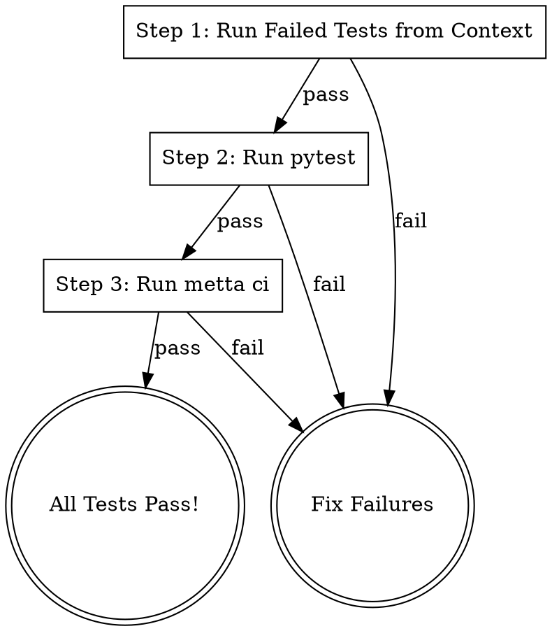

# Run Tests

## Overview

Run tests in progressive order, starting with the fastest feedback loop and expanding to full CI. Stops at the first
failure to fix issues incrementally.

**Core principle:** Failed Tests → pytest → metta ci

**Announce at start:** "I'm using t:run-tests to validate changes progressively."

## The Process



## Step 1: Run Failed Tests from Context

Check the conversation context for any test failures that were mentioned. Run those specific tests first for fast
feedback.

**Look for:**

- Test file paths mentioned in error messages
- Specific test names (e.g., `test_something`)
- pytest output showing `FAILED tests/path/to/test.py::test_name`

**If failed tests found in context:**

```bash
# Run specific failed tests
uv run pytest tests/path/to/test.py::test_name -v

# Or if multiple tests failed
uv run pytest tests/path/to/test1.py::test_func1 tests/path/to/test2.py::test_func2 -v
```

**If no failed tests in context:** Skip to Step 2.

**On failure:** Stop and report. User needs to fix before continuing.

**On success:** Continue to Step 2.

## Step 2: Run pytest

Run the broader pytest suite, focused on changed files.

```bash
# Run tests affected by changes
metta pytest --changed -v
```

**If `--changed` isn't available or doesn't find tests:**

```bash
# Run full pytest suite
uv run pytest tests/ -v --tb=short
```

**On failure:** Stop and report the failures. User needs to fix.

**On success:** Continue to Step 3.

## Step 3: Run metta ci

Run the full CI validation locally.

```bash
metta ci
```

This typically includes:

- Linting (ruff, etc.)
- Type checking
- Full test suite
- Any other CI checks

**On failure:** Stop and report. Show which CI step failed.

**On success:** All tests pass! Safe to commit/submit.

## Quick Reference

| Step | Command                             | Purpose                         |
| ---- | ----------------------------------- | ------------------------------- |
| 1    | `uv run pytest <specific-tests> -v` | Fast feedback on known failures |
| 2    | `metta pytest --changed -v`         | Test affected code              |
| 3    | `metta ci`                          | Full CI validation              |

## Handling Failures

### Step 1 Failures (Specific Tests)

```
## Test Failure

**Failed test:** tests/path/to/test.py::test_name

**Error:**
```

<error message>
```

**Fix the issue, then run `/t:run-tests` again.**

```

### Step 2 Failures (pytest)

```

## pytest Failures

**Failed tests:**

- tests/path/to/test1.py::test_func1
- tests/path/to/test2.py::test_func2

**Summary:** 2 failed, 45 passed

**Fix the failures, then run `/t:run-tests` again.**

```

### Step 3 Failures (metta ci)

```

## CI Failure

**Failed step:** <linting|type-check|tests|etc>

**Error:**

```
<error output>
```

**Fix the issue, then run `/t:run-tests` again.**

```

## Success Report

When all steps pass:

```

## All Tests Pass! ✓

- [x] Step 1: Failed tests from context (N tests)
- [x] Step 2: pytest --changed (N tests)
- [x] Step 3: metta ci

Ready to commit/submit.

```

## Tips

- **Fast iteration:** If you're fixing a specific test, just run that test directly until it passes, then use `/t:run-tests` to verify everything else.
- **Skip steps:** If there are no failed tests in context, Step 1 is skipped automatically.
- **CI parity:** `metta ci` should match what runs in GitHub Actions, so if it passes locally, CI should pass too.

## Integration

**Pairs with:**
- **gt:submit** - Run this before submitting to ensure CI will pass
- **gt:fix-ci** - If CI fails after submit, use fix-ci to diagnose
- **cf:really** - Use `cf:really t:run-tests` to keep fixing until all pass
```
