# Richard Higgins - Codex usage analysis

This document summarizes local Codex CLI usage across workspaces and provides a deep analysis of session patterns,
intent distribution, prompt structure, and assistant response characteristics. It is intended to capture how I (Richard
Higgins) actually use Codex in day-to-day work.

## Scope and data sources

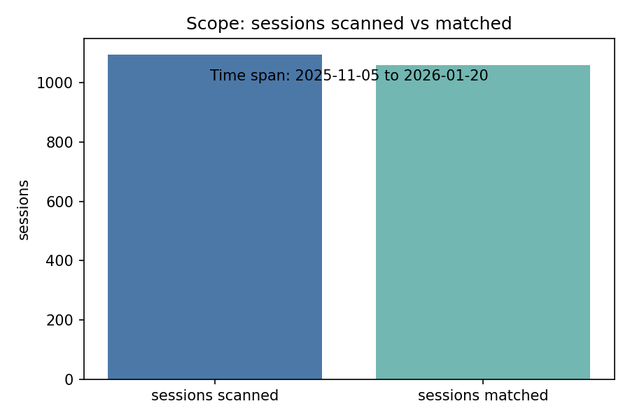

- Data source: local Codex CLI session logs under `~/.codex/sessions/2025` and `~/.codex/sessions/2026`.
- Target workspaces (combined set, inferred from `cwd`):
  - `/Users/relh/Code/PufferLib`
  - `/Users/relh/Code/dummyspace/metta`
  - `/Users/relh/Code/dummyspace/metta/PufferLib`
  - `/Users/relh/Code/dummyspace/tribal-village`
  - `/Users/relh/Code/fifthspace/tribal-village`
  - `/Users/relh/Code/fourthspace/metta`
  - `/Users/relh/Code/fourthspace/tribal-village`
  - `/Users/relh/Code/metta`
  - `/Users/relh/Code/metta/packages`
  - `/Users/relh/Code/metta/packages/cogames/src/cogames/policy/nim_agents`
  - `/Users/relh/Code/thirdspace`
  - `/Users/relh/Code/thirdspace/metta`
  - `/Users/relh/Code/thirdspace/tribal-village`
  - `/Users/relh/Code/tribal-village`
  - `/Users/relh/Code/workspace`
  - `/Users/relh/Code/workspace/metta`
  - `/Users/relh/Code/workspace/tribal-village`
  - `/home/relh`
  - `/home/relh/Code`
  - `/home/relh/Code/TribalPufferLib`
  - `/home/relh/Code/TribalPufferLib/tribal-village`
  - `/home/relh/Code/dummy/metta`
  - `/home/relh/Code/dummy/metta/PufferLib`
  - `/home/relh/Code/dummy/tribal-village`
  - `/home/relh/Code/fourth/tribal-village`
  - `/home/relh/Code/metta`
  - `/home/relh/Code/sliced-kickstarting`
  - `/home/relh/Code/third/metta`
  - `/home/relh/Code/third/tribal-village`
  - `/home/relh/Code/tribal-village`
  - `/home/relh/Code/windy-fork`
  - `/home/relh/Code/work/metta`
  - `/home/relh/Code/work/tribal-village`
- Sessions scanned: 1587 session files (all found under those years).
- Sessions matched to these workspaces: 1552
- Time span: 2025-09-13 to 2026-01-21 (UTC timestamps from logs).
- Filtering: removed system-injected items (AGENTS instructions, environment context blocks, and internal <user_action>
  payloads).
- Repeated prompts are retained; no de-duplication is applied.
- Character set: non-ASCII characters were stripped to keep this file ASCII-only.

## Executive summary

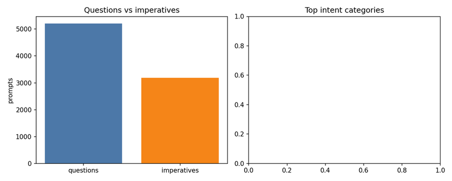

- Total prompts: 10967 across 1552 sessions.
- Questions vs. imperatives: 6743 questions (61.5%) vs 4224 imperatives (38.5%).
- Top intent categories by volume: How-to/questions (2092, 19.1%), Git/branch operations (1916, 17.5%),
  Implementation/refactor (1909, 17.4%).
- Multi-step directives (has 'and/then' + action verb): 4083 (37.2%).
- Prompts with file paths: 3358 (30.6%); with explicit commands: 3285 (30.0%).
- Assistant responses analyzed: 10008 (median 119.2 words; p90 282.9).

## Dataset overview

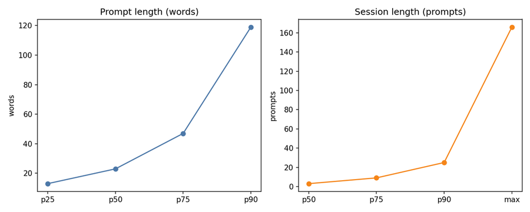

- Total user prompts (after filtering): 10967
- Prompt length: median 23.9 words (p25 13.2, p75 49.6, p90 118.8)
- Session length: median 3 prompts (mean 8.5, p75 8.4, p90 22.8, max 166)
- Short follow-ups (<= 6 words): 748 (6.8%)
- Very short follow-ups (<= 3 words): 195 (1.8%)
- Long prompts (> 200 words): 491 (4.5%)

## Session structure

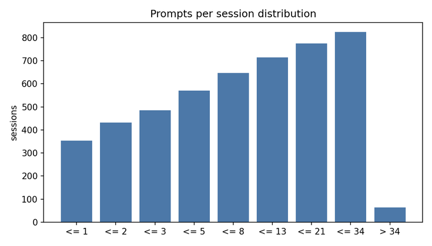

Distribution of prompts per session:

| Prompts per session | Sessions |
| ------------------- | -------: |
| <= 1                |      504 |
| <= 2                |      623 |
| <= 3                |      709 |
| <= 5                |      843 |
| <= 8                |      962 |
| <= 13               |     1053 |
| <= 21               |     1138 |
| <= 34               |     1209 |
| > 34                |       73 |

- Interpretation: the modal session is a single prompt, but there is a long tail of multi-step sessions (p90 = 22.8
  prompts).
- Review mode used in 156 sessions; context compaction in 75 sessions; aborted turns in 398 sessions.

## Intent taxonomy (fine-grained)

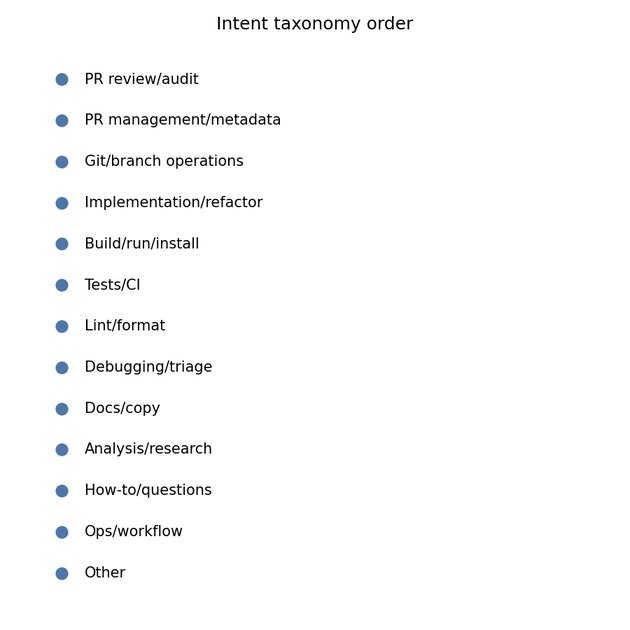

The categories below are assigned by keyword heuristics. A prompt is assigned to the first matching category in this
order:

- PR review/audit
- PR management/metadata
- Git/branch operations
- Implementation/refactor
- Build/run/install
- Tests/CI
- Lint/format
- Debugging/triage
- Docs/copy
- Analysis/research
- How-to/questions
- Ops/workflow
- Other

## Category distribution (combined)

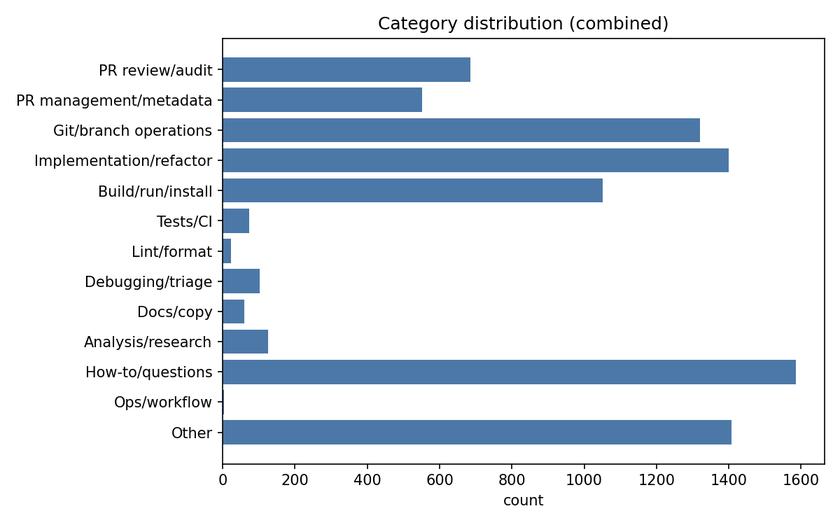

| Category                | Count | Share |
| ----------------------- | ----: | ----: |
| PR review/audit         |   913 |  8.3% |
| PR management/metadata  |   593 |  5.4% |
| Git/branch operations   |  1916 | 17.5% |
| Implementation/refactor |  1909 | 17.4% |
| Build/run/install       |  1326 | 12.1% |
| Tests/CI                |   108 |  1.0% |
| Lint/format             |    28 |  0.3% |
| Debugging/triage        |   119 |  1.1% |
| Docs/copy               |    75 |  0.7% |
| Analysis/research       |   177 |  1.6% |
| How-to/questions        |  2092 | 19.1% |
| Ops/workflow            |     5 |  0.0% |
| Other                   |  1706 | 15.6% |

## Semantic groupings

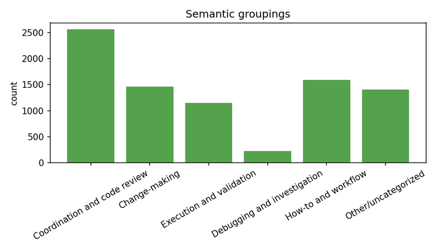

These groupings roll up the fine-grained categories into broader intent clusters:

| Group                        | Included categories                                            | Count | Share |
| ---------------------------- | -------------------------------------------------------------- | ----: | ----: |
| Coordination and code review | PR review/audit, PR management/metadata, Git/branch operations |  3422 | 31.2% |
| Change-making                | Implementation/refactor, Docs/copy                             |  1984 | 18.1% |
| Execution and validation     | Build/run/install, Tests/CI, Lint/format                       |  1462 | 13.3% |
| Debugging and investigation  | Debugging/triage, Analysis/research                            |   296 |  2.7% |
| How-to and workflow          | How-to/questions, Ops/workflow                                 |  2097 | 19.1% |
| Other/uncategorized          | Other                                                          |  1706 | 15.6% |

## Dominant session archetypes

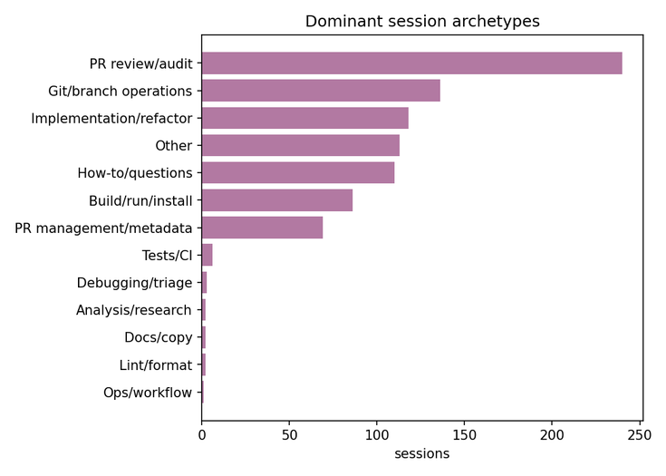

Dominant category per session (based on most frequent prompt category within the session):

| Dominant category       | Sessions | Share |
| ----------------------- | -------: | ----: |
| PR review/audit         |      333 | 21.5% |
| PR management/metadata  |       80 |  5.2% |
| Git/branch operations   |      270 | 17.4% |
| Implementation/refactor |      186 | 12.0% |
| Build/run/install       |      102 |  6.6% |
| Tests/CI                |        7 |  0.5% |
| Lint/format             |        2 |  0.1% |
| Debugging/triage        |        5 |  0.3% |
| Docs/copy               |        3 |  0.2% |
| Analysis/research       |        4 |  0.3% |
| How-to/questions        |      165 | 10.6% |
| Ops/workflow            |        1 |  0.1% |
| Other                   |      124 |  8.0% |

## Workflow flows (category sequences)

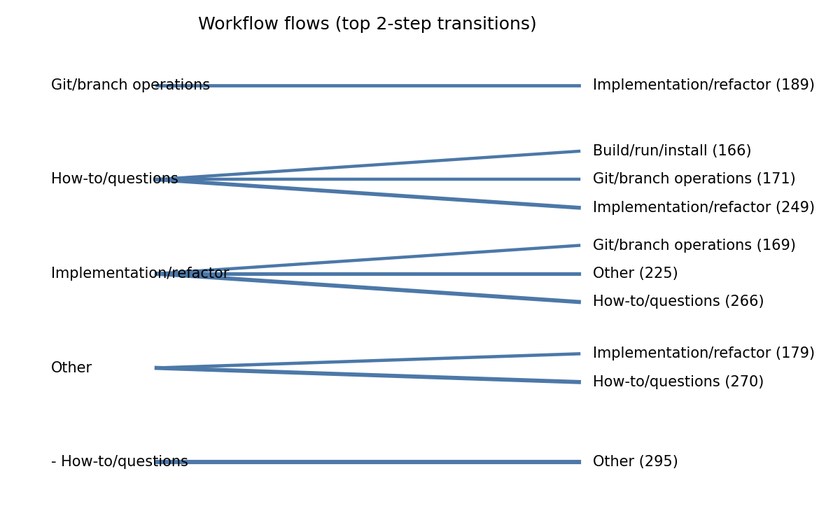

Common category sequences within multi-prompt sessions (consecutive duplicates collapsed). These labels refer to the
intent categories above: `impl_change` (implementation/refactor), `howto_question` (how-to/questions), `build_run`
(build/run/install), `git_branch` (git/branch operations), and `other` (uncategorized). A 2-step flow means two
successive intent categories in a session; a 3-step flow means three in order. The group-level flows are the same
sequences but using the broader intent clusters. For a visual view of these transitions, see
`docs/ai/richard_flow_dendrogram.png`.

Top 2-step flows:

- Implementation/refactor -> How-to/questions (371), How-to/questions -> Other (362), How- to/questions ->
  Implementation/refactor (349), Other -> How-to/questions (336), Implementation/refactor -> Other (282), Git/branch
  operations -> Implementation/refactor (280), Git/branch operations -> How-to/questions (266), Build/run/install ->
  How-to/questions (233), Implementation/refactor -> Git/branch operations (229), How-to/questions -> Git/branch
  operations (228), Other -> Implementation/refactor (179), How-to/questions -> Build/run/install (166)

Top 3-step flows:

- How-to/questions -> Other -> How-to/questions (124), Implementation/refactor -> How-to/questions ->
  Implementation/refactor (108), How-to/questions -> Implementation/refactor -> How-to/questions (100), Other ->
  How-to/questions -> Other (85), Implementation/refactor -> How-to/questions -> Other (83), Implementation/refactor ->
  Other -> Implementation/refactor (67), Other -> How- to/questions -> Implementation/refactor (64), How-to/questions ->
  Implementation/refactor -> Other (60), Implementation/refactor -> Other -> How-to/questions (58), Other ->
  Implementation/refactor -> Other (57), Other -> Implementation/refactor -> How-to/questions (46), How-to/questions ->
  Build/run/install -> Other (46)

Group-level flows (intent clusters):

- Coordination and code review -> Change-making -> Coordination and code review (188), Change-making -> Coordination and
  code review -> Change-making (150), Coordination and code review -> Other/uncategorized -> Coordination and code
  review (134), Coordination and code review -> How-to and workflow -> Coordination and code review (134), Coordination
  and code review -> Change-making -> How-to and workflow (130), Change-making -> How-to and workflow -> Change-making
  (115), How-to and workflow -> Other/uncategorized -> How-to and workflow (103), Coordination and code review ->
  Execution and validation -> Coordination and code review (89), Other/uncategorized -> How-to and workflow ->
  Other/uncategorized (85), How-to and workflow -> Coordination and code review -> How- to and workflow (83)

## Codebase focus (paths referenced in prompts)

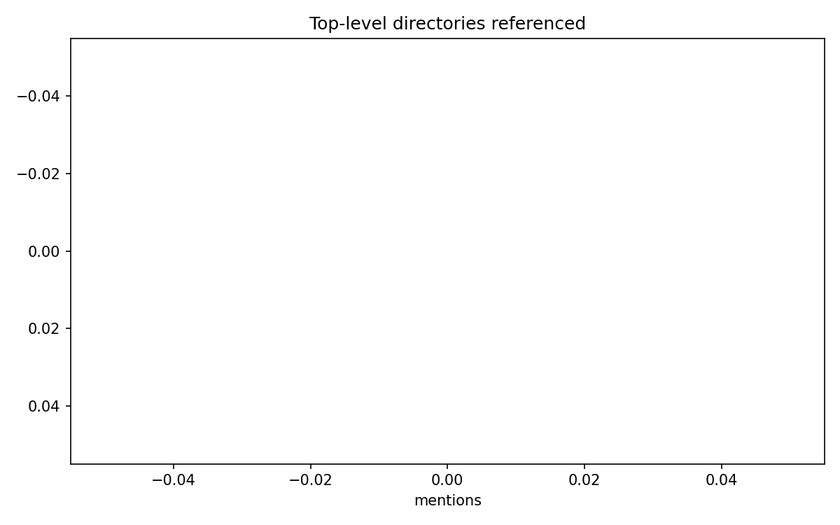

This is a proxy for where editing attention concentrates. It is based on file-path mentions inside prompts (repeats
counted), not on actual diffs.

- Prompts with at least one path: 3358 (30.6%)
- Total path mentions: 15174

Top-level directories referenced:

| Directory          | Mentions | Share |
| ------------------ | -------: | ----: |
| packages           |      958 | 31.3% |
| metta              |      503 | 16.4% |
| tests              |      450 | 14.7% |
| tools              |      188 |  6.1% |
| src                |      184 |  6.0% |
| train_dir          |      171 |  5.6% |
| agent              |      119 |  3.9% |
| recipes            |       99 |  3.2% |
| data               |       92 |  3.0% |
| devops             |       85 |  2.8% |
| docs               |       57 |  1.9% |
| common             |       50 |  1.6% |
| cogames            |       38 |  1.2% |
| mettagrid          |       36 |  1.2% |
| tribal_village_env |       29 |  0.9% |

Within `metta/` (subfolders, counts >= 3):

| Subfolder | Mentions | Share |
| --------- | -------: | ----: |
| rl        |      333 | 66.2% |
| tools     |       50 |  9.9% |
| cogworks  |       40 |  8.0% |
| sim       |       34 |  6.8% |
| packages  |        9 |  1.8% |
| devops    |        6 |  1.2% |
| setup     |        5 |  1.0% |
| utils     |        3 |  0.6% |
| metta     |        3 |  0.6% |

Within `packages/` (package names, counts >= 2):

| Package        | Mentions | Share |
| -------------- | -------: | ----: |
| mettagrid      |      415 | 43.3% |
| cogames        |      384 | 40.1% |
| tribal_village |       44 |  4.6% |
| codebot        |       32 |  3.3% |
| cortex         |       30 |  3.1% |
| pufferlib-core |       26 |  2.7% |
| alo            |       18 |  1.9% |
| gitta          |        2 |  0.2% |

## Flow diagrams (ASCII)

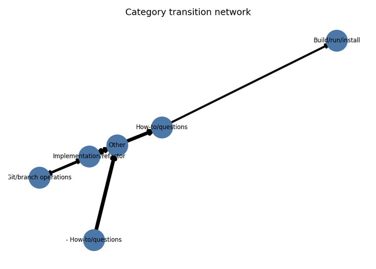

Text-only views of the most common flow patterns:

Top 2-step transitions (tree view):

```
How-to/questions
├─ Other (362)
├─ Implementation/refactor (349)
├─ Git/branch operations (228)
└─ Build/run/install (212)
Git/branch operations
├─ Implementation/refactor (280)
├─ How-to/questions (266)
├─ Other (222)
└─ Build/run/install (147)
Implementation/refactor
├─ How-to/questions (371)
├─ Other (282)
├─ Git/branch operations (229)
└─ Build/run/install (45)
Other
├─ How-to/questions (336)
├─ Implementation/refactor (223)
├─ Git/branch operations (199)
└─ Build/run/install (165)
Build/run/install
├─ How-to/questions (233)
├─ Git/branch operations (183)
├─ Other (171)
└─ Implementation/refactor (159)
```

Top 3-step transitions (path list):

```
How-to/questions -> Other -> How-to/questions (124)
Implementation/refactor -> How-to/questions -> Implementation/refactor (108)
How-to/questions -> Implementation/refactor -> How-to/questions (100)
Other -> How-to/questions -> Other (85)
Implementation/refactor -> How-to/questions -> Other (83)
Implementation/refactor -> Other -> Implementation/refactor (67)
Other -> How-to/questions -> Implementation/refactor (64)
How-to/questions -> Implementation/refactor -> Other (60)
Implementation/refactor -> Other -> How-to/questions (58)
Other -> Implementation/refactor -> Other (57)
Other -> Implementation/refactor -> How-to/questions (46)
How-to/questions -> Build/run/install -> Other (46)
```

Group-level transitions (path list):

```
Coordination and code review -> Change-making -> Coordination and code review (188)
Change-making -> Coordination and code review -> Change-making (150)
Coordination and code review -> Other/uncategorized -> Coordination and code review (134)
Coordination and code review -> How-to and workflow -> Coordination and code review (134)
Coordination and code review -> Change-making -> How-to and workflow (130)
Change-making -> How-to and workflow -> Change-making (115)
How-to and workflow -> Other/uncategorized -> How-to and workflow (103)
Coordination and code review -> Execution and validation -> Coordination and code review (89)
Other/uncategorized -> How-to and workflow -> Other/uncategorized (85)
How-to and workflow -> Coordination and code review -> How-to and workflow (83)
```

## Prompt composition and specificity

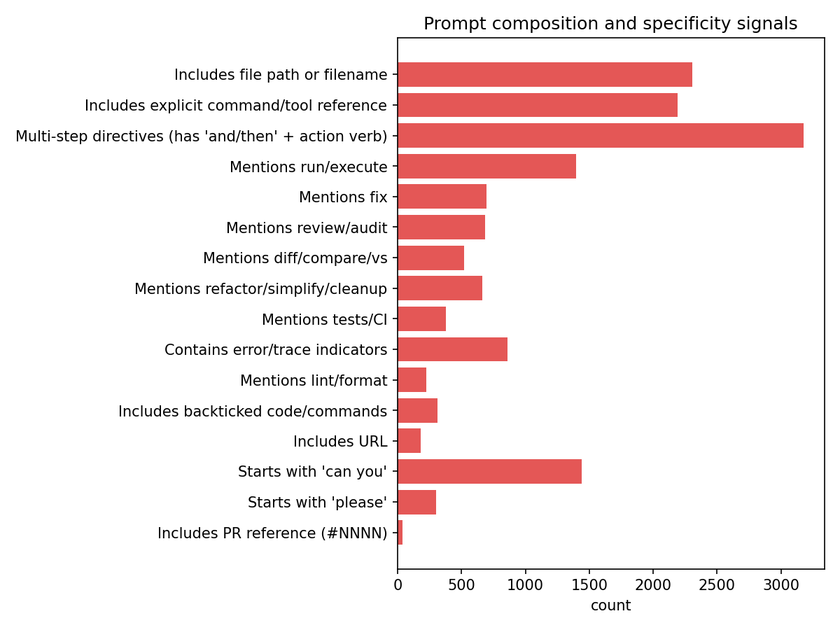

Heuristic indicators of prompt structure and specificity:

- Multi-step directives (has 'and/then' + action verb): 4083 (37.2%)
- Starts with 'can you': 1786 (16.3%)
- Starts with 'please': 376 (3.4%)
- Mentions review/audit: 910 (8.3%)
- Mentions diff/compare/vs: 690 (6.3%)
- Mentions run/execute: 1931 (17.6%)
- Mentions tests/CI: 634 (5.8%)
- Mentions lint/format: 411 (3.7%)
- Mentions fix: 1021 (9.3%)
- Mentions refactor/simplify/cleanup: 919 (8.4%)
- Includes file path or filename: 3358 (30.6%)
- Includes explicit command/tool reference: 3285 (30.0%)
- Includes URL: 244 (2.2%)
- Includes PR reference (#NNNN): 46 (0.4%)
- Includes backticked code/commands: 533 (4.9%)
- Contains error/trace indicators: 1002 (9.1%)

## Assistant response analysis

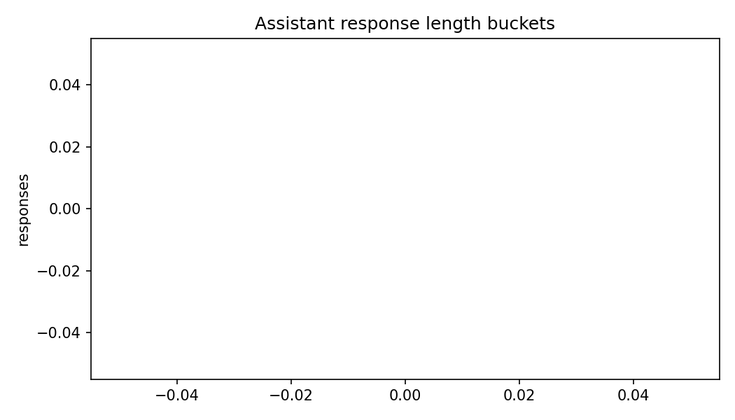

- Total assistant responses: 10008
- Response length: median 119.2 words (p25 71.0, p75 189.2, p90 282.9)

Response length buckets:

| Response length (words) | Count | Share |
| ----------------------- | ----: | ----: |
| <= 10                   |    35 |  0.3% |
| <= 25                   |   230 |  2.3% |
| <= 50                   |  1160 | 11.6% |
| <= 100                  |  2647 | 26.4% |
| <= 200                  |  3717 | 37.1% |
| <= 400                  |  1852 | 18.5% |
| > 400                   |   367 |  3.7% |

Assistant response content signals:

- Contains code fences: 1006 (10.1%)
- Contains diff/patch markers: 5 (0.0%)
- Contains bullet lists: 7283 (72.8%)
- Mentions tests not run: 444 (4.4%)
- Mentions tests run/passed: 374 (3.7%)

Change size proxy (based on number of file paths mentioned in a response):

- Small (0-1 files): 2621 (26.2%)
- Medium (2-4 files): 3600 (36.0%)
- Large (5+ files): 3787 (37.8%)

Large change responses by dominant session category (top categories):

| Dominant category       | Large responses | Share of large |
| ----------------------- | --------------: | -------------: |
| Git/branch operations   |             828 |          21.9% |
| How-to/questions        |             818 |          21.6% |
| Other                   |             696 |          18.4% |
| Implementation/refactor |             552 |          14.6% |
| Build/run/install       |             448 |          11.8% |

## Assistant failure modes and oversight signals

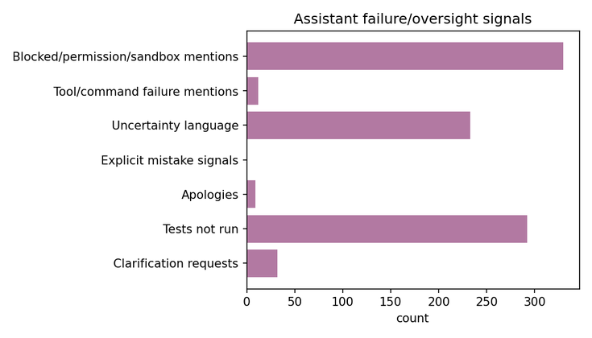

These counts capture explicit signals in assistant responses (self-reported uncertainty, inability, or incomplete
execution).

- Blocked/permission/sandbox mentions: 466 (4.7%)
- Tool/command failure mentions: 15 (0.1%)
- Uncertainty language: 389 (3.9%)
- Explicit mistake signals: 47 (0.5%)
- Apologies: 14 (0.1%)
- Tests not run: 444 (4.4%)
- Clarification requests: 37 (0.4%)

Interpretation: these are lower-bound indicators of oversight or friction because they rely on explicit self-reporting
in text. Actual misses are likely higher than these counts suggest.

## Category transitions within sessions

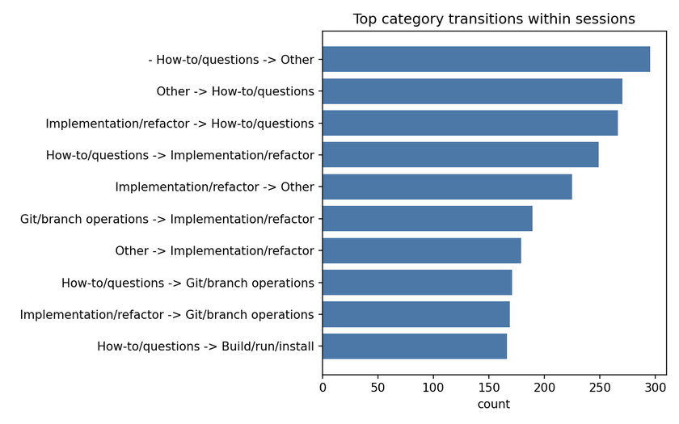

Most common transitions between prompt categories in multi-prompt sessions:

- Implementation/refactor -> How-to/questions (371), How-to/questions -> Other (362), How- to/questions ->
  Implementation/refactor (349), Other -> How-to/questions (336), Implementation/refactor -> Other (282), Git/branch
  operations -> Implementation/refactor (280), Git/branch operations -> How-to/questions (266), Build/run/install ->
  How-to/questions (233), Implementation/refactor -> Git/branch operations (229), How-to/questions -> Git/branch
  operations (228), Other -> Implementation/refactor (179), How-to/questions -> Build/run/install (166)

## Temporal trends

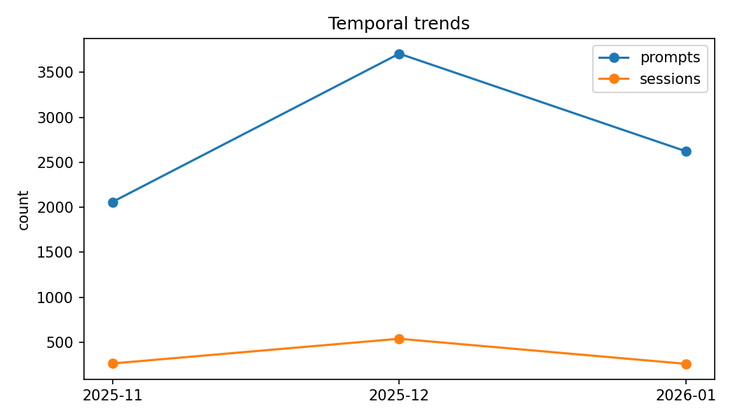

Prompt and session volume by month:

| Month   | Prompts | Sessions |
| ------- | ------: | -------: |
| 2025-09 |     927 |      125 |
| 2025-11 |    2512 |      371 |
| 2025-12 |    4484 |      631 |
| 2026-01 |    3044 |      327 |

- Note: 2026 data currently covers January only, so year-over-year comparisons are not like-for-like.

## Lexical themes (filtered prompts only)

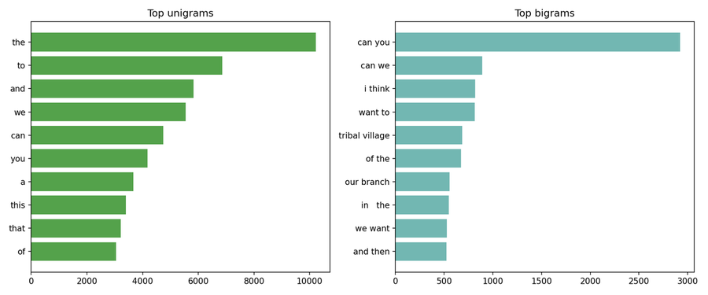

Lexical analysis was run on prompts <= 200 words to reduce skew from log dumps and large pasted outputs.

Top unigrams:

- the (13668), to (9434), and (7836), we (7460), can (6087), you (5425), a (4731), this (4688), that (4262), of (3915),
  in (1065), run (1035), metta (992), i (950), our (882), is (880), it (848), for (832), py (619), or (603)

Top bigrams:

- can you (3682), can we (1142), i think (1081), want to (1033), of the (868), our branch (756), tribal village (683),
  type annotations (348), user instructions (232), before committing (232), annotations to (232), workspace metta (207),
  in the (203), py line (194), line in (194), file workspace (188), metta rl (182), we can (180), uv run (162), in this
  (150)

## Tool and command mentions

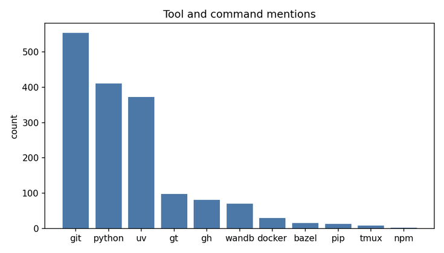

Commands/tools referenced in prompts (keyword match):

- git: 711, python: 605, uv: 589, gt: 104, wandb: 102, gh: 97, docker: 31, pip: 29, tmux: 21, bazel: 17, npm: 2

## Common prompt openers

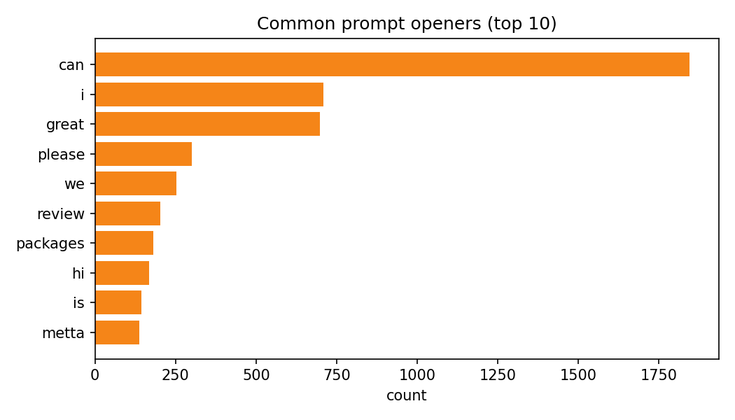

Top first words across prompts (alphabetic only):

- can (2310), i (926), great (827), please (377), we (349), review (293), hi (242), is (185), packages (182), user
  (123), this (61), metta (55), let (45), file (44), do (43), what (40), lets (39), are (39), no (29), how (29)

## Observed prompt archetypes

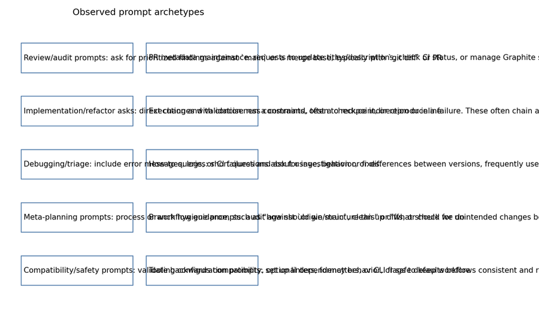

These describe common prompt shapes and the workflow intent behind them:

- Review/audit prompts: ask for prioritized findings against `main` or a merge base, typically with `git diff` or PR
  references.
- PR metadata maintenance: requests to update titles/descriptions, check CI status, or manage Graphite stacks. These are
  short, directive prompts.
- Implementation/refactor asks: direct changes with conciseness constraints, often to reduce indirection or inline
  helpers, sometimes accompanied by follow-up checks.
- Execution and validation: run a command, test a checkpoint, or reproduce a failure. These often chain actions (run +
  verify + summarize).
- Debugging/triage: include error messages, logs, or CI failures and ask for investigation or fixes.
- How-to queries: short questions about usage, behavior, or differences between versions, frequently used for quick
  clarification.
- Meta-planning prompts: process or workflow guidance, such as "how should we structure this" or "what should we do
  next".
- Branch hygiene prompts: audit against `origin/main`, clean up diffs, or check for unintended changes before merge.
- Compatibility/safety prompts: validate backwards compatibility, optional dependency behavior, or safe defaults before
  release.
- Tooling configuration prompts: set up linters, formatters, or CLI flags to keep workflows consistent and repeatable.

## Investigation patterns (more in-depth)

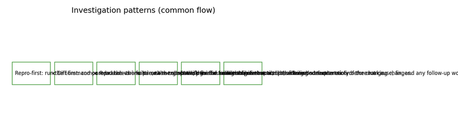

Common investigation flows that show up across sessions:

- Repro-first: run the command or reproduce the failure, then collect the minimal failing output.
- Diff-first: compare branch vs `main` or a merge base, then focus on changes that touch the failing surface area.
- Read-the-errors: parse the traceback/logs and trace to the first actionable frame.
- Narrow the scope: ask for the smallest file set or command to reduce uncertainty before making changes.
- Verify the fix: re-run the command, lint, or targeted test to confirm the change.
- Summarize impact: provide a short explanation of the root cause, fix, and any follow-up work.

## Prompt templates that match my usage

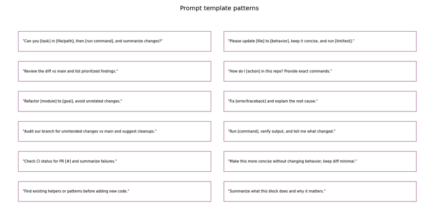

- "Can you [task] in [file/path], then [run command], and summarize changes?"
- "Please update [file] to [behavior], keep it concise, and run [lint/test]."
- "Review the diff vs main and list prioritized findings."
- "How do I [action] in this repo? Provide exact commands."
- "Refactor [module] to [goal], avoid unrelated changes."
- "Fix [error/traceback] and explain the root cause."
- "Audit our branch for unintended changes vs main and suggest cleanups."
- "Run [command], verify output, and tell me what changed."
- "Check CI status for PR [#] and summarize failures."
- "Make this more concise without changing behavior; keep diff minimal."
- "Find existing helpers or patterns before adding new code."
- "Summarize what this block does and why it matters."

## Claude Code usage (Metta workspaces)

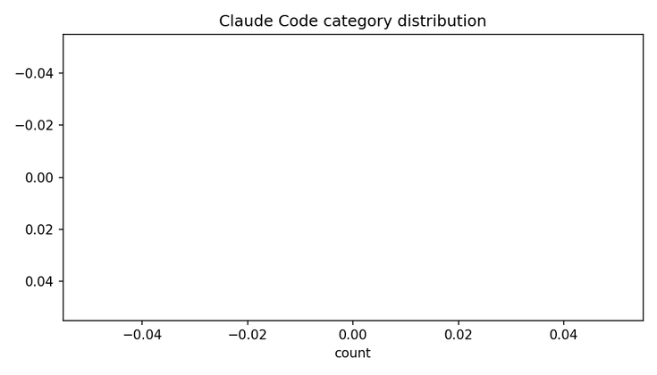

A small set of Claude Code sessions is present locally. This likely reflects partial retention or a reset/migration at
some point; older sessions may not be available on disk.

- Project session files scanned: 86
- Sessions detected: 29
- User prompts: 179
- Time span: 2025-11-22 to 2026-01-07
- Questions vs imperatives: 95 questions (53.1%) vs 84 imperatives (46.9%)
- Prompt length: median 24.5 words
- Prompts with explicit commands: 63 (35.2%)
- Prompts with file paths: 62 (34.6%)

## Limitations

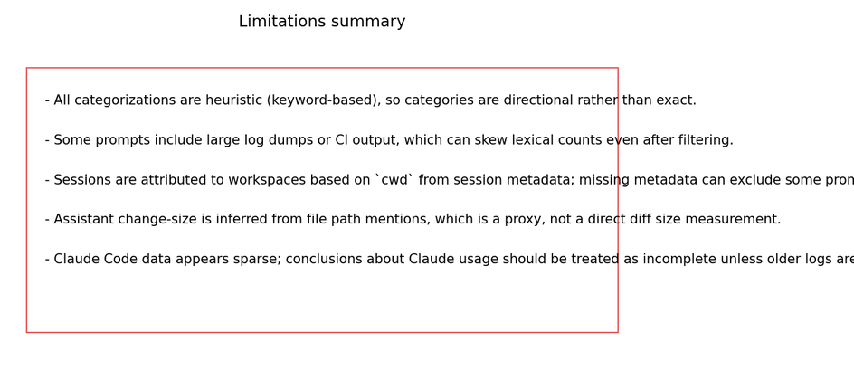

- All categorizations are heuristic (keyword-based), so categories are directional rather than exact.
- Some prompts include large log dumps or CI output, which can skew lexical counts even after filtering.
- Sessions are attributed to workspaces based on `cwd` from session metadata; missing metadata can exclude some prompts.
- Assistant change-size is inferred from file path mentions, which is a proxy, not a direct diff size measurement.
- Combined percentile metrics are weighted approximations because full prompt/response distributions from the prior
  machine are unavailable.
- Claude Code data appears sparse; conclusions about Claude usage should be treated as incomplete unless older logs are
  recovered.
