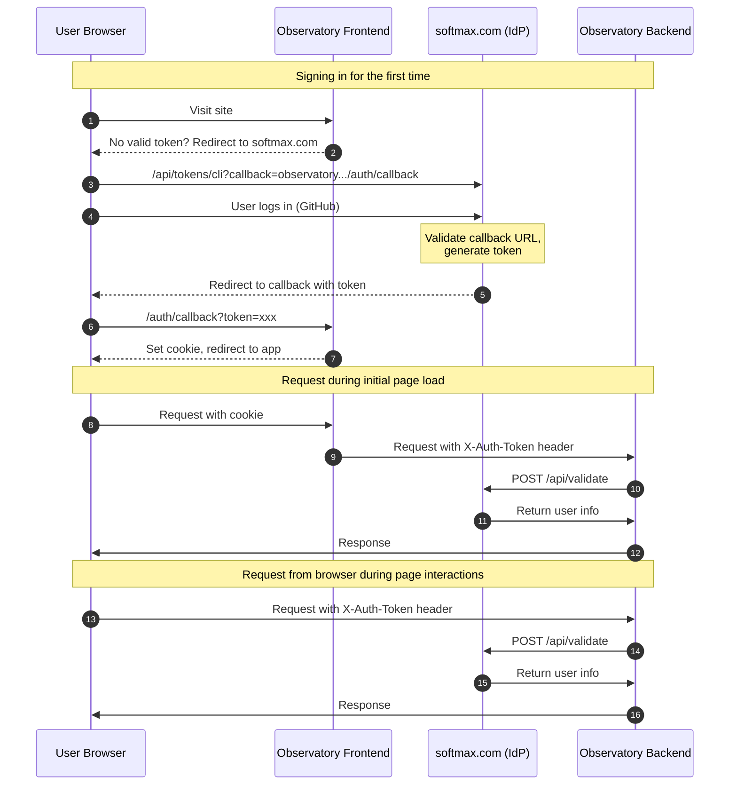
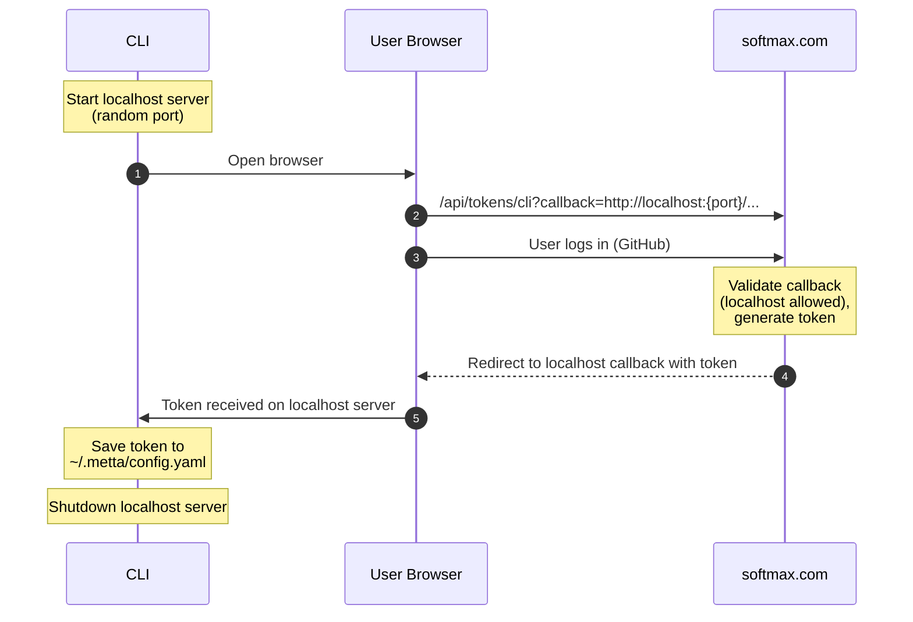
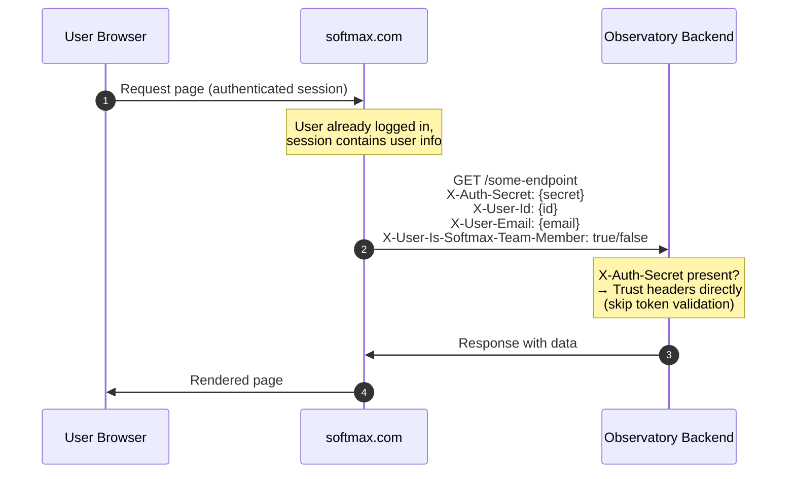

# Softmax Auth System

> **Status:** In Review **Author:** Slava **Created:** 2026-01-16

## Summary

The Softmax Auth System provides centralized authentication for internal services, CLI tools and public web apps on
softmax.com itself.

Users maintain a single account on softmax.com (currently via GitHub login), and internal services like Observatory can
authenticate users by issuing and validating tokens through softmax.com's API.

### Components

| Component                | URL                                          | Description                                                                                                   |
| ------------------------ | -------------------------------------------- | ------------------------------------------------------------------------------------------------------------- |
| **softmax.com**          | https://softmax.com                          | Identity provider. Hosts user database, GitHub OAuth login, and token management.                             |
| **Observatory Backend**  | https://api.observatory.softmax-research.net | Python API server. Validates tokens and enforces authorization. Also referred to as `app_backend` internally. |
| **Observatory Frontend** | https://observatory.softmax-research.net     | Web application (Next.js). Initiates browser auth flow.                                                       |
| **CLI**                  | User's machine or containerized deployments  | Python CLI tools such as `metta` and `cogames`. Stores credentials in `~/.metta/config.yaml`.                 |

## Identity Provider (softmax.com)

### Current Implementation

softmax.com uses [Auth.js](https://authjs.dev) (formerly NextAuth.js) for authentication. Currently, **GitHub is the
only supported login provider**.

The `isSoftmaxTeamMember` flag is determined by checking the user's membership in the Softmax GitHub organization during
login.

### Future Plans

- **Additional social logins:** Google and other OAuth providers may be added, allowing users to link multiple login
  methods to a single account.
- **Library migration:** The Auth.js team was recently acquired by [Better Auth](https://www.better-auth.com), so we may
  migrate to Better Auth in the future. Alternatively, we may move to a more robust solution like
  [Ory Hydra](https://www.ory.sh/hydra/) for a full OAuth2/OIDC server setup. This decision is still under evaluation.

## Authentication Flows

There are three authentication flows:

1. **Browser flow** - for the Observatory web app
2. **CLI flow** - for command-line tools
3. **Server-to-server flow** - for softmax.com pages that need Observatory data

The browser and CLI flows use token issuance and validation. The server-to-server flow uses a shared secret with trusted
headers.

### Browser Flow



### CLI Flow

This is used by the `metta` and `cogames` CLI tools to authenticate users.



### Server-to-Server Flow (softmax.com → Observatory Backend)

Some pages on softmax.com need to display data from the Observatory backend. Rather than issuing a token and validating
it (which would be redundant since softmax.com already knows who the user is), softmax.com passes user information
directly to the backend using trusted headers and a shared secret.



**Request Headers:**

| Header                          | Description                                                   |
| ------------------------------- | ------------------------------------------------------------- |
| `X-Auth-Secret`                 | Static shared secret (from `OBSERVATORY_AUTH_SECRET` env var) |
| `X-User-Id`                     | The authenticated user's ID                                   |
| `X-User-Email`                  | The user's email (may be empty string)                        |
| `X-User-Is-Softmax-Team-Member` | `"true"` or `"false"`                                         |

### Backend Authentication Logic

The Observatory backend checks authentication in this order:

1. **If `X-Auth-Secret` is present and valid:** Trust the `X-User-*` headers directly. No external validation call
   needed.
2. **Otherwise:** Fall back to standard token authentication—read the token from `X-Auth-Token` header (or cookie) and
   validate it via `POST softmax.com/api/validate`.

## Token Management

### Token Format

Tokens are **opaque strings** (not JWTs). They are stored SHA-256 hashed in the softmax.com database.

### Token Lifecycle

- **Issuance:** Via `softmax.com/api/tokens/cli` endpoint
- **Expiration:** Tokens do not currently expire
- **Revocation:** Users can revoke tokens from the softmax.com web UI (planned)
- **Refresh:** No refresh mechanism; users re-authenticate when needed

### Token Storage

| Client  | Storage Location                 | Notes                                                                        |
| ------- | -------------------------------- | ---------------------------------------------------------------------------- |
| Browser | Cookie: `observatory_auth_token` | Domain: `observatory.softmax-research.net`. Not HttpOnly (see Known Issues). |
| CLI     | `~/.metta/config.yaml`           | Plain text file on user's machine.                                           |

## API Endpoints

### Token Issuance

```
GET softmax.com/api/tokens/cli?callback={callback_url}
```

Initiates the authentication flow. After successful login, redirects to the callback URL with the token.

**Callback URL Validation:**

The callback URL must match one of:

- `localhost`
- `127.0.0.1`
- `*.softmax-research.net`

All other callback URLs are rejected with HTTP 400.

### Token Validation

```
POST softmax.com/api/validate
Authorization: Bearer {token}
```

**Response:**

```json
{
  "id": "user_123",
  "email": "alice@example.com",
  "name": "Alice Smith",
  "isSoftmaxTeamMember": true
}
```

The `email` and `name` fields may be `null`.

## Authorization Model

The Observatory backend uses the validated user info to enforce authorization:

| Route Type        | Requirement                                  |
| ----------------- | -------------------------------------------- |
| **Public**        | No authentication required                   |
| **Authenticated** | Any valid token (external users allowed)     |
| **Team-only**     | Valid token with `isSoftmaxTeamMember: true` |

Authorization checks happen in the backend after token validation. The `isSoftmaxTeamMember` flag is the primary
permission control, and is determined by the user's membership in the Softmax GitHub organization.

## Known Issues and Future Improvements

### Non-HttpOnly Cookie

The `observatory_auth_token` cookie is not marked HttpOnly. This is because the frontend JavaScript needs to read the
token to make direct API calls to `api.observatory.softmax-research.net`.

**Risk:** XSS vulnerabilities could allow token theft.

**Mitigation (planned):** Migrate API calls to go through the Next.js backend (server-side), allowing the cookie to be
HttpOnly.

### Not OAuth2/OIDC

We might adopt [oidc-provider](https://npmjs.com/package/oidc-provider), [hydra](https://github.com/ory/hydra) or a
similar lib on softmax.com to make the flow more standard.

### Faster Token Validation

Right now every request to the backend validates the token through softmax.com.

We might want to switch to JWT-based tokens and validate them locally. This puts more pressure on token expiration or
revocation, though, so it's not clear if it's worth it.

### No Service Accounts

Containerized jobs (e.g., scheduled tasks, batch processing) currently authenticate by reusing a personal token that we
stored manually as a Kubernetes secret. This is problematic for several reasons.

It could also be useful to have **scoped permissions**—some containerized jobs should only be able to call a subset of
Observatory backend routes, not the full API.

**Potential solutions:**

- **Service account tokens:** Create a new token type in softmax.com that represents a service rather than a user. These
  would have an associated identity (e.g., `jobs-watcher`) and explicit permission scopes.

- **JWTs with scopes:** If we move to JWT-based tokens, we could embed permission scopes directly in the token (e.g.,
  `scopes: ["observatory:read", "observatory:jobs:write"]`). The backend could validate these locally without hitting
  softmax.com on every request. This also makes short-lived tokens practical—a job could get a fresh JWT at startup that
  expires in an hour.

- **OAuth 2.0 Client Credentials flow:** A more standard approach would be to implement OAuth 2.0 with the Client
  Credentials grant. Each service would be registered as an OAuth client with specific allowed scopes. Services would
  exchange their client ID and secret for a short-lived access token.

## Quick Reference

| What                         | Where                                         |
| ---------------------------- | --------------------------------------------- |
| Token issuance               | `GET softmax.com/api/tokens/cli?callback=...` |
| Token validation             | `POST softmax.com/api/validate` (Bearer auth) |
| Server-to-server auth header | `X-Auth-Secret` + `X-User-*` headers          |
| Browser cookie name          | `observatory_auth_token`                      |
| CLI token storage            | `~/.metta/config.yaml`                        |
| User info fields             | `id`, `email`, `name`, `isSoftmaxTeamMember`  |
