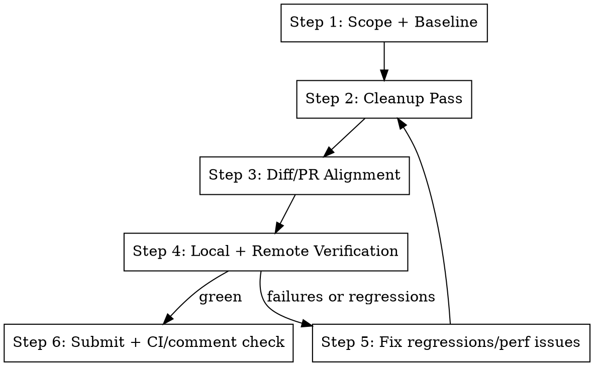

# Audit Cleanup Verify

## Overview

Run a focused cleanup loop for one slice (`training`, `dashboard`, `agent`, etc.): simplify meaningfully, keep scope
tight, and prove runtime behavior after cleanup.

**Announce at start:** "Running audit-cleanup-verify for `<focus_path>`: cleanup pass, then runtime verification."

## The Process



## Step 1: Scope + Baseline

Define a path scope and optional smoke command.

```bash
FOCUS="${FOCUS:-${1:-}}"
if [ -z "$FOCUS" ]; then
  echo "Usage: <focus_path> [smoke_cmd] [mettabox_host=metta3]"
  return 1 2>/dev/null || exit 1
fi
SMOKE_CMD="${SMOKE_CMD:-${2:-uv run ./tools/run.py recipes.experiment.cogsguard.train -- run=smoke.cleanup}}"
METTABOX_HOST="${METTABOX_HOST:-${3:-metta3}}"
BASE=$(git merge-base HEAD origin/main)
git diff --stat "$BASE"...HEAD -- "$FOCUS"
```

## Step 2: Cleanup Pass

Use `cb.cleanup-refactor` patterns only inside `FOCUS`.

- Delete backcompat shims/aliases/fallbacks.
- Remove one-use helpers and unnecessary indirection.
- Keep behavior unchanged.

```bash
rg -n "shim|compat|fallback|one_use|except Exception|dict.get\\(" "$FOCUS"
git diff --shortstat "$BASE"...HEAD -- "$FOCUS"
```

Aim for net simplification (fewer branches/helpers) unless a regression fix requires an increase.

## Step 3: Diff/PR Alignment

Ensure current diff still matches PR intent.

```bash
git diff "$BASE"...HEAD -- "$FOCUS"
git diff --name-only "$BASE"...HEAD
```

Use `cb.review-main` and refresh PR title/body via `pr.summary` if scope changed.

## Step 4: Local + Remote Verification

Run targeted tests first, then smoke runtime.

```bash
uv run pytest -q
$SMOKE_CMD
```

If requested, verify on mettabox/sandbox via `do.mettabox-ops`, then compare SPS/perf with a baseline run (`origin/main`
or no-teacher equivalent).

## Step 5: Fix Regressions/Perf Issues

If runtime fails or SPS regresses materially, apply a focused fix and loop back to Step 2.

## Step 6: Submit + CI/Comments Check

Before submit, run `cb.lint-fix`. Then submit and verify CI/comments are clean:

```bash
git add -A
gt modify --no-interactive || gt create -m "refactor: cleanup <focus_path>"
gt submit --no-interactive
```

Use `pr.check-ci` and address actionable comments before finalizing.

## Quick Reference

| Need              | Action                                         |
| ----------------- | ---------------------------------------------- |
| Focused cleanup   | `cb.cleanup-refactor` + `rg` in `<focus_path>` |
| Scope truth       | merge-base diff and `cb.review-main`           |
| Runtime proof     | local pytest + smoke run command               |
| Remote confidence | `do.mettabox-ops` run + SPS comparison         |
| Ship cleanly      | `cb.lint-fix`, submit, then `pr.check-ci`      |

## Integration

**Uses:**

- `cb.cleanup-refactor` for simplification patterns
- `cb.review-main` for diff audit against `origin/main`
- `do.mettabox-ops` for remote run/SPS verification
- `cb.lint-fix`, `pr.summary`, `pr.submit`, `pr.check-ci`

**Called by:**

- `cf.bop-it` and `pr.fix-branch` when cleanup + verification is requested

**Pairs with:**

- `t.run-tests` for progressive test coverage
