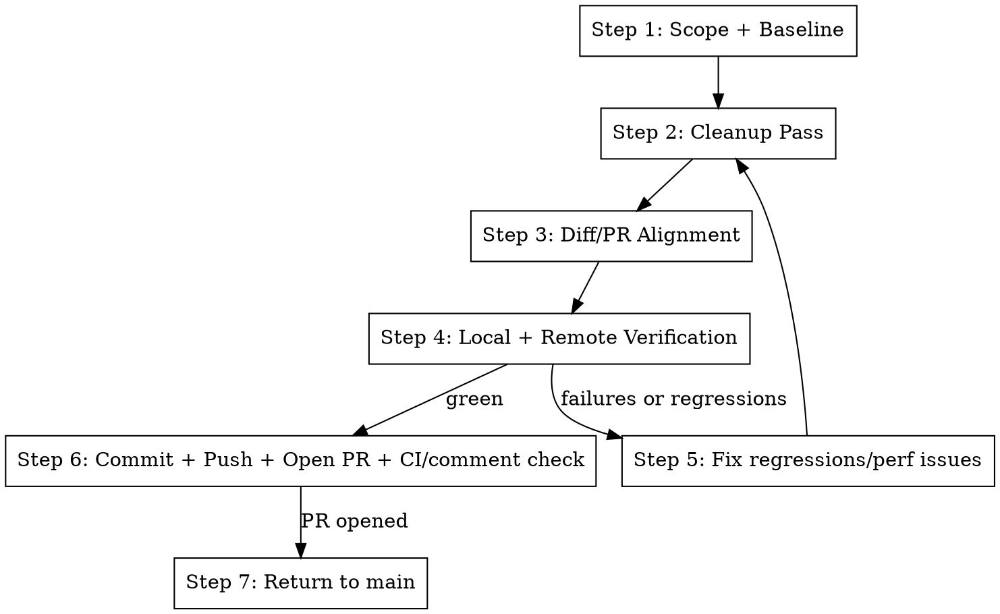

# Audit Cleanup Verify

## Overview

Run a focused cleanup loop for one slice (`training`, `dashboard`, `agent`, etc.): simplify meaningfully, keep scope
tight, and prove runtime behavior after cleanup.

Primary objective: net simplification in the focus path (lower LOC, fewer helper layers), with explicit removal of
backwards-compatibility and shim code.

This is a cleanup-scoped variant of bop-it: it is not done at green tests. It is done when the change is committed,
pushed, and opened as a PR with a sensible title/body, then the repo is returned to `main`.

**Announce at start:** "Running audit-cleanup-verify for `<focus_path>`: cleanup pass, then runtime verification."

## The Process



## Step 1: Scope + Baseline

Define a path scope and optional smoke command.

```bash
FOCUS="${FOCUS:-${1:-}}"
if [ -z "$FOCUS" ]; then
  echo "Usage: <focus_path> [smoke_cmd] [mettabox_host=metta3]"
  return 1 2>/dev/null || exit 1
fi
SMOKE_CMD="${SMOKE_CMD:-${2:-uv run ./tools/run.py recipes.experiment.cogsguard.train -- run=smoke.cleanup}}"
METTABOX_HOST="${METTABOX_HOST:-${3:-metta3}}"
BASE=$(git merge-base HEAD origin/main)
git diff --stat "$BASE"...HEAD -- "$FOCUS"
```

## Step 2: Cleanup Pass

Use `cb.cleanup-refactor` patterns only inside `FOCUS`.

- Delete backcompat shims/aliases/fallbacks and update all callsites to the new path.
- Remove one-use helpers and bad indirection layers (pass-through wrappers, alias helpers, unnecessary adapters).
- Reduce LOC in `FOCUS` whenever possible; net LOC should stay flat or decrease unless a regression fix requires extra
  lines.
- Keep behavior unchanged.
- Do not keep dual old/new paths.

```bash
rg -n "shim|compat|backward|legacy|alias|fallback|one_use|except Exception|dict.get\\(" "$FOCUS"
git diff --numstat "$BASE"...HEAD -- "$FOCUS" | awk '{add+=$1; del+=$2} END {print "Net LOC delta (add-del):", add-del}'
git diff --shortstat "$BASE"...HEAD -- "$FOCUS"
```

Aim for net simplification (fewer branches/helpers/layers and lower LOC) unless a regression fix requires an increase.

## Step 3: Diff/PR Alignment

Ensure current diff still matches PR intent.

```bash
git diff "$BASE"...HEAD -- "$FOCUS"
git diff --name-only "$BASE"...HEAD
rg -n "shim|compat|backward|legacy|fallbacks?" "$FOCUS"
```

Use `cb.review-main` and refresh PR title/body via `pr.summary` if scope changed. If shim/compat hits remain, remove
them or document why they are not code-path backcompat.

## Step 4: Local + Remote Verification

Run targeted tests first, then smoke runtime.

```bash
uv run pytest -q
$SMOKE_CMD
```

If requested, verify on mettabox/sandbox via `do.mettabox-ops`, then compare SPS/perf with a baseline run (`origin/main`
or no-teacher equivalent).

## Step 5: Fix Regressions/Perf Issues

If runtime fails or SPS regresses materially, apply a focused fix and loop back to Step 2.

## Step 6: Commit + Push + Open PR + CI/Comments Check

Before shipping, run `cb.lint-fix`.

Completion criteria for this step:

- Changes committed on a dedicated branch (not `main`)
- Branch pushed to remote
- PR opened with a clear cleanup-focused title and plain-English body
- CI status checked and actionable comments addressed (or documented)

Graphite flow:

```bash
git add -A
gt modify --no-interactive || gt create -m "refactor: cleanup <focus_path>"
gt submit --no-interactive
```

GitHub fallback flow (if Graphite tooling is unavailable):

```bash
git add -A
git commit -m "refactor: cleanup <focus_path>"
git push -u origin "$(git branch --show-current)"
gh pr create --base main --title "refactor: cleanup <focus_path>" --body "<plain-English summary + verification>"
```

Then run the bop-it shipping/polish step for this diff:

- Preferred: use `cf.bop-it` ship behavior for title/body polish.
- Minimum required: run `pr.summary`, then set a clear PR title and a plain-English PR body (what changed, why, and
  verification).

```bash
# Draft title/body from diff
# Use Skill tool: skill="pr.summary"

# Ensure final PR text is human-readable and scoped
gh pr edit --title "<clear cleanup title>" --body "<plain-English summary + verification>"
```

Use `pr.check-ci` and address actionable comments before finalizing.

## Step 7: Return to `main`

After the PR is open and checks are inspected, return local workspace to `main`:

```bash
git checkout main
```

If the skill created a worktree, finish with `wt.cleanup` after returning to `main`.

## Quick Reference

| Need              | Action                                         |
| ----------------- | ---------------------------------------------- |
| Focused cleanup   | `cb.cleanup-refactor` + `rg` in `<focus_path>` |
| Net LOC down      | `git diff --numstat` delta (target `<= 0`)     |
| Scope truth       | merge-base diff and `cb.review-main`           |
| Runtime proof     | local pytest + smoke run command               |
| Remote confidence | `do.mettabox-ops` run + SPS comparison         |
| Ship cleanly      | lint + commit + push + PR polish + CI + `main` |

## Integration

**Uses:**

- `cb.cleanup-refactor` for simplification patterns
- `cb.review-main` for diff audit against `origin/main`
- `do.mettabox-ops` for remote run/SPS verification
- `cb.lint-fix`, `pr.summary`, `pr.submit`, `pr.check-ci`
- `cf.bop-it` ship/polish behavior for clean PR title/body

**Called by:**

- `cf.bop-it` and `pr.fix-branch` when cleanup + verification is requested

**Pairs with:**

- `t.run-tests` for progressive test coverage
