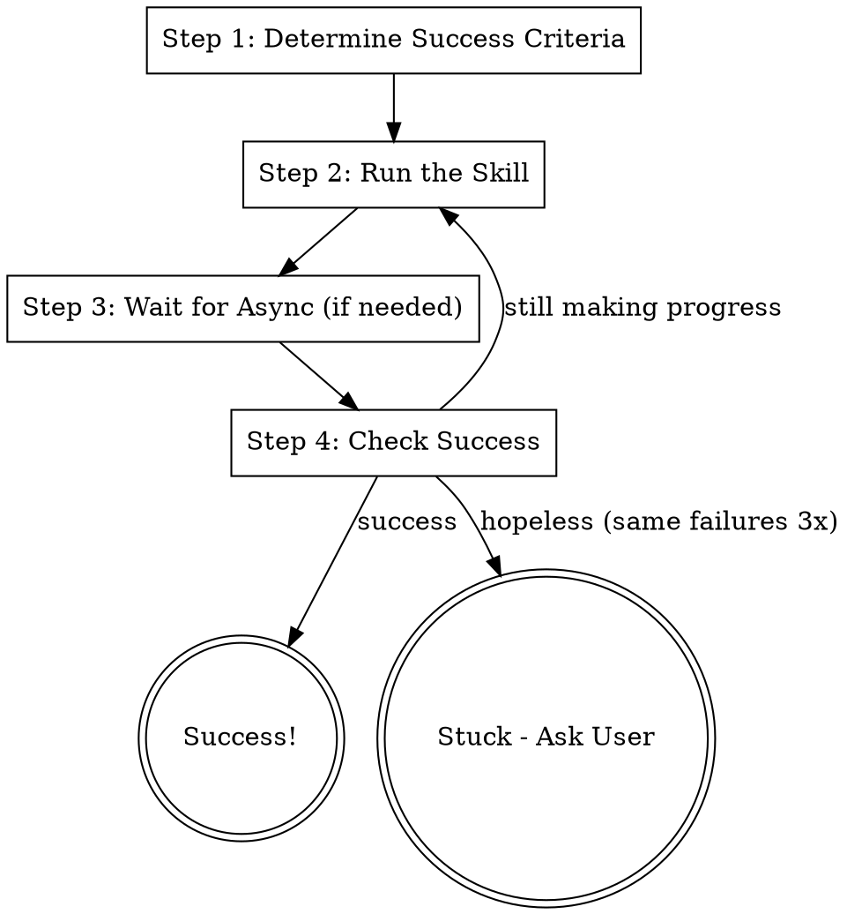

# Really - Run Until Success

## Overview

Run a skill repeatedly until it achieves its success condition. Keep going as long as progress is being made - only give
up when it's truly hopeless. Handles waiting for async processes (CI, deployments) between iterations.

**Usage:** `/cf.really /pr.fix-ci`, `/cf.really /pr.submit`, `/cf.really /pr.fix-branch`

**Announce at start:** "I'm using cf.really to run `<skill>` until it succeeds."

## The Process



## Step 1: Determine Success Criteria

Before running, identify what "success" means for the target skill. Use the table below for known skills, or infer from
the skill's purpose.

### Known Skills - Success Criteria & Async Waits

| Skill             | Success Condition                                      | Async Wait                               |
| ----------------- | ------------------------------------------------------ | ---------------------------------------- |
| `pr.fix-ci`       | All CI check-runs pass (via commit SHA)                | Wait for CI completion (poll check-runs) |
| `pr.fix-comments` | All PR review comments addressed                       | None                                     |
| `pr.fix-branch`   | Branch synced, restacked, comments addressed, CI green | Wait for CI completion                   |
| `pr.submit`       | Branch submitted and CI passes                         | Wait for CI completion                   |
| `st.fix-stack`    | All branches in stack have CI green                    | Wait for CI on each branch               |
| `pr.cool`         | No compat cruft remains, tests pass                    | None                                     |

### Unknown Skills - Infer Success

If the skill isn't in the table above:

1. **Read the skill** to understand its purpose
2. **Identify the end state** - what does "done" look like?
3. **Identify async processes** - does it trigger something that needs time?
4. **Define a check** - how can you verify the end state was reached?

Common patterns:

- **CI/CD skills:** Success = all checks pass on the current commit SHA
- **Code fix skills:** Success = specific tests/lints pass locally
- **Submission skills:** Success = PR created/updated and CI green
- **Sync skills:** Success = branch is up-to-date with trunk

## Step 2: Run the Skill

Invoke the target skill:

```
Use Skill tool: skill="<skill-name>", args="<skill-args>"
```

Track which iteration this is. Log what happened.

## Step 3: Wait for Async Processes

If the skill triggers an async process (CI, deployment, etc.), wait for it to complete before checking success.

### CI Wait Pattern (most common)

```bash
# Get the current HEAD (may have changed after skill ran)
HEAD_SHA=$(git rev-parse HEAD)
OWNER=$(gh repo view --json owner -q '.owner.login')
REPO=$(gh repo view --json name -q '.name')

# Poll until all checks complete
MAX_POLLS=60
POLL_INTERVAL=30

for i in $(seq 1 $MAX_POLLS); do
  sleep $POLL_INTERVAL

  STATUS=$(gh api repos/$OWNER/$REPO/commits/$HEAD_SHA/check-runs \
    --jq '{
      total: (.check_runs | length),
      in_progress: ([.check_runs[] | select(.status != "completed")] | length),
      failed: ([.check_runs[] | select(.conclusion == "failure")] | length),
      passed: ([.check_runs[] | select(.conclusion == "success")] | length)
    }')

  TOTAL=$(echo "$STATUS" | jq -r '.total')
  IN_PROGRESS=$(echo "$STATUS" | jq -r '.in_progress')

  if [ "$TOTAL" -gt 0 ] && [ "$IN_PROGRESS" -eq 0 ]; then
    echo "All $TOTAL checks complete."
    break
  fi

  echo "Poll $i: $IN_PROGRESS/$TOTAL still running..."
done
```

### No Async Wait

If the skill doesn't trigger async processes (e.g., `pr.cool`, `pr.fix-comments`), skip directly to Step 4.

## Step 4: Check Success

Evaluate whether the success criteria from Step 1 are met.

### CI-Based Success Check

```bash
HEAD_SHA=$(git rev-parse HEAD)
OWNER=$(gh repo view --json owner -q '.owner.login')
REPO=$(gh repo view --json name -q '.name')

FAILED=$(gh api repos/$OWNER/$REPO/commits/$HEAD_SHA/check-runs \
  --jq '[.check_runs[] | select(.conclusion == "failure")] | length')

if [ "$FAILED" -eq 0 ]; then
  echo "SUCCESS: All checks passing"
else
  echo "FAILED: $FAILED checks still failing"
fi
```

### Local Test Success Check

```bash
# Run relevant tests
metta pytest --changed -v
# Success = exit code 0
```

### PR Comments Success Check

```bash
# Check for unresolved review comments
PR_NUMBER=$(gh pr view --json number -q '.number')
UNRESOLVED=$(gh api repos/$OWNER/$REPO/pulls/$PR_NUMBER/comments \
  --jq '[.[] | select(.resolved == false or .resolved == null)] | length' 2>/dev/null || echo "0")
```

## Iteration Control

**No hard iteration cap.** Keep going as long as progress is being made. Only stop when it's hopeless.

### Progress Tracking

Between iterations, track:

1. **Failure count** - how many things are failing now vs last time?
2. **Failure identity** - are these the _same_ failures or _different_ ones?
3. **Trend** - is the situation improving, stable, or worsening?

Progress means ANY of:

- Fewer failures than before
- Different failures than before (old ones fixed, new ones uncovered)
- Partial fix (e.g., a test now gets further before failing)

### Keep Going If

| Situation                                    | Action                         |
| -------------------------------------------- | ------------------------------ |
| Fewer failures than last iteration           | Keep going - making progress   |
| Different failures (old fixed, new appeared) | Keep going - peeling the onion |
| First time seeing this failure               | Keep going - give it a shot    |
| Failure count same but errors are different  | Keep going - still moving      |

### Stop Only If Hopeless

| Situation                                                       | Action                               |
| --------------------------------------------------------------- | ------------------------------------ |
| Success criteria met                                            | Done! Report success.                |
| Exact same failures 3+ iterations in a row                      | Hopeless - stop, report what's stuck |
| Failures increasing for 3+ iterations straight                  | Getting worse - stop, report         |
| Skill crashes/errors (not the target failing, the skill itself) | Stop, report error                   |
| Infrastructure issue (CI runner down, network, OOM)             | Stop - not a code problem            |

## Completion Report

On success:

```
## Done!

- **Skill:** <skill-name>
- **Iterations:** {N}
- **Result:** All success criteria met
- **Details:** <specific to the skill>
```

On hopeless:

```
## Gave up after {N} iterations

- **Skill:** <skill-name>
- **Reason:** <why it's hopeless>
- **Stuck on:** <the failures that won't budge>
- **Progress made:** <what DID get fixed along the way>
- **Suggestion:** <what the user could try>
```

## Examples

### `/cf.really /pr.fix-ci`

1. Determine: success = all CI checks pass
2. Run `/pr.fix-ci` (fixes failures, submits)
3. Wait for CI to complete on new commit
4. Check: any failures remaining?
5. If yes, run `/pr.fix-ci` again
6. Repeat until green or hopeless

### `/cf.really /pr.submit`

1. Determine: success = branch submitted + CI green
2. Run `/pr.submit` (tests, cleans, submits)
3. Wait for CI to complete
4. Check: did submit succeed and CI pass?
5. If CI fails, run `/pr.submit` again (which will re-test and fix)
6. Repeat until green or hopeless

### `/cf.really /pr.fix-comments`

1. Determine: success = all comments addressed (no async)
2. Run `/pr.fix-comments` (reads comments, fixes, submits)
3. No async wait needed
4. Check: are all comments resolved?
5. If not, run again (maybe new comments appeared)
6. Repeat until clean or hopeless

## CRITICAL: Use Commit SHA for CI

Never use `gh pr checks` - it returns stale data. Always:

```bash
HEAD_SHA=$(git rev-parse HEAD)
gh api repos/$OWNER/$REPO/commits/$HEAD_SHA/check-runs
```

## Integration

**Wraps any skill** - acts as a retry/persistence layer.

**Replaces:**

- **pr.fix-ci-really** - Use `/cf.really /pr.fix-ci` instead

**Pairs with:**

- **systematic-debugging** - If same failure persists, may need deeper investigation
