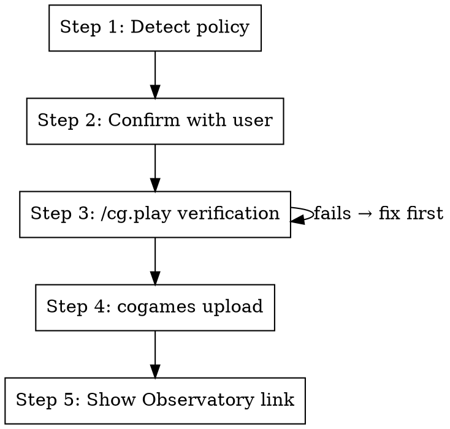

# CoGames Submit

Submit a scripted or trained policy to the CogsGuard tournament.

**Announce at start:** "Submitting policy to the CogsGuard tournament. Let me verify it works first."

## The Process



## Step 1: Detect Policy

Determine the policy from args or the current branch/working directory.

Run `uv run cogames policies` to list available short names. Default to `planky` if the branch touches planky files.

Derive defaults:

- **name**: `<git-username>.<short_name>` (e.g., `daveey.planky`)
- **season**: `beta-cvc` (the main active season; run `uv run cogames seasons` to list)

## Step 2: Confirm with User

Use AskUserQuestion to confirm/adjust:

- **Submission name** (default: `<user>.<policy>`)
- **Season** (default: `beta-cvc`, options from `cogames seasons`)

## Step 3: Verify with /cg.play

Run a headless play test for 1000 steps to verify the policy loads and runs well:

```bash
uv run cogames play --mission cogsguard_machina_1.basic \
  --policy "metta://policy/<short_name>" --render=none --steps=1000
```

If this fails, stop and fix before uploading.

After it completes, report the Episode Stats table (gear, reward) to the user.

## Step 4: Upload

Run from `packages/cogames-agents/`:

```bash
cd packages/cogames-agents
uv run cogames upload \
  -p "class=<full_class_path>" \
  -n "<name>" \
  --season <season> \
  --validation-mode docker \
  --include-files src/cogames_agents \
  --setup-script setup_script.py
```

Example:

```bash
cd packages/cogames-agents
uv run cogames upload \
  -p "class=cogames_agents.policy.scripted_agent.planky.policy.PlankyPolicy" \
  -n "daveey.planky" \
  --season beta-cvc \
  --validation-mode docker \
  --include-files src/cogames_agents \
  --setup-script setup_script.py
```

For **trained checkpoints**, use the checkpoint URI instead of the short name:

```bash
uv run cogames upload \
  -p "file://./train_dir/<run>/checkpoints" \
  -n "<name>" \
  --season <season> \
  --validation-mode docker
```

Use `--validation-mode docker` to validate the policy in a container matching the tournament environment.

## Step 5: Show Observatory Link

After upload succeeds, extract the version UUID so you can link directly to the policy page:

```bash
uv run cogames submissions --season <season> --policy <name> --json 2>/dev/null \
  | python3 -c "import sys,json; d=json.load(sys.stdin); print(d[0]['policy']['id'])"
```

The first entry in the JSON array is the most recent submission. Use its `policy.id` to construct the URL.

Show:

```
Policy page:  https://observatory.softmax-research.net/policies/versions/<version-uuid>
Check status: uv run cogames submissions --season <season>
Leaderboard:  uv run cogames leaderboard --season <season>
```

## Quick Reference

| Field         | Default                   | Override               |
| ------------- | ------------------------- | ---------------------- |
| Name          | `<git-user>.<policy>`     | User chooses           |
| Season        | `beta-cvc`                | From `cogames seasons` |
| Working dir   | `packages/cogames-agents` | -                      |
| Include-files | `src/cogames_agents`      | Explicit path          |
| Setup script  | `setup_script.py`         | Explicit path          |

## Integration

**Uses:** `cg.play` (pre-upload verification) **Pairs with:** `tr.cogames-command`, `cg.policy-dashboard`
