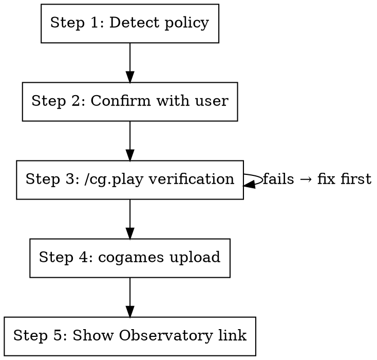

# CoGames Submit

Submit a scripted or trained policy to the CogsGuard tournament.

**Announce at start:** "Submitting policy to the CogsGuard tournament. Let me verify it works first."

## The Process



## Step 1: Detect Policy

Determine the policy from args or the current branch/working directory.

**For scripted agents**, resolve the short name to class path and source directory:

```bash
uv run cogames policies   # list available short names + class paths
```

The class path and include-files directory follow a pattern. For a policy with short_name `planky`:

- class: `cogames_agents.policy.scripted_agent.planky.policy.PlankyPolicy`
- include-files: `packages/cogames-agents/src/cogames_agents/policy/scripted_agent/planky`

For **trained checkpoints**, the policy arg is the checkpoint URI (e.g., `file://./train_dir/my_run/checkpoints`).

Derive defaults:

- **name**: `<git-username>.<short_name>` (e.g., `daveey.planky`)
- **season**: `beta-cvc` (the main active season; run `uv run cogames seasons` to list)

## Step 2: Confirm with User

Use AskUserQuestion to confirm/adjust:

- **Submission name** (default: `<user>.<policy>`)
- **Season** (default: `beta-cvc`, options from `cogames seasons`)

## Step 3: Verify with /cg.play

Run `/cg.play` with the policy to verify it loads and runs:

```bash
uv run cogames play --mission cogsguard_machina_1.basic \
  --policy "metta://policy/<short_name>" --render=none --steps=100
```

If this fails, stop and fix before uploading.

## Step 4: Upload

For **scripted agents** (source code submissions):

```bash
uv run cogames upload \
  -p "class=<class_path>" \
  -n "<name>" \
  --season <season> \
  --skip-validation \
  --include-files <source_dir>
```

Example:

```bash
uv run cogames upload \
  -p "class=cogames_agents.policy.scripted_agent.planky.policy.PlankyPolicy" \
  -n "daveey.planky" \
  --season beta-cvc \
  --skip-validation \
  --include-files packages/cogames-agents/src/cogames_agents/policy/scripted_agent/planky
```

For **trained checkpoints**:

```bash
uv run cogames upload \
  -p "file://./train_dir/<run>/checkpoints" \
  -n "<name>" \
  --season <season>
```

Use `--skip-validation` for scripted agents since we already verified in Step 3.

## Step 5: Show Observatory Link

After upload succeeds, show:

```
Tournament:   https://observatory.softmax-research.net/tournament/<season>
Check status: uv run cogames submissions --season <season>
Leaderboard:  uv run cogames leaderboard --season <season>
```

## Quick Reference

| Field         | Default                        | Override                               |
| ------------- | ------------------------------ | -------------------------------------- |
| Name          | `<git-user>.<policy>`          | User chooses                           |
| Season        | `beta-cvc`                     | From `cogames seasons`                 |
| Validation    | `--skip-validation` (scripted) | Omit flag for full isolated validation |
| Include-files | Auto from class path           | Explicit path                          |

## Integration

**Uses:** `cg.play` (pre-upload verification) **Pairs with:** `tr.cogames-command`, `cg.policy-dashboard`
