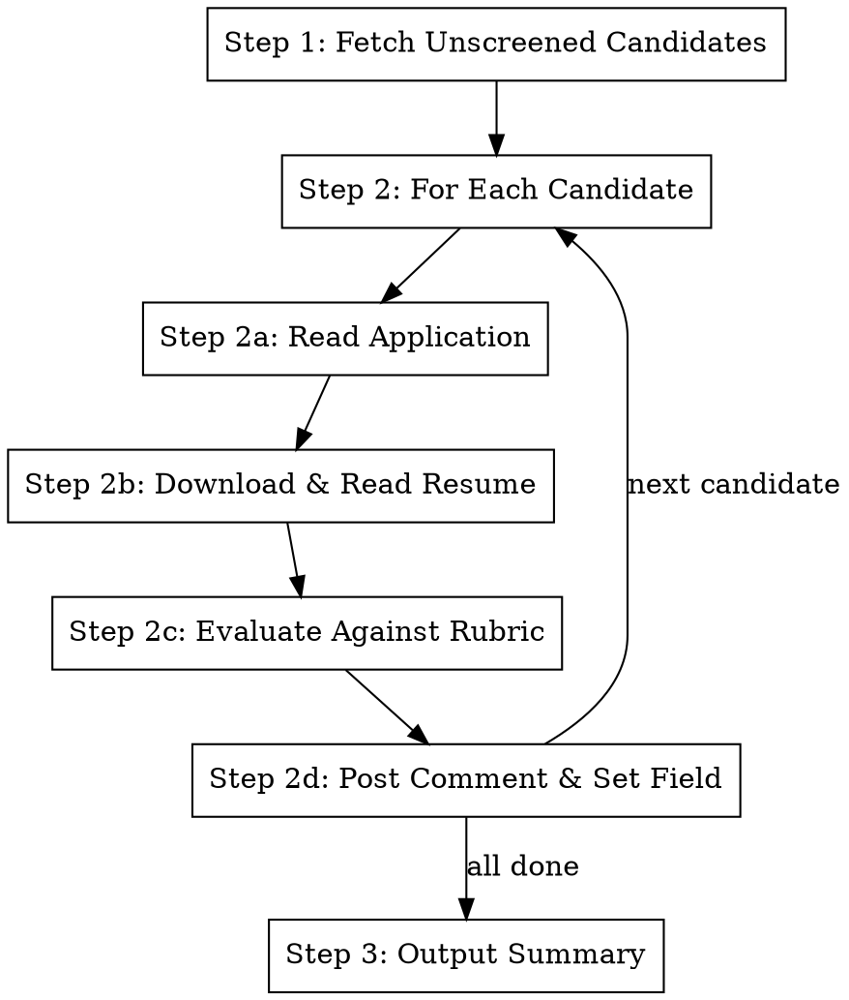

# Screen Resumes

## Overview

Screen new engineering candidates in the Asana "Hiring Pipeline - Engineers (MVP)" project. Fetches unscreened
candidates from the Resume Scan section, evaluates each against the rubric, posts a recommendation comment, and sets the
custom field.

**Core principle:** Fetch unscreened → Read application + resume → Evaluate against rubric → Post recommendation

**Announce at start:** "I'm screening new engineering candidates from the Asana hiring pipeline."

## Prerequisites

The `ASANA_TOKEN` environment variable must be set. If it is not set, stop and tell the user:

> `ASANA_TOKEN` is not set. Create a Personal Access Token at https://app.asana.com/0/developer-console and export it:
>
> ```bash
> export ASANA_TOKEN="your-token-here"
> ```

## Asana IDs

These are stable project-level identifiers:

| Resource                                          | GID                |
| ------------------------------------------------- | ------------------ |
| Project: Hiring Pipeline - Engineers (MVP)        | `1213177191803651` |
| Section: Resume Scan                              | `1213177191803657` |
| Custom field: Claude resume screen recommendation | `1213544906392353` |
| Field option: Advance                             | `1213544906392354` |
| Field option: Lean Advance                        | `1213544906392355` |
| Field option: Lean Reject                         | `1213544906392356` |
| Field option: Reject                              | `1213544906392357` |

## The Process



### Step 1: Fetch Unscreened Candidates

Get all tasks in the Resume Scan section, then filter to those without a Claude recommendation set.

```bash
# Get tasks in the Resume Scan section
curl -s -H "Authorization: Bearer $ASANA_TOKEN" \
  "https://app.asana.com/api/1.0/sections/1213177191803657/tasks?opt_fields=name,custom_fields,notes,permalink_url" \
  | python3 -c "
import json, sys
data = json.load(sys.stdin)
for task in data.get('data', []):
    # Check if Claude recommendation field is unset
    for cf in task.get('custom_fields', []):
        if cf['gid'] == '1213544906392353':
            if cf.get('enum_value') is None:
                print(f\"{task['gid']}\t{task['name']}\")
            break
"
```

If there is pagination (`next_page` in the response), follow `next_page.uri` to get all tasks.

If no unscreened candidates are found, report that and stop.

### Step 2: For Each Candidate

#### Step 2a: Read Application

Fetch the full task details. The application text (answers to "What work are you most proud of?", "Analytical rigor",
"Why Softmax?") is in the task notes.

```bash
curl -s -H "Authorization: Bearer $ASANA_TOKEN" \
  "https://app.asana.com/api/1.0/tasks/TASK_GID?opt_fields=name,notes,custom_fields,attachments,permalink_url"
```

#### Step 2b: Download & Read Resume

List attachments on the task, find the PDF resume, download it, and read it.

```bash
# List attachments
curl -s -H "Authorization: Bearer $ASANA_TOKEN" \
  "https://app.asana.com/api/1.0/tasks/TASK_GID/attachments?opt_fields=name,download_url"

# Download the PDF
curl -s -L -o /tmp/resume_TASK_GID.pdf "DOWNLOAD_URL"
```

Then use the **Read tool** to read the PDF (Claude can read PDFs natively):

```
Read tool: /tmp/resume_TASK_GID.pdf
```

**Important:** Always read both the application notes AND the resume before evaluating. Do not skip either.

#### Step 2c: Evaluate Against Rubric

Read the rubric:

```
Read tool: docs/resume-screen-rubric.md
```

Evaluate the candidate on all dimensions from the rubric:

1. Technical Caliber
2. AI/ML Relevance
3. Application Quality
4. Visa Status
5. Referral / Source Signal

Apply the decision framework to arrive at one of: **ADVANCE**, **LEAN ADVANCE**, **LEAN REJECT**, or **REJECT**.

#### Step 2d: Post Comment & Set Field

Post a structured comment on the Asana task:

```bash
curl -s -X POST -H "Authorization: Bearer $ASANA_TOKEN" \
  -H "Content-Type: application/json" \
  "https://app.asana.com/api/1.0/tasks/TASK_GID/stories" \
  -d '{
    "data": {
      "text": "Claude'\''s suggestion: RECOMMENDATION\n\nKey Signals:\n- Signal 1\n- Signal 2\n\nConcerns for Interviewer:\n- Concern 1\n\nRationale:\nBrief explanation."
    }
  }'
```

Set the custom field value:

```bash
# Map recommendation to enum option GID:
# ADVANCE       -> 1213544906392354
# LEAN ADVANCE  -> 1213544906392355
# LEAN REJECT   -> 1213544906392356
# REJECT        -> 1213544906392357

curl -s -X PUT -H "Authorization: Bearer $ASANA_TOKEN" \
  -H "Content-Type: application/json" \
  "https://app.asana.com/api/1.0/tasks/TASK_GID" \
  -d '{
    "data": {
      "custom_fields": {
        "1213544906392353": "ENUM_OPTION_GID"
      }
    }
  }'
```

### Step 3: Output Summary

After processing all candidates, output a summary table:

```
| Candidate | Recommendation | Key Signal |
|---|---|---|
| Name | ADVANCE | Top-tier org + relevant AI work |
| Name | REJECT | Generic application, no AI connection |
```

Include the total count: "Screened X candidates: Y advanced, Z rejected."

## Important Notes

- **Protect against missing great candidates, but reject merely good ones.** Given application volume, the bar is "this
  person might be great," not "this person might be fine." If your reaction is "maybe they're okay," that's a reject.
- **One strong signal is enough to advance -- but it must be concrete.** Jargon and self-promotion are not signals.
  "Worked on AI" means nothing; "built a neuroevolution pipeline" or "published at NeurIPS" is a signal.
- **Always read both application AND resume.** Do not evaluate based on only one.
- **The "proud of" question is often the most revealing.** A great story about building something novel can outweigh a
  thin resume.
- **Watch for templated applications.** If answers are generic or match patterns seen in other applications, flag it.
- **Watch for jargon without substance.** Resumes that are heavy on AI buzzwords but light on concrete technical
  accomplishments should be rejected. Look for what they actually built and invented, not what terminology they used.
- **Do NOT penalize unconventional backgrounds** if the candidate demonstrates exceptional ability through other means.
- **LEAN ADVANCE is not a parking spot for uncertainty.** There must be a specific positive signal worth exploring in a
  call. If you can't name what the interviewer should probe, it's a LEAN REJECT.

## Integration

**References:**

- `docs/resume-screen-rubric.md` -- evaluation criteria and calibration examples
