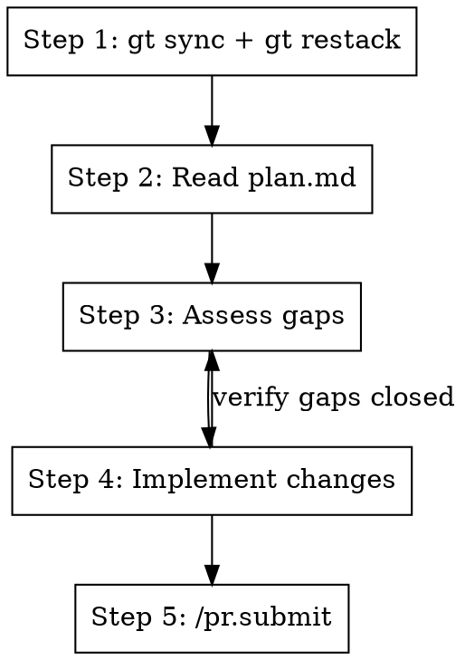

# Conform Branch to Plan

## Overview

Make the current branch's code match its `plan.md` design document, then lint, submit, and test. Always syncs and
restacks first.

**Announce at start:** "Conforming branch to its plan.md."

## The Process



## Step 1: Sync and Restack

```bash
gt sync --no-interactive
gt restack
```

If restack has conflicts, resolve them before continuing.

## Step 2: Read the Plan

```bash
BRANCH=$(gt branch current 2>/dev/null || git branch --show-current)
```

Read `plan.md` (or `PLAN.md`, `docs/plans/*.md`) from the branch root. The plan describes the intended code changes for
this branch.

## Step 3: Assess Gaps

Compare the plan against the actual code on the branch:

1. Read every file the plan mentions or implies changes to
2. Check `gt diff` to see what's already been done
3. Build a list of **gaps** — things the plan says should exist but don't, or things that exist but don't match the plan

Report the gaps to the user before implementing:

```
## Gaps found
- [ ] <file>: <what's missing or wrong>
- [x] <file>: <already matches plan>
```

## Step 4: Implement Changes

For each gap, make the code match the plan:

- Follow the plan's design decisions exactly — don't freelance
- If the plan is ambiguous, ask the user
- If the plan conflicts with existing code patterns, follow the plan (the plan is the spec)

After implementing, re-read the changed files and verify each gap is closed. Loop back to Step 3 if gaps remain.

## Step 5: Submit

Invoke `/pr.submit` to handle lint, commit, submit to Graphite, and run tests:

```
Use Skill tool: skill="pr.submit"
```

This handles the full flow: `/pr.cool` → disabled tests → `/cb.lint-fix` → `gt modify` → `gt submit` →
`metta pytest --changed` → fix and re-submit if needed.

## Quick Reference

| Step | Action         | Command / Skill                           |
| ---- | -------------- | ----------------------------------------- |
| 1    | Sync + restack | `gt sync --no-interactive` + `gt restack` |
| 2    | Read plan      | Read `plan.md`                            |
| 3    | Find gaps      | Compare plan vs code                      |
| 4    | Implement      | Edit code to match plan                   |
| 5    | Submit         | `/pr.submit`                              |

## Integration

**Uses:**

- **pr.submit** — Lint, commit, submit, test (Step 5)

**Called by:**

- Can be used with **st.fix-stack** style orchestration to conform an entire stack

**Pairs with:**

- **pr.fix-branch** — For branches driven by PR comments instead of plans
- **cb.lint-fix** — Called transitively via pr.submit
