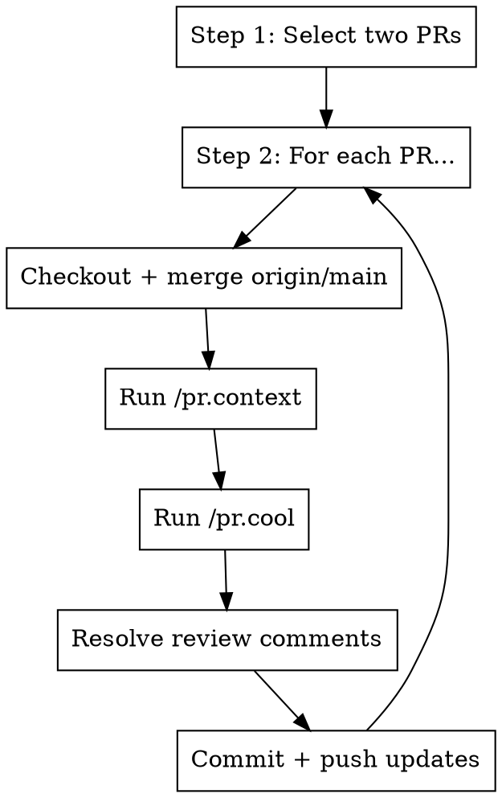

# Context + Cool Sweep

## Overview

Run a repeatable cleanup pass on two open PRs authored by the current user. Core principle: pick two PRs by prefix, sync
with main, capture context, clean up, resolve comments, and push updates.

**Announce at start:** "Running the context+cool sweep for two user-authored PRs."

## The Process



## Step 1: Select Two PRs (Optional Prefix)

- If a prefix is provided (e.g., `feat` or `cogames`), choose two PRs whose **titles start with that prefix**.
- If no prefix is provided, choose any two open PRs authored by the current user (`@me` in gh).
- If fewer than two matching PRs exist, ask the user how to proceed.

```bash
PREFIX="${1:-}"

gh pr list --author @me --state open --json number,title,headRefName \
  -q '.[] | "\(.number)\t\(.title)\t\(.headRefName)"' \
  | (if [ -n "$PREFIX" ]; then rg "^\\d+\\t$PREFIX"; else cat; fi) \
  | head -n 2
```

Record the two PR numbers and branch names from the output.

## Step 2: Process Each PR (First, Then Second)

For each selected PR, in order:

1. **Checkout + merge main**

   ```bash
   gh pr checkout <PR_NUMBER>
   git fetch origin
   git merge origin/main
   ```

2. **Gather context**

   ```
   /pr.context
   ```

3. **Clean up compat/defensive code**

   ```
   /pr.cool
   ```

   If `pr.cool` uses a worktree, continue the remaining steps in that worktree.

4. **Resolve review comments if present**

   If the PR has review threads or change requests, invoke:

   ```
   /pr.fix-comments
   ```

5. **Commit and push**

   ```bash
   git add -A
   gt modify --no-interactive
   git push
   ```

   If there is no existing commit to amend, create one first and include the required co-author footer.

6. **Verify clean state**

   ```bash
   git status -sb
   ```

Repeat Step 2 for the second PR.

## Quick Reference

| Step     | Command                                    | Purpose                      |
| -------- | ------------------------------------------ | ---------------------------- |
| List PRs | `gh pr list --author @me --state open ...` | find candidates              |
| Checkout | `gh pr checkout <PR>`                      | switch to PR branch          |
| Sync     | `git merge origin/main`                    | merge main into PR           |
| Context  | `/pr.context`                              | build context brief          |
| Cleanup  | `/pr.cool`                                 | remove compat/defensive code |
| Comments | `/pr.fix-comments`                         | resolve review threads       |
| Push     | `gt modify` + `git push`                   | update PR                    |

## Integration

**Uses:** pr.context, pr.cool, pr.fix-comments **Pairs with:** pr.check-ci, pr.fix-ci, pr.sync-main
