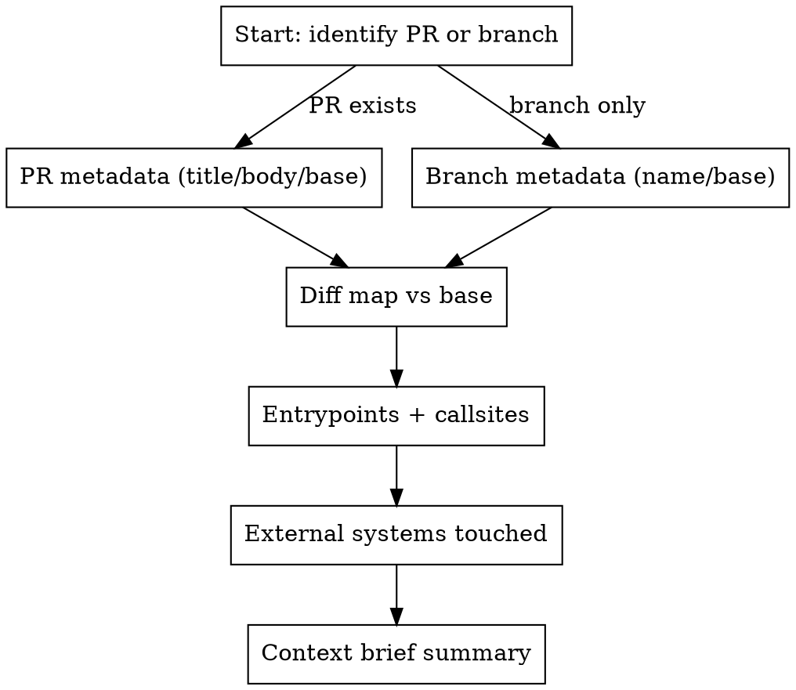

# PR Context

## Overview

Build a structured technical context brief for an existing PR or branch before making edits. Core principle: diff-first,
then trace entrypoints/callsites and external systems.

**Announce at start:** "Gathering PR context (diff, entrypoints, systems) before editing."

## The Process



## Step 1: Identify Target + Base

- Determine PR number/URL or use current branch.
- Prefer PR metadata when available; otherwise use branch name.

```bash
git status -sb

gh pr view <PR> --json number,title,body,baseRefName,headRefName -q \
  '"\(.number) \(.title)"\nbase=\(.baseRefName) head=\(.headRefName)\n\(.body)'
```

If `gh` is unavailable or PR is not open, use the current branch:

```bash
git branch --show-current
```

## Step 2: Build the Diff Map

```bash
git fetch origin
base=$(git merge-base HEAD origin/main)

git diff --stat "$base"
git diff --name-only "$base"
git log --oneline "$base"..HEAD
```

For key files, capture focused diffs:

```bash
git diff "$base" -- path/to/file.py
```

## Step 3: Entrypoints + Callsites

- List changed symbols, then find who calls them.
- Identify entrypoints (CLI, services, scripts, tests, config).

```bash
rg -n "^(def|class|fn|proc)\s" path/to/changed_file
rg -n "<SymbolName>" -g "*.{py,ts,rs,go,nim,cpp,js,tsx}" .
rg -n "__main__|main\(|entrypoint|cli|Command\(" .
```

Summarize the call chains: entrypoint → module → function/class.

## Step 4: External Systems Touched

Scan for integrations and side effects (network, storage, DB, telemetry):

```bash
rg -n "s3|aws|http|grpc|sql|redis|kafka|wandb|observatory" path/to/changed_dir
```

Note config files or env vars that change behavior.

## Step 5: Produce the Context Brief

Output a concise, structured brief (no code changes):

- **PR/Branch metadata:** title, base, merge-base SHA, commit count
- **Change map:** top-level directories + key files
- **Behavioral summary:** what changes do, not how to implement
- **Entrypoints & call chains:** where code is invoked
- **Systems touched:** external services, storage, DB, telemetry
- **Tests/CI notes:** tests changed or recommended
- **Open questions:** missing context to confirm before editing

## Quick Reference

| Step      | Command                           | Output                  |
| --------- | --------------------------------- | ----------------------- |
| Target    | `gh pr view ...`                  | PR title/body/base/head |
| Base      | `git merge-base HEAD origin/main` | merge-base SHA          |
| Diff map  | `git diff --stat $base`           | change surface          |
| Callsites | `rg -n <Symbol>`                  | callers/entrypoints     |
| Systems   | `rg -n "s3\|aws\|http\|..."`      | integrations touched    |
| Brief     | (summarize)                       | context report          |

## Integration

**Uses:** (none)  
**Called by:** (none)  
**Pairs with:** cb.review-main, pr.summary, pr.check-ci, pr.address-review
