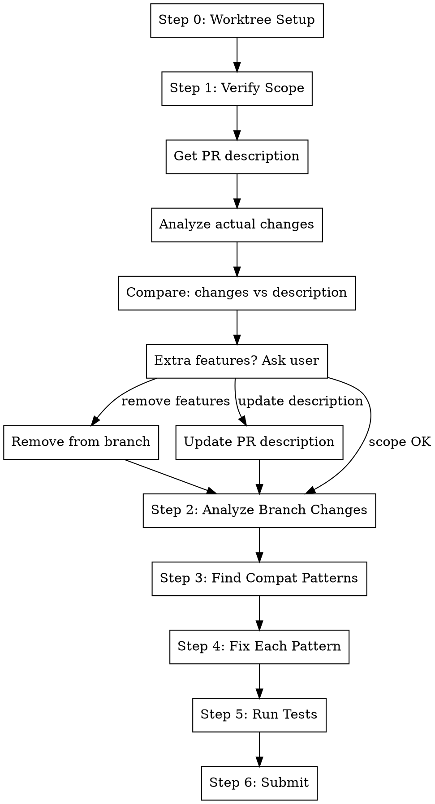

# Cool (Clean Out Old Leftovers)

## Overview

Analyze a branch and clean it up. **Works in a git worktree by default** for isolation.

1. **Scope check** - Verify only features in the PR description are in the branch
2. **Compat cleanup** - Remove backwards compatibility code, fix callsites
3. **Assert over fallback** - Replace defensive fallbacks with assertions

**Core principle:** Worktree → Verify scope → Delete compat code → Fix callsites → Assert don't fallback

**Announce at start:** "I'm using the cool skill to verify scope and clean up this branch."

## The Process



## Step 0: Worktree Setup (Default)

By default, work in an isolated git worktree. **Skip if already in worktree** (e.g., called from /pr.submit).

```bash
BRANCH=$(git branch --show-current)
WORKTREE_PATH=$(git worktree list --porcelain | grep -B2 "branch refs/heads/$BRANCH" | grep "worktree " | cut -d' ' -f2)

# Check if already in a worktree for this branch
if [ "$(pwd)" = "$WORKTREE_PATH" ]; then
  echo "Already in worktree for $BRANCH - skipping setup"
else
  # Ask user (with worktree as default)
  # If yes: create/reuse worktree, cd into it
  # If no: continue in current directory
fi
```

**If using worktree:** Follow `using-git-worktrees` skill - find/create `.worktrees/$BRANCH`, verify ignored, run
project setup.

## Step 1: Verify Scope

Check that the branch only contains features described in the PR.

### 1a: Get PR Description

```bash
# Get PR number and description
PR_NUMBER=$(gh pr view --json number -q '.number')
gh pr view --json title,body -q '"\(.title)\n\n\(.body)"'
```

**Extract the intended scope:**

- What features/changes does the PR claim to make?
- What files/components should be affected?
- Any explicit "out of scope" mentions?

### 1b: Analyze Actual Changes

```bash
# Get current branch
BRANCH=$(git branch --show-current)

# See what changed on this branch vs main
git diff main..HEAD --name-only

# Get commit messages
git log main..HEAD --oneline

# Get the full diff summary
git diff main..HEAD --stat
```

**Categorize each change:**

- What features does each change implement?
- Group changes by feature/concern

### 1c: Compare Scope

**For each feature in the branch, check:**

- Is it mentioned in the PR description?
- Is it a necessary dependency of something mentioned?
- Is it a small cleanup that doesn't warrant mention?

**Features that need attention:** | Change | In PR Description? | Action Needed |
|--------|-------------------|---------------| | Feature A | Yes | None | | Feature B | No - unrelated | Ask user | |
Refactor C | No - but small cleanup | Usually OK |

### 1d: Ask User About Extra Features

**If features exist that aren't in the PR description:**

Present the situation:

```
## Scope Check

The PR description says:
> "{PR title}: {summary of described changes}"

But the branch also contains:
1. **{Feature X}** - Changes to {files}
   - {description of what it does}

2. **{Feature Y}** - Changes to {files}
   - {description of what it does}

These aren't mentioned in the PR description.
```

**Use AskUserQuestion** with options:

1. **Remove from branch** - Revert these changes, keep for a separate PR
2. **Update description** - Add these features to the PR description
3. **They're fine** - Minor changes that don't need explicit mention

### 1e: Handle User Decision

**If "Remove from branch":**

```bash
# For each file to remove
git checkout main -- path/to/file.py

# Or for partial changes, manually revert specific hunks
git checkout -p main -- path/to/file.py

# Stage the reversions
git add -A
```

**If "Update description":**

```bash
# Get current PR body
CURRENT_BODY=$(gh pr view --json body -q '.body')

# Update with new content
gh pr edit $PR_NUMBER --body "$(cat <<'EOF'
{Updated PR description including the extra features}
EOF
)"
```

**If "They're fine":** Proceed to Step 2.

---

## Step 2: Analyze for Compat Patterns

```bash
# See what changed on this branch vs main
git diff main..HEAD --name-only

# Get the full diff
git diff main..HEAD
```

Look for patterns that suggest backwards compatibility:

- New names alongside old names
- Aliases or re-exports
- `# deprecated` or `# backwards compat` comments
- Fallback logic with `or`, `if x is None`, `getattr(..., default)`

## Step 3: Find Compat Patterns

### Pattern: Class/Function Aliases

```python
# BEFORE: Alias for backwards compatibility
class NewClassName:
    pass

OldClassName = NewClassName  # DELETE THIS

# Also check for:
from .new_module import NewThing as OldThing  # DELETE THIS
```

**Search for these:**

```bash
# Find alias assignments
grep -rn "= [A-Z][a-zA-Z]*$" --include="*.py" | grep -v "^#"

# Find re-exports with old names
grep -rn "as Old\|as _\|# compat\|# deprecated\|# backwards" --include="*.py"
```

### Pattern: Defensive Fallbacks

```python
# BEFORE: Fallback that hides bugs
value = config.get("key") or default_value
value = getattr(obj, "attr", fallback)
value = x if x is not None else fallback

# AFTER: Assert and fail fast
value = config["key"]  # Will raise if missing
value = obj.attr  # Will raise if missing
assert x is not None
value = x
```

**Search for these:**

```bash
# Find or-fallbacks
grep -rn " or \(default\|fallback\|None\|\[\]\|{}\|''\|0\)" --include="*.py"

# Find getattr with defaults
grep -rn "getattr(.*,.*," --include="*.py"

# Find None checks with fallbacks
grep -rn "if .* is None:" --include="*.py"
```

### Pattern: Compatibility Shims

```python
# BEFORE: Shim wrapping new behavior
def old_function(*args, **kwargs):
    # Convert to new format
    return new_function(convert(args), **kwargs)

# AFTER: Just use new_function directly at callsites
```

**Search for these:**

```bash
# Find functions that just wrap other functions
grep -rn "def .*:\s*$" -A 3 --include="*.py" | grep -B 1 "return.*("
```

## Step 4: For Each Pattern Found

### 3a: Removing Aliases

1. **Find all usages of the old name:**

   ```bash
   grep -rn "OldClassName" --include="*.py"
   ```

2. **Replace with new name at each callsite:**

   ```python
   # BEFORE
   from module import OldClassName
   x = OldClassName()

   # AFTER
   from module import NewClassName
   x = NewClassName()
   ```

3. **Delete the alias definition:**

   ```python
   # DELETE THIS LINE
   OldClassName = NewClassName
   ```

4. **Update imports in `__init__.py`:**

   ```python
   # BEFORE
   from .module import NewClassName, OldClassName

   # AFTER
   from .module import NewClassName
   ```

### 3b: Replacing Fallbacks with Asserts

**Evaluate each fallback:**

| Fallback Type        | Question to Ask                | Action                           |
| -------------------- | ------------------------------ | -------------------------------- |
| `x or default`       | Should `x` ever be falsy here? | If no → `assert x` then use `x`  |
| `getattr(o, "a", d)` | Should attr always exist?      | If yes → `o.a` directly          |
| `dict.get(k, d)`     | Should key always exist?       | If yes → `dict[k]` directly      |
| `x if x else y`      | Is `x` required?               | If yes → `assert x` then use `x` |

**When to keep fallbacks:**

- External input (user data, API responses)
- Optional configuration
- Explicitly optional fields
- Migration periods with mixed data

**When to assert:**

- Internal invariants
- Required configuration
- Fields that "should always" exist
- After initialization is complete

### 3c: Removing Shims

1. **Understand what the shim does:**
   - What's the old API?
   - What's the new API?
   - What conversion happens?

2. **Find all callsites of the old API:**

   ```bash
   grep -rn "old_function(" --include="*.py"
   ```

3. **Update each callsite to use new API directly:**

   ```python
   # BEFORE
   result = old_function(x, y)

   # AFTER
   result = new_function(convert(x), y)
   # Or if conversion is trivial:
   result = new_function(x.new_attr, y)
   ```

4. **Delete the shim function**

## Step 5: Run Tests

```bash
# Run tests affected by changes
metta pytest --changed -v

# Run full test suite if changes are widespread
metta pytest
```

**If tests fail:**

- The failure shows you a callsite that was missed
- Fix the callsite
- Re-run tests

## Step 6: Submit

```bash
# Stage all changes
git add -A

# Create commit
gt create -m "refactor: remove backwards compatibility code

- Remove class/function aliases, fix callsites
- Replace defensive fallbacks with assertions
- Remove compatibility shims

BREAKING: Removes deprecated names"

# Or amend if already on a branch
gt modify --no-interactive

# Submit
gt submit --no-interactive
```

## Quick Reference

### Scope Verification

| Situation                  | Action                                 |
| -------------------------- | -------------------------------------- |
| Feature in PR description  | Keep it                                |
| Feature NOT in description | Ask user: remove or update description |
| Minor cleanup/refactor     | Usually OK to keep                     |

### Compat Patterns

| Pattern                   | Find                | Fix                            |
| ------------------------- | ------------------- | ------------------------------ |
| `OldName = NewName`       | `grep "= [A-Z].*$"` | Update callsites, delete alias |
| `x or default`            | `grep " or "`       | `assert x; use(x)`             |
| `getattr(o, "a", d)`      | `grep "getattr.*,"` | `o.a` directly                 |
| `dict.get(k, d)`          | `grep "\.get("`     | `dict[k]` directly             |
| `def old(): return new()` | Manual review       | Update callsites, delete shim  |

## Examples

### Example 1: Class Rename

```python
# BEFORE (in models.py)
class UserProfile:
    pass

# Backwards compat alias
Profile = UserProfile

# AFTER (in models.py)
class UserProfile:
    pass
# Alias deleted

# BEFORE (in views.py)
from models import Profile
p = Profile()

# AFTER (in views.py)
from models import UserProfile
p = UserProfile()
```

### Example 2: Fallback to Assert

```python
# BEFORE
def process_user(user):
    name = user.get("name") or "Unknown"
    email = user.get("email") or raise_error()

# AFTER
def process_user(user):
    assert "name" in user, "User must have name"
    assert "email" in user, "User must have email"
    name = user["name"]
    email = user["email"]
```

### Example 3: Shim Removal

```python
# BEFORE (in compat.py)
def create_widget(name, size):
    """Deprecated: use Widget class directly"""
    return Widget(name=name, dimensions=Size(size, size))

# BEFORE (in app.py)
widget = create_widget("foo", 10)

# AFTER (in app.py)
widget = Widget(name="foo", dimensions=Size(10, 10))

# compat.py: delete create_widget entirely
```

## Red Flags

**Stop and ask if:**

- Branch has significant features not mentioned in PR description
- Removing a feature would require major code changes
- Fallback handles external/user input (keep the fallback)
- Alias is part of public API (may need deprecation period)
- Shim is used by external packages (breaking change)
- Unsure if something is truly "always present"

## Common Mistakes

**Scope creep in PRs**

- **Problem:** PR does more than described, reviewers confused
- **Fix:** Either remove extra features or update description to match

**Removing features user wants to keep**

- **Problem:** Assumed feature was out of scope without asking
- **Fix:** Always ask before removing - user may want to update description instead

**Removing fallbacks for external data**

- **Problem:** External APIs can return unexpected shapes
- **Fix:** Only assert on internal invariants, not external input

**Breaking public API without warning**

- **Problem:** External users depend on old names
- **Fix:** For public packages, deprecate first, remove later

**Not running tests after each change**

- **Problem:** Hard to track which change broke what
- **Fix:** Run tests incrementally, fix as you go

## Integration

**Uses:**

- **using-git-worktrees** - For worktree setup (Step 0, when called standalone)

**Called by:**

- **pr.submit** - As Step 4, after tests pass and before final submission (worktree already set up)

**Pairs with:**

- **test-driven-development** - Ensure tests catch missing callsites
- **pr.fix-ci** - May be needed if /pr.cool introduces test failures
