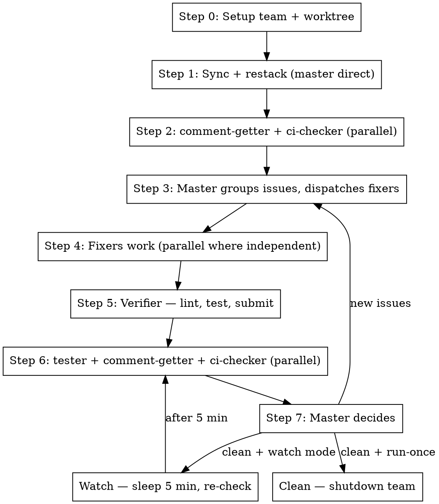

# Fix Branch (Team)

## Overview

Fix the current Graphite branch using a **Claude agent team**. Spawns specialized teammates that work in parallel:
checkers find issues, the master dispatches fixers intelligently, and a verifier submits. Loops until the PR is clean or
runs in watch mode polling every 5 minutes.

**Core principle:** Parallel detection → Smart dispatch → Fix → Verify → Submit → Re-check → Loop

**Announce at start:** "I'm using the fix-branch.team skill to fix this branch with an agent team."

## Team Architecture

```
branch-master (team lead, delegate mode — coordination only)
├── comment-getter   — fetches PR review threads, reports to master
├── ci-checker       — checks remote CI status + logs, reports to master
├── tester           — runs metta-ci locally after submit, reports to master
├── fixer-1..N       — implements fixes (spawned on demand by master)
└── verifier         — lint, fast tests, gt modify, gt submit
```

**Why a team instead of sub-agents?** Teammates communicate directly with each other and the master. The master can
dynamically spawn/reuse fixers based on what the checkers report. Sub-agents can only report back — they can't
coordinate.

## The Process



### Step 0: Setup Team + Worktree

**Create the team:**

```
Teammate(operation="spawnTeam", team_name="fix-branch-{branch_name}", description="Fixing branch {branch_name}")
```

**Setup worktree** (same as pr.fix-branch Step 0):

```bash
BRANCH=$(git branch --show-current)
EXISTING=$(git worktree list --porcelain | grep -B2 "branch refs/heads/$BRANCH" | grep "worktree " | cut -d' ' -f2)
if [ -n "$EXISTING" ]; then
  cd "$EXISTING"
else
  git worktree add .worktrees/$BRANCH $BRANCH
  cd .worktrees/$BRANCH
fi
```

**Spawn initial teammates** (comment-getter, ci-checker, tester, verifier). Use the Task tool with `team_name`
parameter:

```
Task(
  subagent_type="general-purpose",
  name="comment-getter",
  team_name="fix-branch-{branch_name}",
  description="Fetch PR comments for {branch}",
  prompt="..." # See Step 2
)

Task(
  subagent_type="general-purpose",
  name="tester",
  team_name="fix-branch-{branch_name}",
  description="Run tests for {branch}",
  prompt="..." # See Step 6
)
```

The master operates in **delegate mode** (Shift+Tab after team creation) — it only coordinates, never edits code.

### Step 1: Sync + Restack

Master runs these directly before spawning checkers:

```bash
gt sync --no-interactive
gt restack
```

### Step 2: Parallel Issue Detection

Spawn **comment-getter** and **ci-checker** as teammates. They run in parallel and report issues to the master via
messages.

**comment-getter prompt:**

```
You are the comment-getter for branch '{branch}' in '{worktree_path}'.

Your job: fetch all unresolved PR review comments and report them to the branch-master.

1. Get PR info:
   OWNER=$(gh repo view --json owner -q '.owner.login')
   REPO=$(gh repo view --json name -q '.name')
   PR_NUMBER=$(gh pr view --json number -q '.number')

2. Fetch all review threads via GraphQL:
   gh api graphql -f query='
     query($owner: String!, $repo: String!, $pr: Int!) {
       repository(owner: $owner, name: $repo) {
         pullRequest(number: $pr) {
           reviewThreads(first: 250) {
             nodes {
               id
               isResolved
               path
               line
               comments(first: 100) {
                 nodes { body author { login } }
               }
             }
           }
         }
       }
     }
   ' -f owner=$OWNER -f repo=$REPO -F pr=$PR_NUMBER

3. Filter to unresolved threads only.

4. Send a message to branch-master with a structured summary:
   - For each unresolved thread: file path, line number, comment body, thread ID
   - Group by file path so master can see overlaps

If no unresolved comments, tell master "no comments to fix".

After reporting, go idle and wait. Master will ask you to re-check after submit.
```

**ci-checker prompt:**

```
You are the ci-checker for branch '{branch}' in '{worktree_path}'.

Your job: check CI status and report failures to the branch-master.

1. Get fresh CI status (NEVER use gh pr checks — it returns stale data):
   HEAD_SHA=$(git rev-parse HEAD)
   OWNER=$(gh repo view --json owner -q '.owner.login')
   REPO=$(gh repo view --json name -q '.name')
   gh api repos/$OWNER/$REPO/commits/$HEAD_SHA/check-runs \
     --jq '.check_runs[] | {name, status, conclusion}'

2. For any failed checks, get logs:
   gh run view <run_id> --log-failed

3. Send a message to branch-master with:
   - List of all check runs and their status
   - For failures: the relevant log output, file paths affected, error messages
   - Group by file path so master can see overlaps with comments

If all checks passing (or no checks yet), tell master "CI clean".

After reporting, go idle and wait. Master will ask you to re-check after submit.
```

### Step 3: Master Groups Issues and Dispatches Fixers

When both checkers report back, the master:

1. **Collects all issues** from both comment-getter and ci-checker
2. **Groups by file overlap:**
   - Issues touching the same file → assign to the **same fixer**
   - Issues on independent files → assign to **separate fixers** (parallel)
3. **Creates tasks** for each fixer in the shared task list
4. **Spawns fixers** as needed:

```
Task(
  subagent_type="general-purpose",
  name="fixer-1",
  team_name="fix-branch-{branch_name}",
  description="Fix issues in {file_group}",
  prompt="""
  You are a fixer for branch '{branch}' in '{worktree_path}'.

  Fix these issues:
  {issues_for_this_fixer}

  For each issue:
  1. Read the relevant file(s)
  2. Make the fix
  3. For PR comment issues: reply to the thread explaining what you did, then resolve it
  4. Stage your changes: git add <files>

  Do NOT commit or submit — the verifier handles that.

  When done, send a message to branch-master listing what you fixed.
  """
)
```

**Fixer reuse:** If a fixer from a previous loop iteration is idle and the new issues match its file area, message it
with new work instead of spawning a new one.

### Step 4: Fixers Work

Fixers work in parallel on their assigned issues. Each fixer:

- Reads files, makes changes, stages them
- Replies to PR comment threads where applicable
- Reports completion to master

Master waits for all fixers to report done.

### Step 5: Verifier — Lint, Test, Submit

Once all fixers complete, master tells the verifier to run:

**verifier prompt:**

```
You are the verifier for branch '{branch}' in '{worktree_path}'.

Run the verification and submit pipeline:

1. Lint: Run autofix linting and fix any remaining lint errors
2. Fast tests: metta pytest --changed -v
3. If tests fail: report failures to branch-master and STOP (don't submit broken code)
4. If tests pass:
   a. Stage all changes: git add -A
   b. Commit: gt modify --no-interactive
   c. Submit: gt submit --no-interactive
5. Report to branch-master: submit success + PR URL

Working directory: {worktree_path}
Branch: {branch}
```

If verifier reports test failures, master dispatches fixers for those failures, then re-runs verifier.

### Step 6: Post-Submit Parallel Re-Check (CRITICAL)

After successful submit, master tells all three checkers to re-check **in parallel**. The ci-checker **must use the
remote HEAD SHA** (not local) since submit creates a new commit, and **must wait for CI to complete** before reporting.

- **tester**: runs `metta-ci` locally → reports any failures to master
- **comment-getter**: re-fetches PR threads → reports any new unresolved comments
- **ci-checker**: polls remote CI on the **new commit SHA** until complete → reports pass/fail

**tester prompt:**

```
You are the tester for branch '{branch}' in '{worktree_path}'.

Run the full local test suite after submit:

1. Run: metta-ci (or the project's full CI equivalent locally)
2. Capture all output
3. Send results to branch-master:
   - If all pass: "local tests clean"
   - If failures: list each failure with file path, test name, error message

Working directory: {worktree_path}
```

**ci-checker re-check prompt (IMPORTANT — use remote SHA, wait for completion):**

```
You are the ci-checker re-checking after submit for branch '{branch}'.

CRITICAL: The submit created a new commit. You MUST check CI on the REMOTE head, not the local one.

1. Get the remote HEAD SHA (not local):
   PR_NUMBER=$(gh pr view --json number -q '.number')
   REMOTE_SHA=$(gh pr view "$PR_NUMBER" --json headRefOid -q '.headRefOid')

2. Poll CI until all checks complete (up to 10 minutes):
   OWNER=$(gh repo view --json owner -q '.owner.login')
   REPO=$(gh repo view --json name -q '.name')
   for i in $(seq 1 20); do
     RESULTS=$(gh api "repos/$OWNER/$REPO/commits/$REMOTE_SHA/check-runs" \
       --jq '.check_runs[] | "\(.name)|\(.status)|\(.conclusion // "pending")"')
     IN_PROGRESS=$(echo "$RESULTS" | grep -c "|in_progress|" || true)
     QUEUED=$(echo "$RESULTS" | grep -c "|queued|" || true)
     if [ "$IN_PROGRESS" -eq 0 ] && [ "$QUEUED" -eq 0 ]; then
       break
     fi
     sleep 30
   done

3. Report to branch-master:
   - Per-check name and conclusion
   - For failures: get logs with gh run view <run_id> --log-failed
   - IMPORTANT: report "CI still running" if checks didn't complete in time
```

### Step 7: Master Decides

Master collects reports from all three checkers:

- **New issues found** → goto Step 3 (group and dispatch fixers)
- **Clean + run-once mode** → shutdown team, report success
- **Clean + watch mode** → sleep 5 minutes, then goto Step 6

### Run-Once vs Watch Mode

The skill accepts a mode parameter:

- **run-once** (default): Loop until clean, then shutdown and report
- **watch**: After clean, sleep 5 min and re-check. Keeps running until user cancels (`/cancel` or Ctrl+C)

Watch mode is useful when waiting for reviewer comments or slow CI pipelines.

## Shutdown

When done (or cancelled):

1. Master sends shutdown requests to all teammates
2. Wait for all to acknowledge
3. Run `Teammate(operation="cleanup")`
4. If not called from fix-stack.team: invoke `/wt.cleanup` for worktree removal

## Quick Reference

| Step | Who                                  | What                          | Parallel?                |
| ---- | ------------------------------------ | ----------------------------- | ------------------------ |
| 0    | Master                               | Setup team + worktree         | —                        |
| 1    | Master                               | gt sync + gt restack          | —                        |
| 2    | comment-getter + ci-checker          | Detect issues                 | Yes                      |
| 3    | Master                               | Group issues, dispatch fixers | —                        |
| 4    | fixer-1..N                           | Implement fixes               | Yes (across file groups) |
| 5    | Verifier                             | Lint, test, submit            | —                        |
| 6    | tester + comment-getter + ci-checker | Re-check                      | Yes                      |
| 7    | Master                               | Decide: loop, done, or watch  | —                        |

## Red Flags

**Stop and escalate to user if:**

- Verifier fails tests 3+ times on the same issue
- Fixer reports it can't resolve a design disagreement in comments
- Restack fails with conflicts
- CI failures in code not touched by this branch
- Watch mode running for 30+ minutes with no progress

## CRITICAL: Check CI Status Correctly

**Always use commit SHA** — `gh pr checks` returns stale data:

```bash
HEAD_SHA=$(git rev-parse HEAD)
OWNER=$(gh repo view --json owner -q '.owner.login')
REPO=$(gh repo view --json name -q '.name')
gh api repos/$OWNER/$REPO/commits/$HEAD_SHA/check-runs \
  --jq '.check_runs[] | "\(.name): \(.conclusion // .status)"'
```

## Integration

**Uses:**

- **using-git-worktrees** — Worktree setup (Step 0)
- **pr.fix-comments** — Referenced by comment-getter for thread format
- **pr.fix-ci** — Referenced by ci-checker for CI check patterns
- **cb.lint-fix** — Called by verifier
- **wt.cleanup** — Worktree removal on shutdown

**Called by:**

- **st.fix-stack.team** — Runs this on each branch in a stack

**Pairs with:**

- **pr.fix-branch** — Simpler sub-agent alternative (no team coordination)
