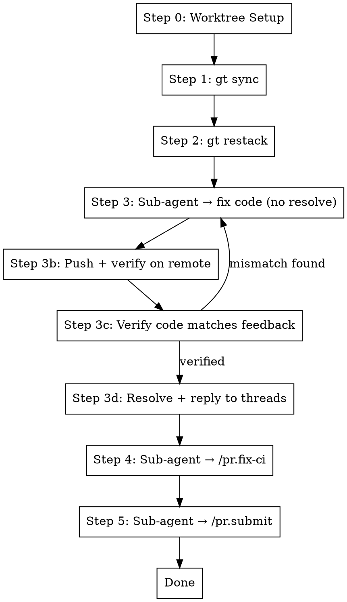

# Fix Branch

## Overview

Sync and fix the current Graphite branch by syncing with trunk, restacking, addressing PR review comments, and fixing CI
failures. **Always works in a git worktree** for isolation (unless user explicitly opts out).

**Core principle:** Worktree → Sync → Restack → Fix Comments (sub-agent) → Fix CI (sub-agent) → Submit (sub-agent)

**Announce at start:** "I'm using the fix-branch skill to sync and fix this branch."

## Sub-Agent Architecture

Steps 3-5 are dispatched as **sub-agents** using the Task tool to reduce context churn. Each sub-agent runs
independently with a focused prompt and returns a summary. The orchestrator (this skill) only tracks high-level
success/failure.

```
Orchestrator (this skill)
├── Step 0-2: Direct (lightweight git commands)
├── Step 3: Task(subagent_type="Bash", prompt="fix-comments for <branch>")
├── Step 4: Task(subagent_type="Bash", prompt="fix-ci for <branch>")
└── Step 5: Task(subagent_type="Bash", prompt="submit <branch>")
```

## The Process



**Key principle:** Push each branch immediately after fixing, don't wait for the entire stack to be complete.

### Step 0: Worktree Setup (Always)

**Always** work in an isolated git worktree unless the user explicitly said not to. Do NOT ask - just set it up.

**Check if already in a worktree for this branch:**

```bash
BRANCH=$(git branch --show-current)
WORKTREE_PATH=$(git worktree list --porcelain | grep -B2 "branch refs/heads/$BRANCH" | grep "worktree " | cut -d' ' -f2)

# If we're already in that worktree, skip setup
if [ "$(pwd)" = "$WORKTREE_PATH" ]; then
  echo "Already in worktree for $BRANCH"
fi
```

**If not in a worktree, set one up automatically:**

Follow the `using-git-worktrees` skill to:

1. Find or create worktree directory (`.worktrees/` or `worktrees/`)
2. Verify directory is git-ignored
3. Create worktree: `git worktree add <path> $BRANCH` (or reuse existing)
4. `cd` into the worktree
5. Run project setup (npm install, etc.)

**Worktree reuse:** If a worktree already exists for this branch, just `cd` into it:

```bash
# Check for existing worktree
EXISTING=$(git worktree list --porcelain | grep -B2 "branch refs/heads/$BRANCH" | grep "worktree " | cut -d' ' -f2)
if [ -n "$EXISTING" ]; then
  cd "$EXISTING"
else
  # Create new worktree
  git worktree add .worktrees/$BRANCH $BRANCH
  cd .worktrees/$BRANCH
fi
```

**Only skip worktrees if** the user explicitly passed `--no-worktree` or said "don't use worktrees".

### Step 1: Sync with Trunk

```bash
gt sync --no-interactive
```

This pulls latest trunk and rebases all open PRs/stacks on top.

### Step 2: Restack

```bash
gt restack
```

Ensures the current stack has latest changes from downstack branches.

### Step 3: Fix Comments (Sub-Agent — Code Only, No Resolve)

Dispatch a sub-agent to handle PR review comments. **The sub-agent must NOT resolve or reply to threads.** It only makes
code changes and returns a structured report of what was done per thread.

```
Task(
  subagent_type="general-purpose",
  description="Fix PR comments on <branch>",
  prompt="""
  You are fixing PR review comments on branch '<branch>' in directory '<worktree_path>'.

  Run the /pr.fix-comments skill:
  1. Fetch GitHub and Graphite review comments for the current branch's PR
  2. Address each unresolved comment by making code changes
  3. DO NOT resolve or reply to any threads — the orchestrator will do that after verifying
  4. Run tests to verify fixes: metta pytest --changed
  5. Stage and commit: git add -A && gt modify --no-interactive

  Working directory: <worktree_path>
  Branch: <branch>

  IMPORTANT: DO NOT call resolveReviewThread or addPullRequestReviewThreadReply.

  Report back a structured list for each thread:
  - thread_id: the GraphQL node ID
  - path: file path
  - line: line number
  - reviewer_ask: what the reviewer asked for (1 sentence)
  - action_taken: what you changed (1-2 sentences)
  - response_msg: the reply message to post (e.g. "Fixed: <what was changed>.")
  - status: fixed | already_fixed | skipped_design | could_not_fix

  Also report: total comments addressed, any that couldn't be resolved, test results.
  """
)
```

**If sub-agent reports no comments:** Continue to Step 3b. **If sub-agent reports failures:** Review the summary and
decide whether to retry or escalate.

### Step 3b: Push Changes and Verify Push Landed

After the fix-comments sub-agent completes, **push the changes to remote and verify the push succeeded** before doing
anything with the comment threads. This ensures we don't resolve/reply to comments for changes that aren't actually on
the remote.

```bash
# Stage and push
git add -A && gt modify --no-interactive
gt submit --no-interactive

# Verify the push landed by comparing local and remote HEADs
LOCAL_SHA=$(git rev-parse HEAD)
PR_NUMBER=$(gh pr view --json number -q '.number')
REMOTE_SHA=$(gh pr view "$PR_NUMBER" --json headRefOid -q '.headRefOid')

if [ "$LOCAL_SHA" != "$REMOTE_SHA" ]; then
  echo "WARNING: Local SHA ($LOCAL_SHA) != Remote SHA ($REMOTE_SHA)"
  echo "Submit may have amended. Verifying remote has our changes..."
  # Check that the remote diff includes our expected changes
  gh api repos/$OWNER/$REPO/pulls/$PR_NUMBER/files --jq '.[].filename' | sort
fi

echo "Push verified: remote HEAD is $REMOTE_SHA"
```

**If push fails:** Investigate and fix (merge conflicts, rebase issues, etc.) before proceeding.

**Only proceed to Step 3c when changes are confirmed on remote.**

### Step 3c: Verify Code Changes Match Feedback (CRITICAL)

**Don't trust the sub-agent's report alone.** After confirming the push landed, **independently verify the code changes
on the remote actually address each reviewer's feedback**.

For each thread the sub-agent reported as `fixed` or `already_fixed`:

1. **Read the reviewer's original comment** (what did they ask for?)
2. **Read the file at the line they commented on** (what does the code say now?)
3. **Verify the code change matches the feedback**

```bash
# For each thread reported by sub-agent, verify the fix
for each THREAD in SUB_AGENT_REPORT:
  COMMENT_BODY = thread.reviewer_ask
  FILE_PATH = thread.path
  LINE_NUMBER = thread.line

  # Read the current code at that location
  CURRENT_CODE=$(sed -n "${LINE_NUMBER}p" "$FILE_PATH")

  # Compare: does the code now match what the reviewer asked for?
  # If not, the fix is incomplete
```

**Red flags that indicate a bad fix:**

| Reviewer Said        | But Code Shows         | Problem                 |
| -------------------- | ---------------------- | ----------------------- |
| "Change X to Y"      | X is still there       | Fix not applied         |
| "Remove this"        | Code still exists      | Fix not applied         |
| "Add validation"     | No validation added    | Fix incomplete          |
| "Use version 4"      | Still uses version 3   | Fix incomplete          |
| "These should match" | They still don't match | Inconsistency not fixed |

**If verification fails:**

1. **Log the mismatch:** "Fix incomplete: reviewer asked for X, code shows Y"
2. **Re-dispatch fix-comments sub-agent** with specific instructions for this thread
3. **Loop back to Step 3b** (push + verify again)

**Only proceed to Step 3d when ALL code changes are verified correct on the remote.**

### Step 3d: Resolve and Reply to Threads (After Verification)

**Only after the push is verified and code correctness confirmed**, resolve and reply to each thread. Use the
sub-agent's report to determine the response message.

For each thread with status `fixed` or `already_fixed`:

```bash
# 1. Reply to the thread explaining what was done
gh api graphql -f query='
  mutation($threadId: ID!, $body: String!) {
    addPullRequestReviewThreadReply(input: {pullRequestReviewThreadId: $threadId, body: $body}) {
      comment { id }
    }
  }
' -f threadId=$THREAD_ID -f body="$RESPONSE_MSG"

# 2. Resolve the thread
gh api graphql -f query='
  mutation($threadId: ID!) {
    resolveReviewThread(input: {threadId: $threadId}) {
      thread { isResolved }
    }
  }
' -f threadId=$THREAD_ID
```

For threads with status `skipped_design` or `could_not_fix`: **do not resolve**. Report these to the user.

**Verify after resolving:** Re-fetch all threads and confirm:

- All `fixed`/`already_fixed` threads are now resolved
- All resolved threads have a reply from the bot

```bash
OWNER=$(gh repo view --json owner -q '.owner.login')
REPO=$(gh repo view --json name -q '.name')
PR_NUMBER=$(gh pr view --json number -q '.number')
BOT_LOGIN=$(gh api user -q '.login')

ALL_THREADS=$(gh api graphql -f query='
  query($owner: String!, $repo: String!, $pr: Int!) {
    repository(owner: $owner, name: $repo) {
      pullRequest(number: $pr) {
        reviewThreads(first: 250) {
          nodes {
            id
            isResolved
            path
            comments(first: 100) {
              nodes { body author { login } }
              pageInfo { hasNextPage }
            }
          }
          pageInfo { hasNextPage }
        }
      }
    }
  }
' -f owner=$OWNER -f repo=$REPO -F pr=$PR_NUMBER)

# Check for any unresolved threads that should have been resolved
STILL_UNRESOLVED=$(echo "$ALL_THREADS" | jq -r '
  .data.repository.pullRequest.reviewThreads.nodes[]
  | select(.isResolved == false)
  | "STILL UNRESOLVED: \(.path) - \(.comments.nodes[0].body[0:80])"')

if [ -n "$STILL_UNRESOLVED" ]; then
  echo "WARNING: Some threads still unresolved after Step 3d:"
  echo "$STILL_UNRESOLVED"
fi
```

**Only proceed to Step 4 when all fixable threads are resolved with replies and the code is verified on remote.**

### Step 4: Fix CI (Sub-Agent)

Dispatch a sub-agent to check and fix CI failures:

```
Task(
  subagent_type="general-purpose",
  description="Fix CI failures on <branch>",
  prompt="""
  You are fixing CI failures on branch '<branch>' in directory '<worktree_path>'.

  Run the /pr.fix-ci skill:
  1. Check CI status using commit SHA (NEVER use `gh pr checks` - it returns stale data):
     HEAD_SHA=$(git rev-parse HEAD)
     OWNER=$(gh repo view --json owner -q '.owner.login')
     REPO=$(gh repo view --json name -q '.name')
     gh api repos/$OWNER/$REPO/commits/$HEAD_SHA/check-runs \
       --jq '.check_runs[] | "\(.name): \(.conclusion // .status)"'
  2. If all passing, report success and stop
  3. If failures: get logs with `gh run view <run_id> --log-failed`
  4. Fix each failure
  5. Verify locally: metta pytest --changed
  6. Stage and commit: git add -A && gt modify --no-interactive

  Working directory: <worktree_path>
  Branch: <branch>

  Report back: CI status before/after, what was fixed, local test results.
  """
)
```

**If sub-agent reports CI already passing:** Continue to Step 5. **If sub-agent reports fixes made:** Continue to
Step 5. **If sub-agent reports unfixable failures:** Escalate to user.

### Step 5: Submit Branch (Sub-Agent)

Dispatch a sub-agent to run the full submit flow (lint → submit → test locally in parallel with CI):

```
Task(
  subagent_type="general-purpose",
  description="Submit <branch> to Graphite",
  prompt="""
  You are submitting branch '<branch>' to Graphite from directory '<worktree_path>'.

  Run the /pr.submit skill:
  1. Run /pr.cool to clean up backwards compat code
  2. Check for disabled tests (@pytest.mark.skip etc) - fix or remove them
  3. Run lint: /cb.lint-fix (ensures prettier available, fixes errors)
  4. Stage and commit: git add -A && gt modify --no-interactive
  5. Submit: gt submit --no-interactive (CI starts running remotely)
  6. Run tests locally (parallel with CI): metta pytest --changed -v
  7. If local tests fail: fix, re-lint, re-commit (gt modify), re-submit
  8. Loop step 6-7 until local tests pass

  Working directory: <worktree_path>
  Branch: <branch>

  Report back: Graphite PR URL (format: https://app.graphite.dev/github/pr/OWNER/REPO/PR_NUMBER), test results, summary of changes, any issues.
  To get the PR number: gh pr view --json number -q '.number'
  To get owner/repo: gh repo view --json owner,name -q '.owner.login + "/" + .name'
  """
)
```

**After the submit sub-agent completes**, print the Graphite URL for the user:

```
https://app.graphite.dev/github/pr/<OWNER>/<REPO>/<PR_NUMBER>
```

### Step 5b: Post-Submit CI Verification (CRITICAL)

After submitting, **poll CI on the new remote HEAD commit** until all checks complete. The submit creates a new commit
with a new SHA — CI must pass on _that_ commit, not the pre-submit one.

```bash
OWNER=$(gh repo view --json owner -q '.owner.login')
REPO=$(gh repo view --json name -q '.name')
PR_NUMBER=$(gh pr view --json number -q '.number')

# Get the REMOTE head SHA (not local — submit may have amended)
REMOTE_SHA=$(gh pr view "$PR_NUMBER" --json headRefOid -q '.headRefOid')

# Poll until all checks complete (up to 10 minutes)
for i in $(seq 1 20); do
  RESULTS=$(gh api "repos/$OWNER/$REPO/commits/$REMOTE_SHA/check-runs" \
    --jq '.check_runs[] | "\(.name)|\(.status)|\(.conclusion // "pending")"')

  IN_PROGRESS=$(echo "$RESULTS" | grep -c "|in_progress|" || true)
  QUEUED=$(echo "$RESULTS" | grep -c "|queued|" || true)
  FAILURES=$(echo "$RESULTS" | grep "|completed|failure" || true)

  if [ "$IN_PROGRESS" -eq 0 ] && [ "$QUEUED" -eq 0 ]; then
    # All checks done
    if [ -n "$FAILURES" ]; then
      echo "CI FAILURES on new commit $REMOTE_SHA:"
      echo "$FAILURES"
      break
    else
      echo "All CI checks passing on $REMOTE_SHA"
      break
    fi
  fi
  echo "Waiting for CI... ($IN_PROGRESS in progress, $QUEUED queued)"
  sleep 30
done
```

**If CI fails on the new commit:**

1. Jump back to Step 4 (Fix CI sub-agent) with the new commit's failure logs
2. After fixing, re-run Step 5 (Submit) and Step 5b (verify CI again)
3. Loop until CI passes or 3 attempts exhausted (then escalate to user)

**If CI passes:** Proceed to Step 6 (Worktree Cleanup).

## Quick Reference

| Step | Action                     | Method    | Purpose                                   |
| ---- | -------------------------- | --------- | ----------------------------------------- |
| 0    | Worktree setup             | Direct    | Isolation                                 |
| 1    | `gt sync --no-interactive` | Direct    | Pull trunk, rebase stacks                 |
| 2    | `gt restack`               | Direct    | Rebase current stack                      |
| 3    | Fix comments (code only)   | Sub-agent | Make code changes, DO NOT resolve threads |
| 3b   | Push + verify              | Direct    | Push changes, confirm on remote           |
| 3c   | **Verify code matches**    | Direct    | **Read code, confirm fix is correct**     |
| 3d   | Resolve + reply            | Direct    | Reply to and resolve verified threads     |
| 4    | Fix CI                     | Sub-agent | Fix any CI failures                       |
| 5    | Submit                     | Sub-agent | Test, clean, submit branch                |
| 5b   | Post-submit CI verify      | Direct    | Poll CI on new commit, loop if fail       |

## Why Sub-Agents?

Each sub-step (fix-comments, fix-ci, submit) involves:

- Reading lots of CI logs, PR comments, test output
- Multiple fix-verify cycles
- Significant context accumulation

By dispatching these as sub-agents:

- The orchestrator stays lightweight (just tracks success/failure)
- Each sub-agent starts fresh with focused context
- Failed sub-agents can be retried without replaying the whole conversation
- The user sees high-level progress without scrolling through logs

## Common Mistakes

**Resolving threads before verifying push and code correctness**

- **Problem:** Sub-agent resolves threads but fix is incomplete, wrong, or not pushed
- **Fix:** Sub-agent must NOT resolve threads. Push first (3b), verify code (3c), THEN resolve (3d)

**Skipping sync/restack**

- **Problem:** Merge conflicts later, out of sync with trunk
- **Fix:** Always start with sync and restack

**Running fix-comments before restack**

- **Problem:** May fix issues that would be resolved by restack
- **Fix:** Always restack first to get latest downstack changes

**Skipping fix-ci**

- **Problem:** PR comments fixed but CI still failing
- **Fix:** Always run fix-ci after fix-comments

**Waiting to submit until stack is complete**

- **Problem:** Delays CI feedback, other branches wait unnecessarily
- **Fix:** Submit each branch immediately after fixing (Step 5)

## Red Flags

**Stop and investigate if:**

- Sync fails with conflicts → Resolve conflicts manually before continuing
- Restack fails → Check if downstack branches need attention first
- CI failures in code you didn't touch → May be flaky tests or trunk issues
- Sub-agent reports repeated failures → May need manual intervention

## CRITICAL: Check CI Status Correctly

**Use the commit SHA to get fresh CI data** - `gh pr checks` returns stale/cached results:

```bash
# WRONG - Returns cached/stale data
gh pr checks <pr_number>  # DON'T use this!

# RIGHT - Get fresh CI status for the actual HEAD commit
HEAD_SHA=$(git rev-parse HEAD)
OWNER=$(gh repo view --json owner -q '.owner.login')
REPO=$(gh repo view --json name -q '.name')
gh api repos/$OWNER/$REPO/commits/$HEAD_SHA/check-runs \
  --jq '.check_runs[] | "\(.name): \(.conclusion // .status)"'
```

## Step 6: Worktree Cleanup

After the branch is fixed and submitted, invoke `/wt.cleanup` to remove the worktree and return to the main repo.

**Skip cleanup if** called from another skill (e.g., `/st.fix-stack`) that manages its own worktree lifecycle.

## Integration

**Uses:**

- **using-git-worktrees** - For worktree setup (Step 0)
- **pr.fix-comments** - Addresses PR review comments (via sub-agent)
- **pr.fix-ci** - Fixes CI failures (via sub-agent)
- **pr.submit** - Final quality gate (via sub-agent)
- **wt.cleanup** - Worktree removal (Step 6)

**Called by:**

- **st.fix-stack** - Runs this on each branch in a stack (each branch is submitted immediately after fixing)

**Pairs with:**

- **systematic-debugging** - For non-trivial test failures
- **finishing-a-development-branch** - For cleanup after merge
