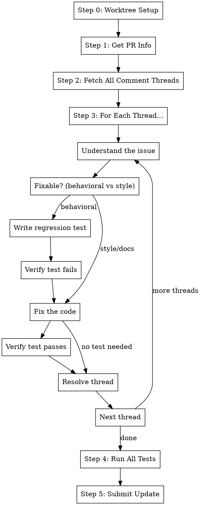

# Fix Comments

## Overview

Autonomously address all PR review comments on the current branch. For each comment, understand the issue, write a
regression test that catches it, then fix the code. **Works in a git worktree by default** for isolation.

**Core principle:** Worktree → Fetch Comments → Understand Each → Write Test → Fix → Submit

**Announce at start:** "I'm using the fix-comments skill to autonomously address PR review comments on this branch."

## The Process



### Step 0: Worktree Setup (Default)

By default, work in an isolated git worktree. **Skip if already in worktree** (e.g., called from /pr.fix-branch).

```bash
BRANCH=$(git branch --show-current)
WORKTREE_PATH=$(git worktree list --porcelain | grep -B2 "branch refs/heads/$BRANCH" | grep "worktree " | cut -d' ' -f2)

# Check if already in a worktree for this branch
if [ "$(pwd)" = "$WORKTREE_PATH" ]; then
  echo "Already in worktree for $BRANCH - skipping setup"
else
  # Ask user (with worktree as default)
  # If yes: create/reuse worktree, cd into it
  # If no: continue in current directory
fi
```

**If using worktree:** Follow `using-git-worktrees` skill - find/create `.worktrees/$BRANCH`, verify ignored, run
project setup.

### Step 1: Get PR Info

```bash
# Get current branch
git branch --show-current

# Get PR details
gh pr view --json number,url,title,headRefName

# Extract owner/repo
OWNER=$(gh repo view --json owner -q '.owner.login')
REPO=$(gh repo view --json name -q '.name')
PR_NUMBER=$(gh pr view --json number -q '.number')
```

### Step 2: Fetch All Comment Threads

**Get review threads with FULL conversation:**

```bash
gh api graphql -f query='
  query($owner: String!, $repo: String!, $pr: Int!) {
    repository(owner: $owner, name: $repo) {
      pullRequest(number: $pr) {
        reviewThreads(first: 250) {
          nodes {
            id
            isResolved
            isOutdated
            path
            line
            comments(first: 100) {
              nodes {
                id
                body
                author { login }
                createdAt
              }
              pageInfo { hasNextPage }
            }
          }
          pageInfo { hasNextPage }
        }
      }
    }
  }
' -f owner=$OWNER -f repo=$REPO -F pr=$PR_NUMBER
```

**Note:** If `pageInfo.hasNextPage` is `true` for either threads or comments, the PR has more data than fetched. Log a
warning and consider manual review for such large PRs.

**Also check Greptile for additional comments:**

```
mcp__plugin_greptile_greptile__list_merge_request_comments
```

### Step 3: Process Each Thread Autonomously

**For each UNRESOLVED thread:**

1. **Read the full conversation** - all comments, not just the first one
2. **Understand what the reviewer is asking for**
3. **Classify the issue** and take appropriate action

**Classification:**

| Type                    | Examples                                            | Action                     |
| ----------------------- | --------------------------------------------------- | -------------------------- |
| **Behavioral bug**      | Logic error, missing validation, wrong return value | Write test → Fix → Resolve |
| **Edge case**           | Missing null check, boundary condition              | Write test → Fix → Resolve |
| **Style/naming**        | Variable rename, formatting                         | Fix directly → Resolve     |
| **Documentation**       | Missing/wrong comments, docstrings                  | Fix directly → Resolve     |
| **Design disagreement** | Architecture choice, approach                       | Skip (needs discussion)    |
| **Already fixed**       | Change was made in later commit                     | Verify → Resolve           |

### Step 3a: Handle Behavioral Issues (Default)

For most comments about code behavior:

1. **Write a regression test** (see Step 3c)
2. **Run the test** - confirm it fails (catches the issue)
3. **Make the fix** described in the comment
4. **Run the test** - confirm it passes
5. **Stage both files:** `git add <test_file> <file>`
6. **Resolve the thread** (see Step 3b)

### Step 3a-alt: Handle Style/Doc Issues

For non-behavioral changes (naming, formatting, docs):

1. **Make the change** directly
2. **Stage the file:** `git add <file>`
3. **Resolve the thread** (see Step 3b)

No test needed since behavior isn't changing.

### Step 3a-skip: When to Skip

**Ask the user** before proceeding if:

- Comment is a design disagreement (not a clear fix)
- Multiple valid approaches exist
- Comment contradicts another comment
- You're unsure what the reviewer wants

For these, present the situation and ask for guidance.

### Step 3b: Respond and Resolve Thread

After fixing or confirming a change, **always reply to the comment** explaining what was done, then resolve the thread.
Every comment must get a response — never silently resolve.

**Reply to the comment:**

```bash
# Reply to the PR review thread with what was done
gh api graphql -f query='
  mutation($threadId: ID!, $body: String!) {
    addPullRequestReviewThreadReply(input: {pullRequestReviewThreadId: $threadId, body: $body}) {
      comment { id }
    }
  }
' -f threadId=$THREAD_NODE_ID -f body="$RESPONSE_MESSAGE"
```

**Response message format:**

| Action Taken                | Response                                                                    |
| --------------------------- | --------------------------------------------------------------------------- |
| Wrote test + fixed          | "Fixed: <what was changed>. Added regression test `test_<name>` to verify." |
| Fixed directly (style/docs) | "Fixed: <what was changed>."                                                |
| Already fixed               | "Already addressed in <commit/change>."                                     |
| Skipped (design)            | "Leaving for discussion — see reply above."                                 |

**Then resolve the thread:**

```bash
gh api graphql -f query='
  mutation($threadId: ID!) {
    resolveReviewThread(input: {threadId: $threadId}) {
      thread {
        isResolved
      }
    }
  }
' -f threadId=$THREAD_NODE_ID
```

### Step 3c: Write Regression Test

**Before fixing the code**, write a test that would catch the issue described in the comment. This ensures:

- The bug is reproducible
- The fix actually addresses the issue
- The bug won't regress in the future

**Process:**

1. **Understand the issue** from the comment thread
2. **Find the appropriate test file:**

   ```bash
   # Look for existing tests for the module
   find . -name "test_*.py" -path "*/tests/*" | xargs grep -l "<module_name>"

   # Or find tests in the same directory structure
   ls tests/$(dirname <file_path>)/
   ```

3. **Write a minimal test that reproduces the issue:**

   ```python
   def test_<descriptive_name>_regression():
       """
       Regression test for PR comment: <brief description>

       The issue: <what was wrong>
       """
       # Arrange: Set up the conditions that trigger the bug

       # Act: Call the code that had the bug

       # Assert: Check the correct behavior
   ```

4. **Run the test to confirm it fails:**

   ```bash
   metta pytest tests/path/to/test_file.py::test_<name> -v
   ```

   - If it **fails**: Good! The test catches the issue. Proceed to fix.
   - If it **passes**: The test doesn't catch the issue. Refine the test.

5. **After fixing, verify the test passes:**
   ```bash
   metta pytest tests/path/to/test_file.py::test_<name> -v
   ```

**Test naming convention:**

- `test_<component>_<what_was_fixed>_regression`
- Example: `test_user_auth_empty_password_handling_regression`

**Skip writing a test if:**

- The comment is about style/naming only (no behavioral change)
- The comment is about documentation
- A test already exists that covers this case (verify it fails first!)

### Step 4: Run Tests

After all threads are handled:

```bash
# Run ALL tests affected by changes (both new regression tests and existing)
metta pytest --changed

# Run linting
metta lint
```

**For each failing test:**

1. Read the error message completely
2. Identify root cause (use `/systematic-debugging` if complex)
3. Fix the issue
4. Re-run to verify

### Step 5: Submit Update

Invoke the submit skill to stage, commit, and push:

```
/pr.submit
```

This will stage all changes, run tests, clean up compat code, lint, commit (amend), and submit to Graphite.

## Quick Reference

| Issue Type              | What Claude Does                                          |
| ----------------------- | --------------------------------------------------------- |
| **Behavioral bug**      | Write test → Verify fails → Fix → Verify passes → Resolve |
| **Edge case**           | Write test → Verify fails → Fix → Verify passes → Resolve |
| **Style/naming**        | Fix directly → Resolve                                    |
| **Documentation**       | Fix directly → Resolve                                    |
| **Design disagreement** | Ask user for guidance                                     |
| **Already fixed**       | Verify change exists → Resolve                            |

## Reading Full Conversations

**Don't just read the first comment.** Review threads often have back-and-forth:

- Reviewer asks for change
- Author explains why they did it differently
- Reviewer agrees or pushes back

The **LATEST comment** in the thread determines what action to take. If the reviewer's final message says "actually,
nevermind" or "good point, let's keep it", then resolve without changes.

## CRITICAL: Check CI Status Correctly

```bash
# WRONG - Returns cached/stale data
gh pr checks <pr_number>  # DON'T use this!

# RIGHT - Get fresh CI status for the actual HEAD commit
HEAD_SHA=$(git rev-parse HEAD)
gh api repos/$OWNER/$REPO/commits/$HEAD_SHA/check-runs \
  --jq '.check_runs[] | "\(.name): \(.conclusion // .status)"'
```

## Common Mistakes

**Only reading first comment**

- **Problem:** Miss important context from replies
- **Fix:** Always read the FULL thread conversation

**Fixing without a test**

- **Problem:** Bug could regress later
- **Fix:** Write a failing test first for behavioral issues

**Test passes before fix**

- **Problem:** Test doesn't actually catch the issue
- **Fix:** Refine the test until it fails, then make the fix

**Skipping test verification**

- **Problem:** Fix might not actually work
- **Fix:** Always run the test after fixing to confirm it passes

**Treating design feedback as bugs**

- **Problem:** Implementing changes the user might disagree with
- **Fix:** Ask for guidance on design/architecture comments

## Red Flags

**Stop and ask the user if:**

- Comment is a design disagreement, not a clear bug
- Multiple valid approaches exist
- Comment contradicts another comment
- Change would significantly affect architecture
- You're unsure what the reviewer actually wants

## Step 6: Worktree Cleanup

After submission is complete, invoke `/wt.cleanup` to remove the worktree and return to the main repo.

**Skip cleanup if** called from another skill (e.g., `/pr.fix-branch`) that manages its own worktree lifecycle.

## Integration

**Uses:**

- **using-git-worktrees** - For worktree setup (Step 0, when called standalone)
- **pr.submit** - Final quality gate: tests, /pr.cool, lint, commit, submit
- **wt.cleanup** - Worktree removal (Step 6)

**Called by:**

- **pr.fix-branch** - After sync/restack, before /pr.fix-ci (worktree already set up)

**Pairs with:**

- **test-driven-development** - Follows TDD principles for fixes
- **systematic-debugging** - For complex test failures
- **pr.fix-ci** - Called after this to fix any CI failures
