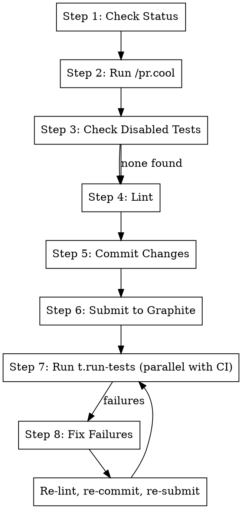

# Submit

## Overview

Prepare and submit the current branch to Graphite, then run tests locally while CI runs remotely. This maximizes
parallelism - CI starts immediately while local tests provide faster feedback.

**Core principle:** Cool → Disabled Tests → Lint → Commit → Submit → Test locally (parallel with CI) → Fix → Re-submit

**Announce at start:** "I'm using the submit skill to clean up, submit, and validate this branch."

## The Process



## Step 1: Check Status

```bash
# Get current branch
git branch --show-current

# Check for uncommitted changes
git status --short

# See what's changed vs main
git diff main..HEAD --stat
```

**If on main:** Stop and ask user which branch to work on.

## Step 2: Run /pr.cool

Invoke the `/pr.cool` skill to clean up backwards compatibility code:

- Remove class/function aliases, fix callsites
- Replace defensive fallbacks with assertions
- Remove compatibility shims

```
Use Skill tool: skill="pr.cool"
```

## Step 3: Check for Disabled Tests

**No tests should be disabled/skipped.** If a test is broken, fix it or fix the code.

### 3a: Find Disabled Tests

```bash
# Search for skip decorators in changed files
git diff main..HEAD --name-only -- "*.py" | xargs grep -l "@pytest.mark.skip\|@unittest.skip\|pytest.skip\|@pytest.mark.xfail" 2>/dev/null

# Search more broadly in test files
grep -rn "@pytest.mark.skip\|@unittest.skip\|pytest.skip(\|@pytest.mark.xfail" tests/ --include="*.py"

# Also check for commented-out tests
grep -rn "# def test_\|#def test_\|# async def test_" tests/ --include="*.py"
```

### 3b: Fix Each Disabled Test

| Situation                          | Action                                      |
| ---------------------------------- | ------------------------------------------- |
| Test is flaky                      | Fix the flakiness (timing, isolation, etc.) |
| Test tests removed feature         | Delete the test                             |
| Test has wrong assertion           | Fix the assertion                           |
| Code has a bug                     | Fix the code, not the test                  |
| Test needs update for new behavior | Update the test                             |
| Environment-specific skip          | OK to keep (e.g., `skipif(not CI)`)         |

### 3c: Acceptable Skips

**These are OK to keep:**

```python
# Environment-specific (can't run locally)
@pytest.mark.skipif(not os.environ.get("CI"), reason="Only runs in CI")

# Platform-specific
@pytest.mark.skipif(sys.platform != "linux", reason="Linux only")

# Dependency-specific
@pytest.mark.skipif(not HAS_GPU, reason="Requires GPU")
```

## Step 4: Lint (MANDATORY - NEVER SKIP)

**CRITICAL:** Lint MUST pass before submitting. Skipping lint causes CI failures. This step is non-negotiable even if
tests pass.

Invoke `/cb.lint-fix` to ensure all formatters (including prettier) are available and run lint:

```
Use Skill tool: skill="cb.lint-fix"
```

**Do NOT proceed to Step 5 until lint passes with exit code 0.**

## Step 5: Commit Changes

```bash
# Check what changed
git status --short
git diff --stat

# Stage all changes
git add -A
```

**If this is a new branch (no commits yet):**

```bash
gt create -m "feat: <description of changes>

- <bullet point 1>
- <bullet point 2>

Co-Authored-By: Claude <noreply@anthropic.com>"
```

**If amending existing branch:**

```bash
gt modify --no-interactive
```

## Step 6: Submit to Graphite

Submit immediately so CI starts running:

```bash
gt submit --no-interactive
```

**CI is now running remotely.** Print the Graphite PR URL and proceed to local tests in parallel:

```bash
PR_NUMBER=$(gh pr view --json number -q '.number')
OWNER=$(gh repo view --json owner -q '.owner.login')
REPO=$(gh repo view --json name -q '.name')
echo "https://app.graphite.dev/github/pr/$OWNER/$REPO/$PR_NUMBER"
```

## Step 7: Run Tests Locally (Parallel with CI)

Run local tests while CI runs remotely. Use t.run-tests for progressive testing:

```bash
# Run tests affected by changes
metta pytest --changed -v

# If --changed isn't available, run full suite
uv run pytest tests/ -v --tb=short
```

Or invoke the t.run-tests skill for the full progressive flow (failed tests → pytest → metta ci).

**If all tests pass:** Done! CI should also pass since local tests mirror CI checks.

**If tests fail:** Continue to Step 8.

## Step 8: Fix and Re-Submit

For each failing test:

1. **Read the full error** including traceback
2. **Understand the root cause:**
   - Is it a bug in the new code?
   - Is it a test that needs updating?
   - Is it a missing import or dependency?

3. **Fix the issue:**
   - If bug in code → fix the code
   - If test needs updating → update the test
   - If unclear → use `/systematic-debugging`

4. **Re-run the specific test:**

   ```bash
   metta pytest tests/path/to/test_file.py::test_name
   ```

5. **Once fixed, re-lint, re-commit, and re-submit:**

   ```
   Use Skill tool: skill="cb.lint-fix"
   ```

   ```bash
   git add -A
   gt modify --no-interactive
   gt submit --no-interactive
   ```

6. **Return to Step 7** to verify all tests pass.

## Step 9: Remove Worktree

After all tests pass and submission is complete, invoke `/wt.cleanup` to remove the worktree and return to the main
repo.

## Quick Reference

| Step           | Command                        | Purpose                      |
| -------------- | ------------------------------ | ---------------------------- |
| Cool           | `/pr.cool` skill               | Clean up compat code         |
| Check disabled | `grep -rn "@pytest.mark.skip"` | Fix test or code             |
| Lint           | `/cb.lint-fix`                 | Fix lint errors              |
| Commit         | `gt modify --no-interactive`   | Stage changes                |
| Submit         | `gt submit --no-interactive`   | Push to Graphite (CI starts) |
| Test           | `metta pytest --changed`       | Run locally parallel with CI |
| Fix + resubmit | Fix → lint → modify → submit   | Iterate until tests pass     |

## Why Submit Before Testing?

- **CI starts immediately** - no waiting for local tests to finish first
- **Parallel execution** - local tests and CI run simultaneously
- **Faster feedback loops** - if local tests pass, CI likely passes too
- **If local tests fail** - fix and re-submit; the previous CI run is just superseded
- **Net time savings** - especially on branches where tests are likely to pass

## Handling Common Issues

### Tests fail after /pr.cool

The `/pr.cool` skill may remove fallbacks that tests depended on:

```python
# /pr.cool changed this:
value = config.get("key", "default")  # BEFORE
value = config["key"]                  # AFTER

# Test that now fails:
def test_something():
    config = {}  # Missing "key"!
    result = func(config)  # Now raises KeyError
```

**Fix:** Update the test to provide required values:

```python
def test_something():
    config = {"key": "test_value"}  # Provide required key
    result = func(config)
```

### Lint errors after fixes

```bash
# Auto-fix what's possible
ruff check . --fix
ruff format .

# For remaining errors, fix manually
```

### Graphite submit fails

```bash
# Check if logged in
gt auth status

# If not logged in
gt auth login

# If branch not tracked
gt track
```

## Red Flags

**Stop and ask if:**

- Tests are failing in ways you don't understand
- A disabled test was added in this branch without clear justification
- `/pr.cool` wants to remove something that looks intentional
- The branch has merge conflicts
- You're unsure if changes should be amending or new commit

## Integration

**Uses:**

- **/pr.cool** - Called in Step 2 to clean up compat code
- **/t.run-tests** - Progressive test runner (Step 7)
- **/systematic-debugging** - For complex test failures
- **/wt.cleanup** - Worktree removal (Step 9)

**Called by:**

- **/pr.fix-branch** - As final step after /pr.fix-comments and /pr.fix-ci
- **/st.make-stack** - For each branch after creation

**Run first if needed:**

- **/pr.fix-comments** - If there are unaddressed PR review comments
- **/pr.fix-ci** - If CI is currently failing
