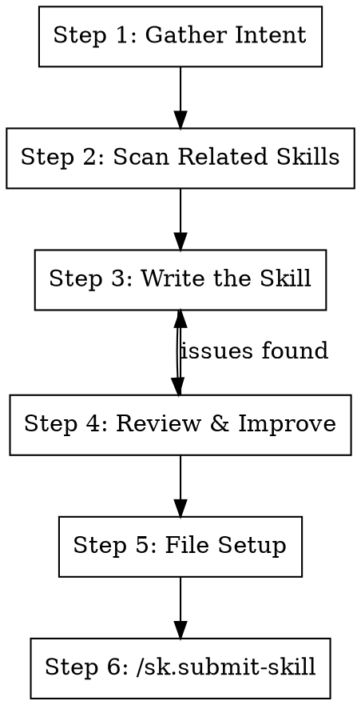

# Make Skill

Create a high-quality skill with proper structure, reviewing it against best practices and existing skills.

**Usage:** `/sk.make-skill my:skill-name "Short description of what it does"`

**Announce at start:** "Creating new skill `<skill-name>`. I'll scan existing skills for related patterns first."

## The Process



## Step 1: Gather Intent

From the user's args or conversation, determine:

- **Name**: `prefix:name` format (e.g., `pr.fix-ci`, `cf.really`, `t.run-tests`)
- **Purpose**: What problem does this solve? When would someone invoke it?
- **Trigger**: What situation or symptom causes someone to reach for this?

If unclear, ask the user before proceeding.

### Prefix Conventions

Read `docs/skills.md` first and use its namespace table as the source of truth.

If a skill spans multiple domains, pick the most central intent. If no prefix fits, propose a new one in
`docs/skills.md` before adding the skill.

## Step 2: Scan Related Skills

Read existing skills to find:

1. **Skills this new one could compose with** (call or be called by)
2. **Skills doing something similar** (to avoid duplication or learn patterns)
3. **Patterns to reuse** (common structures, shared steps)

```bash
REPO_ROOT=$(git rev-parse --show-toplevel)
SKILLS_DIR="$REPO_ROOT/skills"
ls "$SKILLS_DIR"
```

Read the SKILL.md of any that look related. Pay attention to their Integration sections.

**Report findings to user:**

- "Found X related skills: ..."
- "This new skill could compose with: ..."
- "Similar to X but different because: ..."

## Step 3: Write the Skill

Write a complete SKILL.md, not just a skeleton. Use this structure:

### Required Structure

```markdown
---
name: <skill-name>
description: Use when <triggering conditions and symptoms>
---

# <Title>

## Overview

<1-2 sentences: what is this and core principle>

**Announce at start:** "<what to say when invoked>"

## The Process

<dot flowchart if process has non-obvious decisions or loops>

## Step N: <Name>

<concrete steps with bash/code examples>

## Quick Reference

<table for scanning>

## Integration

**Uses:** <skills this calls> **Called by:** <skills that call this> **Pairs with:** <complementary skills>
```

### Writing Guidelines

Apply these from the superpowers:writing-skills best practices:

| Rule                                     | Detail                                                 |
| ---------------------------------------- | ------------------------------------------------------ |
| Description = triggering conditions only | Start with "Use when...", never summarize the workflow |
| One excellent example                    | Not multi-language, not generic templates              |
| Flowchart only for decisions/loops       | Linear steps use numbered lists                        |
| Concrete bash/code                       | Not pseudocode, not abstract                           |
| Integration section                      | Show how it connects to other skills                   |
| Keyword-rich                             | Use terms someone would search for                     |
| Concise                                  | <500 words for most skills                             |

## Step 4: Review & Improve

After writing, review the skill for these common problems:

### Quality Checklist

| Check                               | Problem                                                | Fix                                           |
| ----------------------------------- | ------------------------------------------------------ | --------------------------------------------- |
| Description summarizes workflow?    | Claude may follow description instead of reading skill | Rewrite to only include triggering conditions |
| Missing flowchart for complex flow? | Hard to see the overall process                        | Add dot graph                                 |
| Flowchart for linear steps?         | Unnecessary complexity                                 | Replace with numbered list                    |
| No Integration section?             | Skill is isolated, won't be discovered via composition | Add uses/called-by/pairs-with                 |
| Hardcoded paths?                    | Won't work in other contexts                           | Use variables or relative paths               |
| No "Announce at start"?             | User doesn't know what's happening                     | Add announcement                              |
| Vague steps ("fix the issue")?      | Not actionable                                         | Add concrete commands                         |
| No Quick Reference?                 | Can't scan at a glance                                 | Add summary table                             |
| Over 500 words?                     | Too long to load efficiently                           | Compress, move details to supporting files    |
| Steps missing error handling?       | Skill breaks on common failures                        | Add "if X fails" branches                     |
| Could compose with existing skill?  | Reinventing the wheel                                  | Call existing skill instead of reimplementing |

### Suggest Improvements

Present findings to user:

```
## Skill Review

**Issues found:**
- <problem>: <suggested fix>

**Composition opportunities:**
- Could call <existing-skill> for <step> instead of reimplementing
- Could be called by <existing-skill> as part of its workflow

**Missing sections:**
- <section>: <why it would help>
```

Fix issues before proceeding to Step 5. Loop back to Step 3 if needed.

## Step 5: File Setup

### 5a: Create files

```bash
SKILL_NAME="<skill-name>"
REPO_ROOT=$(git rev-parse --show-toplevel)
SKILLS_DIR="$REPO_ROOT/skills"
mkdir -p "$SKILLS_DIR/$SKILL_NAME"
# Write the SKILL.md (done in Step 3)
```

### 5b: Sync skills

```bash
./scripts/skills-sync.sh
```

### 5c: Update README

Edit the shared skills catalog at `$REPO_ROOT/docs/ai/skills.md`:

- Add row to the appropriate table based on prefix
- If prefix is new, create a new section heading and table

## Step 6: Submit

Invoke `/sk.submit-skill` to handle worktree, lint, commit, submit, publish, and merge-when-ready.

## Common Mistakes When Writing Skills

| Mistake                       | Why It's Bad                      | Fix                          |
| ----------------------------- | --------------------------------- | ---------------------------- |
| Skeleton with "1. ..."        | User has to write the whole thing | Write the full skill content |
| Description says what it does | Claude shortcuts the skill body   | Describe when to use it      |
| No Integration section        | Orphaned skill, never composed    | Map relationships            |
| Reimplementing existing steps | Drift, maintenance burden         | Call existing skills         |
| Too abstract                  | Can't actually follow it          | Use real commands and paths  |
| No review step                | Ships with obvious problems       | Always run Step 4            |

## Integration

**Uses:**

- **sk.submit-skill** - Handles worktree, lint, commit, submit, publish, merge

**Pairs with:**

- **sk.update-skill** - For modifying existing skills
- **superpowers:writing-skills** - For comprehensive skill authoring best practices and TDD approach
- **cf.really** - Can wrap any skill for retry semantics
