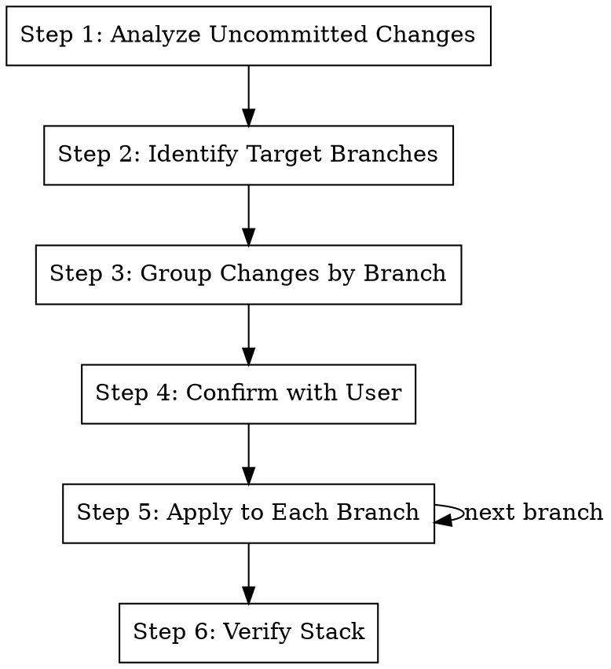

# Apply Changes to Correct Branches

## Overview

Route uncommitted changes to their correct branches in a Graphite stack. Useful when you've been making changes but
realize they belong to different branches in your stack.

**Core principle:** Analyze Changes → Group by Branch → Stash → Apply to Each Branch → Verify

**Announce at start:** "I'm using the st.apply skill to route changes to their correct branches."

## When to Use

- You have uncommitted changes that belong to different branches
- You made a fix but realized it should go to a different branch in the stack
- You want to distribute changes across multiple branches correctly
- You accidentally made changes on the wrong branch

## The Process



## Step 1: Analyze Uncommitted Changes

```bash
# See current branch and stack position
gt log short

# See uncommitted changes
git status

# See the actual diff
git diff

# See staged changes too
git diff --cached
```

**Understand:**

- What files have been modified?
- What is the nature of each change?
- Which branch in the stack should own each change?

## Step 2: Identify Target Branches

```bash
# Get the full stack state
gt state

# See what each branch contains
gt log
```

**For each changed file, determine:**

- Does it relate to a feature in a specific branch?
- Is it a fix for something introduced in a specific branch?
- Is it new work that should be a new branch?

## Step 3: Group Changes by Branch

Create a mapping of changes to branches:

```
## Change Routing Plan

### Branch: feature-auth
Files:
- src/auth/login.py (fix for auth bug introduced in this branch)

### Branch: feature-dashboard
Files:
- src/components/Header.tsx (dashboard-related component)

### Branch: Current (stay here)
Files:
- src/utils/helpers.py (relates to current branch work)

### New Branch Needed
Files:
- src/config/settings.py (unrelated config change)
```

## Step 4: Confirm with User

Present the routing plan:

```
## Change Routing Plan

**Current branch:** {current-branch}
**Uncommitted changes:** {N} files

**Routing:**
- `src/auth/login.py` → `feature-auth` (auth fix)
- `src/components/Header.tsx` → `feature-dashboard` (dashboard component)
- `src/utils/helpers.py` → stay in `{current-branch}`
- `src/config/settings.py` → new branch `config-cleanup`

Proceed with this routing?
```

**Use AskUserQuestion** to confirm the routing is correct.

## Step 5: Apply to Each Branch

For each target branch:

```bash
# Save current state
CURRENT_BRANCH=$(git branch --show-current)

# Create a patch for files going to this branch
git diff -- path/to/file1.py path/to/file2.py > /tmp/branch-changes.patch

# Stash everything
git stash push -m "st.apply - routing changes"

# Go to target branch
gt checkout {target-branch}

# Apply the patch
git apply /tmp/branch-changes.patch

# Stage and amend
git add path/to/file1.py path/to/file2.py
gt modify --no-interactive

# Return to original branch
gt checkout "$CURRENT_BRANCH"

# Pop stash to get remaining changes
git stash pop
```

**For new branches:**

```bash
# Find appropriate parent
PARENT=$(gt state 2>/dev/null | jq -r '.["'$CURRENT_BRANCH'"].parents[0].ref')

# Stash changes
git stash push -m "st.apply - for new branch"

# Go to parent
git checkout "$PARENT"

# Create new branch
gt create -m "chore: {description}"

# Apply changes for this branch
git stash pop
git add path/to/new/file.py
gt modify --no-interactive

# Return to original work
gt checkout "$CURRENT_BRANCH"
```

**Repeat for each target branch.**

After all routing is complete, remaining changes (if any) stay on the current branch:

```bash
# If there are remaining changes for current branch
git add -A
gt modify --no-interactive
```

## Step 6: Verify Stack

```bash
# Verify stack is healthy
gt restack

# Run tests on affected branches
gt checkout {branch-1}
metta pytest --changed -v

gt checkout {branch-2}
metta pytest --changed -v

# Return to original branch
gt checkout "$CURRENT_BRANCH"

# Show final state
gt log short
```

## Quick Reference

| Step     | Command                      | Purpose                  |
| -------- | ---------------------------- | ------------------------ |
| Analyze  | `git diff`                   | See uncommitted changes  |
| Stack    | `gt log short`               | See branch structure     |
| Patch    | `git diff -- file > patch`   | Create partial patch     |
| Stash    | `git stash push -m "..."`    | Save changes temporarily |
| Checkout | `gt checkout branch`         | Switch branches          |
| Apply    | `git apply patch`            | Apply patch to branch    |
| Amend    | `gt modify --no-interactive` | Update branch commit     |
| Restack  | `gt restack`                 | Fix stack after changes  |

## Common Patterns

### Pattern 1: Single File to Different Branch

```bash
# Save the file content
git show :path/to/file.py > /tmp/file-backup.py

# Revert it locally
git checkout -- path/to/file.py

# Go to correct branch
gt checkout correct-branch

# Copy the backup
cp /tmp/file-backup.py path/to/file.py

# Amend
git add path/to/file.py
gt modify --no-interactive

# Return
gt checkout original-branch
```

### Pattern 2: Mixed Changes in One File

If a file has changes for multiple branches:

```bash
# Stage only specific hunks
git add -p path/to/file.py
# Answer y/n for each hunk

# Create patch from staged
git diff --cached > /tmp/partial.patch

# Reset staged
git reset HEAD

# Apply patch to correct branch
gt checkout correct-branch
git apply /tmp/partial.patch
git add -A
gt modify --no-interactive

gt checkout original-branch
```

### Pattern 3: Accidental Changes on Wrong Branch

```bash
# Save all changes
git stash push -m "wrong branch changes"

# Go to correct branch
gt checkout correct-branch

# Pop and apply
git stash pop
git add -A
gt modify --no-interactive

# Return (now clean)
gt checkout original-branch
```

## Handling Conflicts

If applying changes causes conflicts:

1. **Review the conflict** - understand what changed in both places
2. **Resolve manually** - edit the file to combine changes correctly
3. **Stage and continue** - `git add` and `gt modify`

```bash
# After conflict
git status  # See conflicted files

# Edit to resolve
vim path/to/conflicted/file.py

# Mark resolved
git add path/to/conflicted/file.py
gt modify --no-interactive
```

## Common Mistakes

**Forgetting to stash**

- **Problem:** Changes get lost when switching branches
- **Fix:** Always stash before checkout, pop after return

**Applying to wrong branch**

- **Problem:** Changes end up in wrong place in stack
- **Fix:** Use `gt log short` to verify branch before applying

**Breaking the stack**

- **Problem:** Restack fails after changes
- **Fix:** Run `gt restack` after all changes, fix conflicts

**Losing changes**

- **Problem:** Some changes disappear during routing
- **Fix:** Create patches/backups before any git operations

## Red Flags

**Stop and reconsider if:**

- Changes are deeply intertwined (can't cleanly separate)
- You're unsure which branch owns a change (ask user)
- The stack is in a broken state (fix with `gt restack` first)
- There are merge conflicts in the stack (resolve first)

## Integration

**Uses:**

- **gt modify** - For amending changes into branches
- **gt restack** - For fixing stack after changes

**Related skills:**

- **/st.extract** - For extracting features into new branches
- **/pr.fix-branch** - For fixing issues on specific branches
- **/st.make-stack** - For creating new stack structure
