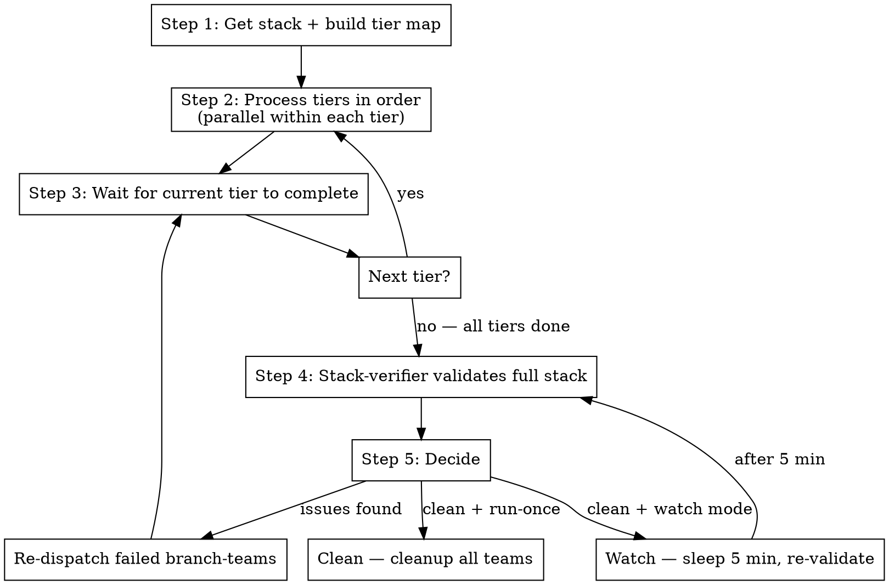

# Fix Stack (Team)

## Overview

Fix an entire Graphite stack using **nested Claude agent teams**. The stack-master determines branch dependency tiers
and spawns branch-teams in parallel for independent branches. Each branch-team runs the full `pr.fix-branch.team` loop
internally. After all branches pass, a stack-verifier checks the entire stack.

**Core principle:** Tier branches by dependency → Parallel branch-teams per tier → Validate full stack → Loop

**Announce at start:** "I'm using the fix-stack.team skill to fix all branches in this stack with agent teams."

## Team Architecture

```
stack-master (top-level lead, delegate mode)
├── branch-team-1  (full pr.fix-branch.team for branch-1)
│   ├── comment-getter
│   ├── ci-checker
│   ├── tester
│   ├── fixer-1..N
│   └── verifier
├── branch-team-2a (full pr.fix-branch.team for branch-2a)  ← parallel with 2b
├── branch-team-2b (full pr.fix-branch.team for branch-2b)  ← parallel with 2a
├── branch-team-3  (full pr.fix-branch.team for branch-3)
└── stack-verifier  — final full-stack validation
```

**Why nested teams?** Each branch needs its own coordinated team (checkers, fixers, verifier). Independent branches
(siblings at the same tier) run their teams concurrently. The stack-master only tracks tier ordering and branch-level
success/failure.

## The Process



### Step 1: Get Stack Branches

**Create the stack team:**

```
Teammate(operation="spawnTeam", team_name="fix-stack-{stack_name}", description="Fixing stack {stack_name}")
```

**Get the stack structure:**

```bash
current=$(git branch --show-current)

# Get full stack as JSON
STACK_JSON=$(gt state 2>/dev/null)

# Find root of stack (branch whose parent is main)
root=$(echo "$STACK_JSON" | jq -r --arg branch "$current" '
  def get_root($b):
    if .[$b].parents[0].ref == "main" then $b
    else get_root(.[$b].parents[0].ref)
    end;
  get_root($branch)
')
```

**Get all branches in bottom-up order:**

```bash
BRANCHES=$(echo "$STACK_JSON" | jq -r --arg root "$root" '
  def children($branch):
    to_entries | map(select(.value.parents and (.value.parents | map(.ref) | contains([$branch])))) | map(.key);

  def get_upstack($branch):
    children($branch) as $kids |
    if ($kids | length) == 0 then [$branch]
    else [$branch] + get_upstack($kids[0])
    end;

  get_upstack($root) | .[]
')
```

### Step 2: Process Branch-Teams in Dependency Order

**Filter out merged branches**, then process remaining branch-teams in tiers based on dependency depth:

```bash
# Build tier map from the branch list (BRANCHES is in bottom-up order from Step 1)
# Tier 0: branches whose parent is main (root of stack)
# Tier 1: branches whose parent is a tier-0 branch
# Tier N: branches whose parent is a tier-(N-1) branch

for branch in $BRANCHES; do
  STATE=$(gh pr view "$branch" --json state -q '.state' 2>/dev/null)
  if [ "$STATE" = "MERGED" ]; then
    echo "Skipping $branch — already merged"
    continue
  fi

  # Determine tier by counting depth from root
  PARENT=$(echo "$STACK_JSON" | jq -r --arg b "$branch" '.[$b].parents[0].ref')
  TIER=0
  CURRENT_PARENT="$PARENT"
  while [ "$CURRENT_PARENT" != "main" ]; do
    TIER=$((TIER + 1))
    CURRENT_PARENT=$(echo "$STACK_JSON" | jq -r --arg b "$CURRENT_PARENT" \
      '.[$b].parents[0].ref')
  done

  echo "Branch $branch → Tier $TIER"
done
```

**Process tiers in order.** For each tier, spawn all branches at that tier in parallel, then wait for them to complete
before moving to the next tier. This ensures lower branches are fixed before their dependents start.

Each branch-team is a teammate that creates its own worktree for isolation and internally invokes `/pr.fix-branch.team`:

```
Task(
  subagent_type="general-purpose",
  name="branch-{branch_name}",
  team_name="fix-stack-{stack_name}",
  description="Fix branch {branch_name}",
  prompt="""
  You are fixing branch '{branch_name}' as part of a Graphite stack fix.

  Working directory: {repo_path}
  Branch: {branch_name}

  IMPORTANT: Set up a worktree BEFORE doing anything else. This ensures
  isolation from other branch-teams running in parallel:

    BRANCH="{branch_name}"
    EXISTING=$(git worktree list --porcelain \
      | grep -B2 "branch refs/heads/$BRANCH" \
      | grep "worktree " | cut -d' ' -f2)
    if [ -n "$EXISTING" ]; then
      cd "$EXISTING"
    else
      git worktree add .worktrees/$BRANCH $BRANCH
      cd .worktrees/$BRANCH
    fi

  Then invoke the /pr.fix-branch.team skill using the Skill tool:
    Skill(skill="pr.fix-branch.team")

  This will set up an agent team for this branch and run the full fix loop:
  - Parallel issue detection (comments + CI)
  - Smart fixer dispatch
  - Verify + submit
  - Local testing with metta-ci
  - Loop until clean

  Run in run-once mode (not watch mode) — the stack-master handles re-checks.

  Report back to stack-master:
  - success/failure
  - PR URL
  - Summary of changes made
  - Any unresolved issues
  """
)
```

**Branches are processed in tiers.** Sibling branches at the same depth run in parallel within their tier. The
stack-master waits for a tier to complete before spawning the next tier. Each branch-team uses its own worktree, so
there are no conflicts between parallel siblings.

### Step 3: Wait for Current Tier, Then Advance

Stack-master waits for all branch-teams in the current tier to report back before moving to the next tier.

**Track progress:**

```
Tier 0:
  branch-1: success — 2 comments fixed, CI passing
Tier 1:
  branch-2a: success — 1 lint error fixed
  branch-2b: in progress...
Tier 2:
  branch-3: pending (waiting for Tier 1)
```

**If a branch-team fails:**

- Log which branch and why
- If it's a fixable issue: retry that branch-team
- Other branches in the same tier continue independently -- don't wait
- Do NOT advance to the next tier until all branches in the current tier succeed or are marked unfixable

**After all tiers complete:** proceed to Step 4.

### Step 4: Stack Verifier Validates Full Stack

After all branches complete, the stack-verifier checks the entire stack:

```
Task(
  subagent_type="general-purpose",
  name="stack-verifier",
  team_name="fix-stack-{stack_name}",
  description="Validate full stack",
  prompt="""
  You are the stack-verifier. Check the health of the entire Graphite stack.

  Branches in order: {all_branches}
  Repository: {repo_path}

  For each branch:
  1. Checkout the branch
  2. Run gt restack — check for conflicts
  3. Check CI status (use commit SHA, not gh pr checks):
     HEAD_SHA=$(git rev-parse HEAD)
     OWNER=$(gh repo view --json owner -q '.owner.login')
     REPO=$(gh repo view --json name -q '.name')
     gh api repos/$OWNER/$REPO/commits/$HEAD_SHA/check-runs \
       --jq '.check_runs[] | "\(.name): \(.conclusion // .status)"'
  4. Check for unresolved PR comments

  Report to stack-master:
  - Per-branch status: CI, comments, restack
  - Any issues that need re-fixing
  - Overall stack health: mergeable or not
  """
)
```

### Step 5: Stack-Master Decides

Based on verifier's report:

- **All clean + run-once mode** → shutdown all teams, report success
- **All clean + watch mode** → sleep 5 min, re-run verifier (Step 4)
- **Issues found** → re-dispatch only affected branch-teams, wait for them, re-validate

### Run-Once vs Watch Mode

- **run-once** (default): Spawn all branches, validate, done
- **watch**: After clean, sleep 5 min and re-validate. Re-dispatches branch-teams for any new issues. Runs until user
  cancels

## Shutdown

When done (or cancelled):

1. Stack-master sends shutdown requests to all branch-team teammates
2. Each branch-team shuts down its internal teammates first
3. Stack-master runs `Teammate(operation="cleanup")`
4. Invoke `/wt.cleanup` with bulk mode to remove all worktrees

## Quick Reference

| Step | Who            | What                                   | Parallel?              |
| ---- | -------------- | -------------------------------------- | ---------------------- |
| 1    | Stack-master   | Get stack branches, build tier map     | --                     |
| 2    | Stack-master   | Process tiers in order, spawn per tier | Yes (within each tier) |
| 3    | Stack-master   | Wait for current tier, advance to next | --                     |
| 4    | Stack-verifier | Validate full stack                    | --                     |
| 5    | Stack-master   | Decide: loop, done, or watch           | --                     |

## Parallel Execution Rules

- **Branches at the same dependency depth run in parallel** within their tier
- **Tiers are processed sequentially** -- lower branches complete before dependents start
- Each branch-team uses its own worktree for isolation (created before any checkout)
- A failed branch in a tier does not block siblings, but blocks dependent tiers
- Stack-master can retry individual failed branches without affecting siblings
- **Skip merged branches**: Before spawning a branch-team, check `gh pr view <branch> --json state -q '.state'`. If
  `MERGED`, skip it
- After all tiers complete, `gt restack` in the verifier ensures the stack is consistent

## Red Flags

**Stop and escalate to user if:**

- A branch has unresolvable merge conflicts after restack
- Same branch fails 3+ times
- Stack structure is unclear or circular
- gt restack fails after branch-teams report success
- Watch mode running 30+ minutes with no progress

## CRITICAL: Check CI Status Correctly

**Always use commit SHA** — `gh pr checks` returns stale data:

```bash
HEAD_SHA=$(git rev-parse HEAD)
OWNER=$(gh repo view --json owner -q '.owner.login')
REPO=$(gh repo view --json name -q '.name')
gh api repos/$OWNER/$REPO/commits/$HEAD_SHA/check-runs \
  --jq '.check_runs[] | "\(.name): \(.conclusion // .status)"'
```

## Integration

**Uses:**

- **pr.fix-branch.team** — Each branch runs the full team-based fix loop
- **using-git-worktrees** — Worktree per branch (via branch-teams)
- **wt.cleanup** — Bulk worktree removal on shutdown

**Simpler alternative:**

- **st.fix-stack** — Sequential sub-agent approach (no teams, less parallelism)

**Pairs with:**

- **st.make-stack** — Creates stacks that this skill later fixes
- **finishing-a-development-branch** — For cleanup after branches are merged
