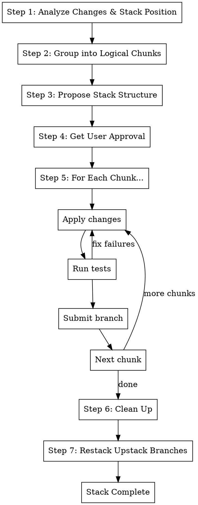

# Make Stack

## Overview

Break a large branch with many changes into a reviewable Graphite stack. Each branch in the stack should be
independently viable (tests pass) and easy to review.

**Maintains stack position:** If the branch being split has upstack branches, they will be restacked on top of the new
stack's top branch.

**Core principle:** Analyze → Plan Stack → Get Approval → Create & Test & Submit Each Branch → Restack Upstack

**Announce at start:** "I'm using the make-stack skill to break this branch into a reviewable stack."

## The Process



### Step 1: Analyze Changes & Stack Position

```bash
# Get current branch
BRANCH=$(git branch --show-current)

# Get all changes from main
git diff main...$BRANCH --stat
git diff main...$BRANCH --name-only

# Get detailed diff
git diff main...$BRANCH

# Get commit history
git log main..$BRANCH --oneline
```

**Understand:**

- Which files changed
- What types of changes (new features, refactors, tests, docs, etc.)
- Dependencies between changes
- Total size of the diff

#### 1a: Record Stack Position

**Critical:** Before splitting, record what branches are stacked on top of this one.

```bash
# Get the current stack state
gt state

# Find branches that have this branch as their parent
UPSTACK_BRANCHES=$(gt state 2>/dev/null | jq -r --arg branch "$BRANCH" '
  to_entries |
  map(select(.value.parents and (.value.parents | map(.ref) | contains([$branch])))) |
  map(.key) | .[]
')

echo "Upstack branches: $UPSTACK_BRANCHES"
```

**Example stack before splitting:**

```
main
  └── branch-A (parent)
      └── branch-B (THIS BRANCH - splitting into 3)
          └── branch-C (upstack - must be preserved)
              └── branch-D (upstack - must be preserved)
```

**After splitting, the result should be:**

```
main
  └── branch-A (parent - unchanged)
      └── branch-B-1 (new bottom)
          └── branch-B-2 (new middle)
              └── branch-B-3 (new top)
                  └── branch-C (restacked here)
                      └── branch-D (automatically follows)
```

**Record these values for Step 7:**

- `ORIGINAL_BRANCH`: The branch being split
- `UPSTACK_BRANCHES`: Branches that were stacked on top
- `PARENT_BRANCH`: The branch this one was stacked on

### Step 2: Group into Logical Chunks

**Grouping principles (in priority order):**

1. **Dependencies first** - Infrastructure/shared code before features using it
2. **One concern per branch** - Single feature, single refactor, or single fix
3. **Tests with implementation** - Keep tests with the code they test
4. **~200-400 lines per branch** - Aim for reviewable size
5. **Each branch must pass tests** - No broken intermediate states

**Common grouping patterns:**

| Pattern                       | Example                                             |
| ----------------------------- | --------------------------------------------------- |
| **Infrastructure → Features** | Add utility → Use utility in feature                |
| **Types → Implementation**    | Add types/interfaces → Implement them               |
| **Refactor → Enhance**        | Clean up existing code → Add new functionality      |
| **Backend → Frontend**        | API changes → UI changes                            |
| **Core → Tests**              | Implementation → Test coverage (if tests are large) |

**Anti-patterns to avoid:**

- Mixing unrelated changes in one branch
- Breaking a feature across branches (half-working states)
- Putting all tests in a separate branch from implementation
- Creating branches that can't pass tests independently
- Stacking independent features (use `/st.extract` for parallel branches instead)

### Step 3: Propose Stack Structure

Present the proposed stack to the user:

```
## Proposed Stack Structure

Base: main

### Branch 1: {base-branch}-types
**Changes:** Add new type definitions
**Files:**
- src/types/user.ts (+45 lines)
- src/types/index.ts (+2 lines)
**Why first:** Other changes depend on these types

### Branch 2: {base-branch}-api
**Changes:** Add user API endpoints
**Files:**
- src/api/users.ts (+120 lines)
- src/api/index.ts (+5 lines)
**Depends on:** Branch 1 (uses new types)

### Branch 3: {base-branch}-ui
**Changes:** Add user management UI
**Files:**
- src/components/UserList.tsx (+180 lines)
- src/components/UserForm.tsx (+95 lines)
**Depends on:** Branch 2 (calls API)

### Branch 4: {base-branch}-tests
**Changes:** Add integration tests
**Files:**
- tests/users.test.ts (+200 lines)
**Depends on:** Branch 3 (tests full feature)

---
Total: 4 branches, ~647 lines
```

**Use AskUserQuestion** to get approval or adjustments.

### Step 4: Get User Approval

Ask the user:

- Does this grouping make sense?
- Should any branches be combined or split further?
- Are the branch names appropriate?
- Any changes to the order?

**Adjust the plan based on feedback before proceeding.**

### Step 5: Create Each Branch

**For each chunk in order:**

#### 5a: Stash current state (first time only)

```bash
# Record the parent branch before we start
PARENT_BRANCH=$(gt state 2>/dev/null | jq -r --arg branch "$BRANCH" '.[$branch].parents[0].ref')

# Save all current changes
git stash push -m "make-stack: original changes"

# Checkout the parent branch (not main, unless parent IS main)
git checkout "$PARENT_BRANCH"
git pull origin "$PARENT_BRANCH" 2>/dev/null || true
```

**Important:** Start from the parent branch, not main, to maintain stack position.

#### 5b: Create the branch

```bash
# Create new branch with gt
gt create -m "feat: {description of this chunk}

{Detailed description of changes in this branch}

Part X of Y in stack for {overall feature}"
```

**Branch naming:** `{original-branch}-{chunk-name}`

- Example: `feature-user-management-types`
- Example: `feature-user-management-api`
- Example: `feature-user-management-ui`

#### 5c: Apply changes for this chunk

```bash
# Apply only the files/changes for this chunk from stash
git stash show -p | git apply --include='{pattern}'

# Or cherry-pick specific changes
git checkout stash@{0} -- path/to/specific/file.ts

# Stage the changes
git add <specific files for this chunk>

# Amend into the branch
gt modify --no-interactive
```

#### 5d: Run tests

```bash
# Run tests to verify this chunk works
metta pytest --changed
```

```
# Run lint (ensures prettier available)
Use Skill tool: skill="cb.lint-fix"
```

**If tests fail:**

1. Fix the issue (may need to pull in dependencies from later chunks)
2. Re-run tests
3. Update the plan if chunks need reorganization

#### 5e: Submit this branch

Run `/pr.submit` for this branch:

```
/pr.submit
```

This will:

- Run tests to verify the branch works
- Run `/pr.cool` to clean up any backwards compat code
- Lint and submit to Graphite

**Move to next chunk and repeat 5b-5e.**

### Step 6: Clean Up

After all branches are created:

```bash
# Clear the stash
git stash drop

# Record the top branch of the new stack
NEW_TOP_BRANCH=$(git branch --show-current)

# Verify stack structure so far
gt state
```

### Step 7: Restack Upstack Branches

**If there were upstack branches** (recorded in Step 1), restack them onto the new top branch.

```bash
# For each upstack branch that was on top of the original branch
for upstack_branch in $UPSTACK_BRANCHES; do
  echo "Restacking $upstack_branch onto $NEW_TOP_BRANCH"

  # Checkout the upstack branch
  git checkout "$upstack_branch"

  # Change its parent to the new top branch
  gt track --parent "$NEW_TOP_BRANCH"

  # Restack to apply the parent change
  gt restack

  # Update NEW_TOP_BRANCH for the next iteration (if there's a chain)
  NEW_TOP_BRANCH="$upstack_branch"
done
```

**Alternative using gt onto:**

```bash
# Move the first upstack branch onto the new top
git checkout "$FIRST_UPSTACK_BRANCH"
gt onto "$NEW_TOP_BRANCH"
gt restack
```

**Verify the final stack structure:**

```bash
# Should show the complete stack with upstack branches at the top
gt state

# Submit all to sync
gt submit --stack --no-interactive
```

**Example verification:**

```
main
  └── branch-A
      └── branch-B-1     ← new (bottom of split)
          └── branch-B-2 ← new (middle of split)
              └── branch-B-3 ← new (top of split)
                  └── branch-C ← restacked (was on original branch-B)
                      └── branch-D ← automatically follows
```

## Quick Reference

| Step            | Command                         | Purpose                      |
| --------------- | ------------------------------- | ---------------------------- |
| Record upstack  | `gt state \| jq ...`            | Find branches stacked on top |
| Record parent   | `gt state \| jq ...`            | Find parent branch           |
| Analyze         | `git diff main...$BRANCH`       | See all changes              |
| Stash           | `git stash push -m "..."`       | Save original changes        |
| Checkout parent | `git checkout "$PARENT_BRANCH"` | Start from correct position  |
| Create          | `gt create -m "..."`            | Create stack branch          |
| Apply           | `git checkout stash -- file`    | Apply chunk changes          |
| Test            | `metta pytest --changed`        | Verify branch works          |
| Submit          | `/pr.submit`                    | Test, clean, submit          |
| Restack upstack | `gt track --parent`             | Reconnect upstack branches   |

## When to Use /st.extract or /st.extract-copy Instead

**Use /st.make-stack when:** Changes are sequential/dependent (branch-2 needs branch-1)

```
parent → branch-1 → branch-2 → branch-3
```

**Use /st.extract when:** Changes are independent/parallel AND you want to split permanently

```
parent
  ├── feature-A (extracted)
  └── feature-B (remaining in original)
```

**Use /st.extract-copy when:** You want to land a subset early WITHOUT modifying the original

```
parent
  ├── original-branch (unchanged, still has all features)
  └── feature-A-early (copy for early landing)
```

| Scenario                      | Skill            | Original Modified?      |
| ----------------------------- | ---------------- | ----------------------- |
| Split into sequential stack   | /st.make-stack   | Yes (replaced by stack) |
| Split into parallel branches  | /st.extract      | Yes (feature removed)   |
| Copy subset for early landing | /st.extract-copy | No (unchanged)          |

**If your branch has both sequential and parallel features:**

1. First use `/st.extract-copy` to copy independent features for early landing
2. Then use `/st.make-stack` on the original to create the sequential stack

**Example workflow:**

```bash
# Original: large-branch has auth + dashboard + API changes

# Step 1: Copy auth for early landing (keeps original intact)
/st.extract-copy  # Copy auth into parallel branch

# Result:
# parent
#   ├── large-branch (unchanged - still has auth + dashboard + API)
#   └── large-branch-auth-early (can land now)

# Step 2: Stack the original branch (sequential features)
/st.make-stack  # Split into api → dashboard → auth

# Final result:
# parent
#   ├── large-branch-api → large-branch-dashboard → large-branch-auth
#   └── large-branch-auth-early (already landed or will merge cleanly)
```

## Handling Complex Dependencies

**If changes are tightly coupled:**

Sometimes changes can't be cleanly separated. In this case:

1. **Combine into one branch** - Better to have a larger reviewable branch than broken intermediate states
2. **Extract shared code first** - Use `/st.extract` to create a "foundation" branch with shared utilities
3. **Use feature flags** - Add code behind flags, enable in later branch

**If tests require full feature:**

1. Put minimal tests with each branch (unit tests)
2. Integration tests go in final branch
3. Or: skip tests in intermediate branches if truly impossible to separate

## Branch Naming Convention

```
{original-branch}-{chunk-type}[-{detail}]
```

**Examples:**

- `user-auth-types` - Type definitions
- `user-auth-api` - Backend API
- `user-auth-ui-components` - UI components
- `user-auth-ui-pages` - UI pages
- `user-auth-tests` - Test coverage
- `user-auth-docs` - Documentation

## Commit Message Format

```
{type}: {short description}

{Detailed description of what this branch adds}

Part {X} of {Y} in {feature-name} stack

Changes:
- {bullet point of changes}
- {bullet point of changes}
```

## Common Mistakes

**Losing upstack branches**

- **Problem:** Split a branch and orphan the branches that were stacked on top
- **Fix:** Record upstack branches in Step 1, restack them in Step 7

**Starting from main instead of parent**

- **Problem:** New stack starts from main, not from where original branch was
- **Fix:** Checkout the parent branch before creating new branches

**Creating broken intermediate states**

- **Problem:** Branch 2 doesn't pass tests without Branch 3
- **Fix:** Reorganize chunks so each is independently viable

**Too many tiny branches**

- **Problem:** 10 branches with 20 lines each is hard to review as a stack
- **Fix:** Combine related changes, aim for 200-400 lines per branch

**Not submitting incrementally**

- **Problem:** Waiting to submit everything at once delays review
- **Fix:** Submit each branch as soon as tests pass

**Forgetting dependencies**

- **Problem:** Branch 3 uses code from Branch 2 but they're not stacked
- **Fix:** Always verify import/dependency graph matches stack order

## Red Flags

**Stop and reconsider if:**

- A chunk can't pass tests without changes from a later chunk
- The stack would be more than 7-8 branches (too complex to review)
- Changes are so intertwined they can't be separated
- Reviewers would need to review multiple branches together anyway
- Upstack branches have conflicts when restacking (may need manual resolution)
- The parent branch has changed significantly since you started

## Integration

**Uses:**

- **pr.submit** - Called for each branch after creation (tests, /pr.cool, submit)
- **st.extract** - Use first to separate independent features into parallel branches
- **st.extract-copy** - Copy subset for early landing without modifying original

**Pairs with:**

- **pr.fix-branch** - Fix issues in individual stack branches later
- **st.fix-stack** - Fix the entire stack after creation
- **st.extract** - For independent features that should be parallel, not stacked
- **st.extract-copy** - For landing a subset early while continuing full development
