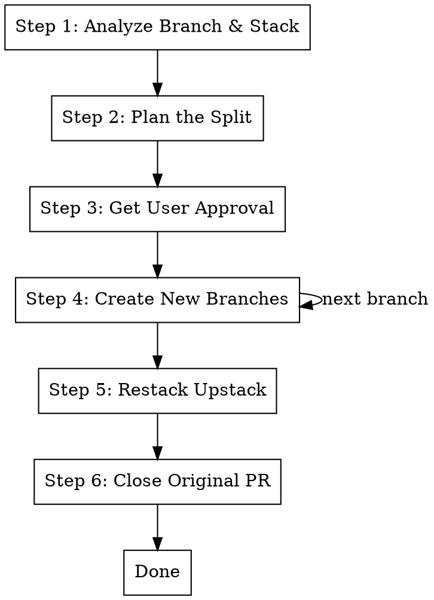

# Split

## Overview

Split a branch into multiple sequential branches occupying the same stack position. The original branch stays on its
parent with its PR closed, and upstack branches are restacked onto the new top branch.

**Announce at start:** "I'm using the split skill to break this branch into multiple sequential branches in-place."

## The Process



## Step 1: Analyze Branch & Stack

```bash
BRANCH=$(git branch --show-current)

# Understand the stack position
gt log short

# Record parent and upstack branches
PARENT_BRANCH=$(gt state 2>/dev/null | jq -r --arg branch "$BRANCH" '.[$branch].parents[0].ref')

# Find upstack branches
UPSTACK_BRANCHES=$(gt state 2>/dev/null | jq -r --arg branch "$BRANCH" '
  to_entries |
  map(select(.value.parents and (.value.parents | map(.ref) | contains([$branch])))) |
  map(.key) | .[]
')

echo "Parent: $PARENT_BRANCH"
echo "Upstack: $UPSTACK_BRANCHES"

# See all changes
git diff "$PARENT_BRANCH"..HEAD --stat
git diff "$PARENT_BRANCH"..HEAD --name-only
```

## Step 2: Plan the Split

Group changes into the requested branches. Follow the same principles as `/st.make-stack`:

- Dependencies first (shared code before features using it)
- Each branch must pass tests independently
- Keep tests with the code they test

Present the plan showing which files/changes go into each new branch.

## Step 3: Get User Approval

Use AskUserQuestion to confirm:

- File groupings per branch
- Branch names
- Order of branches in the stack

## Step 4: Create New Branches

```bash
# Save all current changes
git diff "$PARENT_BRANCH"..HEAD > /tmp/split-full.patch

# Checkout parent
git checkout "$PARENT_BRANCH"
```

**For each new branch (in order):**

```bash
# Create branch
gt create "<branch-name>" -m "feat: <description>

Part X of Y split from $BRANCH

Co-Authored-By: Claude <noreply@anthropic.com>"

# Apply the relevant changes
git checkout "$BRANCH" -- path/to/files
# Or for partial files:
git diff "$PARENT_BRANCH".."$BRANCH" -- path/to/file | git apply

# Stage and amend
git add -A
gt modify --no-interactive
```

**Run /pr.submit for each branch** to test, clean, and submit:

```
/pr.submit
```

## Step 5: Restack Upstack Branches

If there were upstack branches:

```bash
NEW_TOP=$(git branch --show-current)

for upstack in $UPSTACK_BRANCHES; do
  git checkout "$upstack"
  gt track --parent "$NEW_TOP"
  gt restack
  NEW_TOP="$upstack"
done
```

Submit the restacked branches:

```bash
gt submit --stack --no-interactive
```

## Step 6: Close Original PR

The original branch stays on its parent (no code changes needed), but its PR should be closed:

```bash
# Close the PR for the original branch
PR_NUMBER=$(gh pr list --head "$BRANCH" --json number -q '.[0].number')
if [ -n "$PR_NUMBER" ]; then
  gh pr close "$PR_NUMBER" --comment "Split into branches: <list new branch names>. See their PRs for review."
fi
```

**Report:**

- URLs for all new PRs
- Confirmation original PR is closed
- Final stack structure (`gt log short`)

## Quick Reference

| Step           | Command                       | Purpose                    |
| -------------- | ----------------------------- | -------------------------- |
| Record stack   | `gt log short`                | Understand stack position  |
| Find parent    | `gt state \| jq ...`          | Get parent branch          |
| Find upstack   | `gt state \| jq ...`          | Branches to restack later  |
| Create branch  | `gt create "<name>" -m "..."` | New branch in stack        |
| Apply changes  | `git checkout branch -- file` | Move changes to new branch |
| Submit         | `/pr.submit`                  | Test, clean, submit        |
| Restack        | `gt track --parent` + restack | Reconnect upstack          |
| Close original | `gh pr close`                 | Close original PR          |

## Example

**Before:** `a -> b -> c -> d` (splitting `c` into `x`, `y`)

**After:** `a -> b -> x -> y -> d` (with `c` still on `b`, PR closed)

```bash
# On branch c:
PARENT=b  # parent of c
UPSTACK=d # branches on top of c

# Checkout b, create x with first half of c's changes
git checkout b
gt create "x" -m "feat: first half"
git checkout c -- <first-half-files>
git add -A && gt modify --no-interactive
# /pr.submit

# Create y with second half
gt create "y" -m "feat: second half"
git checkout c -- <second-half-files>
git add -A && gt modify --no-interactive
# /pr.submit

# Restack d onto y
git checkout d
gt track --parent y
gt restack

# Close c's PR
gh pr close <c-pr-number> --comment "Split into x, y"
```

## Integration

**Uses:**

- **pr.submit** - Called for each new branch after creation

**Called by:**

- Manual invocation when a branch needs splitting

**Pairs with:**

- **st.make-stack** - Similar but auto-analyzes groupings; st.split is more user-directed
- **st.fix-stack** - Fix issues across the new stack later
- **st.extract** - For parallel branches instead of sequential
