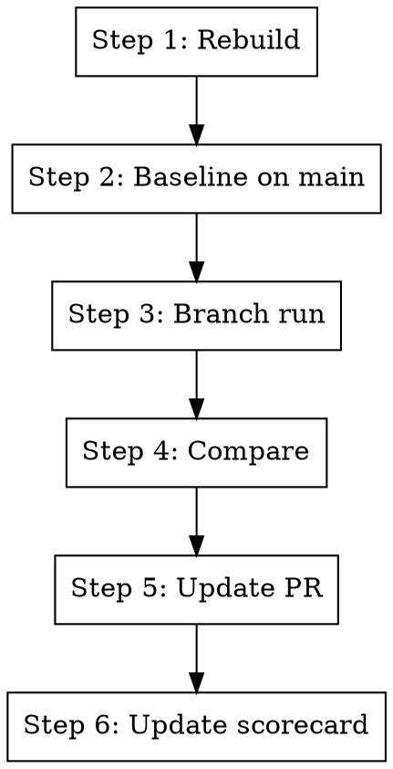

# Perf Eval — Env-Only

## Overview

Run a reproducible branch-vs-main env-only performance comparison using the canonical benchmarks, then update the PR and
scorecard. Two benchmark scripts cover all configs:

- **mettagrid** (`packages/mettagrid/benchmarks/perf/perf_benchmark.py`): `toy`, `arena`
- **cogames** (`packages/cogames/benchmarks/perf/perf_benchmark.py`): `cogsguard`

Both use the shared harness (`mettagrid.perf.harness`).

**Announce at start:** "Running env-only perf eval: rebuild, baseline on main, branch run, compare, and publish."

## The Process



## Step 1: Rebuild mettagrid

Ensure the C++ code is built from the current branch before any measurements.

```bash
uv sync --reinstall-package mettagrid
```

## Step 2: Baseline on main

Stash any uncommitted changes, check out main, rebuild, and run the benchmark.

```bash
BRANCH=$(git branch --show-current)
git stash
git checkout main
uv sync --reinstall-package mettagrid

# mettagrid configs (toy, arena)
uv run python packages/mettagrid/benchmarks/perf/perf_benchmark.py \
  --config <config> --profile --output /tmp/perf_baseline_<config>.json --phase main

# cogsguard (separate script, respects package boundary)
uv run python packages/cogames/benchmarks/perf/perf_benchmark.py \
  --profile --output /tmp/perf_baseline_cogsguard.json --phase main
```

Default config is `toy`. If the user specified a config, use it. For thorough evaluation, run all three configs (`toy`,
`arena`, `cogsguard`).

## Step 3: Branch run

Switch back to the branch, rebuild, and run the same benchmark with the same arguments.

```bash
git checkout "$BRANCH"
git stash pop
uv sync --reinstall-package mettagrid

# mettagrid configs
uv run python packages/mettagrid/benchmarks/perf/perf_benchmark.py \
  --config <config> --profile --output /tmp/perf_branch_<config>.json --phase branch \
  --baseline /tmp/perf_baseline_<config>.json

# cogsguard
uv run python packages/cogames/benchmarks/perf/perf_benchmark.py \
  --profile --output /tmp/perf_branch_cogsguard.json --phase branch \
  --baseline /tmp/perf_baseline_cogsguard.json
```

The `--baseline` flag prints a comparison at the end of the run.

## Step 4: Compare

Review the comparison output. Flag results based on the detection thresholds from the perf benchmarking spec
(`docs/specs/0027-perf-benchmarking.md`):

- **N=1, delta < 7%**: likely noise — note this in the PR
- **N=1, delta > 10%**: likely significant
- **Opposite signs across configs**: divergence — flag prominently

For claims near the noise floor, recommend running N>=3 (repeat Steps 2-3 multiple times).

## Step 5: Update PR

Add benchmark results to the PR description:

- Config, baseline commit, branch commit
- Agent SPS baseline vs branch, delta %
- Step timing breakdown (if `--profile` was used)
- Significance assessment

## Step 6: Update scorecard

```
/tr.perf-scorecard
```

Provide: PR number, config, baseline, runs, N, delta %, status, and notes.

## Quick Reference

| Task              | Command                                                                      |
| ----------------- | ---------------------------------------------------------------------------- |
| Toy (fast)        | `bash packages/mettagrid/benchmarks/perf/run.sh --config toy --profile`      |
| Arena (training)  | `bash packages/mettagrid/benchmarks/perf/run.sh --config arena --profile`    |
| CogsGuard (tourn) | `uv run python packages/cogames/benchmarks/perf/perf_benchmark.py --profile` |
| All configs       | Run each of the above in sequence                                            |
| Compare           | Add `--baseline results/baseline.json` to any run                            |

## Integration

**Uses:** `packages/mettagrid/benchmarks/perf/perf_benchmark.py`, `packages/cogames/benchmarks/perf/perf_benchmark.py`
**Pairs with:** `tr.perf-scorecard`, `tr.perf-eval`
