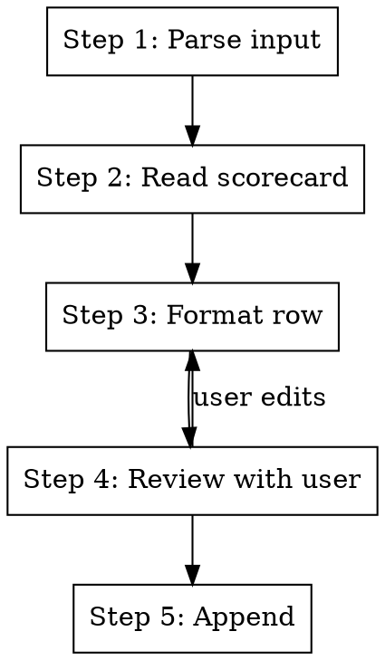

# Perf Scorecard

## Overview

Append benchmark results to the unified perf scorecard at `docs/perf/scorecard.md`, or review existing entries. The
scorecard tracks perf measurements across all three workload phases (env-only, training, tournament) in one place.

**Announce at start:** "Updating perf scorecard. I'll read the current scorecard and your results, then append a row."

## The Process



## Step 1: Parse input

Determine the input source:

- **JSON file path**: read structured benchmark output (see JSON schema below)
- **PR number**: look up the PR description for benchmark data, extract what's available
- **No args**: ask the user for phase, PR#, config, baseline, N, delta, and status

### JSON schema (benchmark script output)

```json
{
  "pr": "#1234",
  "phase": "training",
  "config": "1x4090, uv-run",
  "baseline": "main@abc1234",
  "n": 3,
  "delta_pct": "+2.35%",
  "status": "noise",
  "notes": "e2-10 mean"
}
```

Fields: `pr` (required), `phase` (required: `env-only`, `training`, or `tournament`), `config`, `baseline`, `n`,
`delta_pct`, `status` (`significant`, `noise`, `regression`, `not run`, `divergence`), `notes`.

## Step 2: Read current scorecard

```bash
cat docs/perf/scorecard.md
```

Identify which phase table to append to (Env-Only, Training, or Tournament).

## Step 3: Format row

Format the data as a markdown table row matching the phase table's columns.

**Training rows:**

```
| #1234 | 1x4090, uv-run | main@abc1234 | e2-10 | 3 | +2.35% | noise | description |
```

**Env-only rows:**

```
| #1234 | env-only (20a, 40x40) | main | 5x5K steps | 1 | +68% agent SPS | significant | description |
```

**Tournament rows:**

```
| #1234 | beta-cvc (8a, 10K steps) | CPU baseline | 1 | +5x inference | significant | description |
```

## Step 4: Review with user

Show the formatted row and ask for confirmation before appending. Flag if:

- N=1 and delta < 7% (likely noise for training; flag but don't block)
- Status is missing (suggest based on N and delta magnitude)
- Phase table doesn't exist yet in scorecard (offer to create it)

## Step 5: Append

Add the row to the correct phase table in `docs/perf/scorecard.md`. Do not modify existing rows.

If the scorecard file doesn't exist, create it from the template:

```markdown
# Perf Scorecard

Unified benchmark results across all workload phases. See
[0027-perf-benchmark-standardization](../specs/0027-perf-benchmark-standardization.md) for methodology.

## Env-Only

| PR  | Config | Baseline | Runs | N   | Delta % | Status | Notes |
| --- | ------ | -------- | ---- | --- | ------- | ------ | ----- |

## Training

| PR  | Config | Baseline | Epochs | N   | Delta % | Status | Notes |
| --- | ------ | -------- | ------ | --- | ------- | ------ | ----- |

## Tournament

| PR  | Config | Baseline | N   | Delta % | Status | Notes |
| --- | ------ | -------- | --- | ------- | ------ | ----- |
```

## Quick Reference

| Task              | Command                                             |
| ----------------- | --------------------------------------------------- |
| Add from JSON     | `/tr.perf-scorecard results.json`                   |
| Add from PR       | `/tr.perf-scorecard #7477`                          |
| Add interactively | `/tr.perf-scorecard`                                |
| Review history    | `/tr.perf-scorecard training` (shows training rows) |

## Integration

**Pairs with:** `tr.perf-eval` (produces the benchmark data this skill records)
