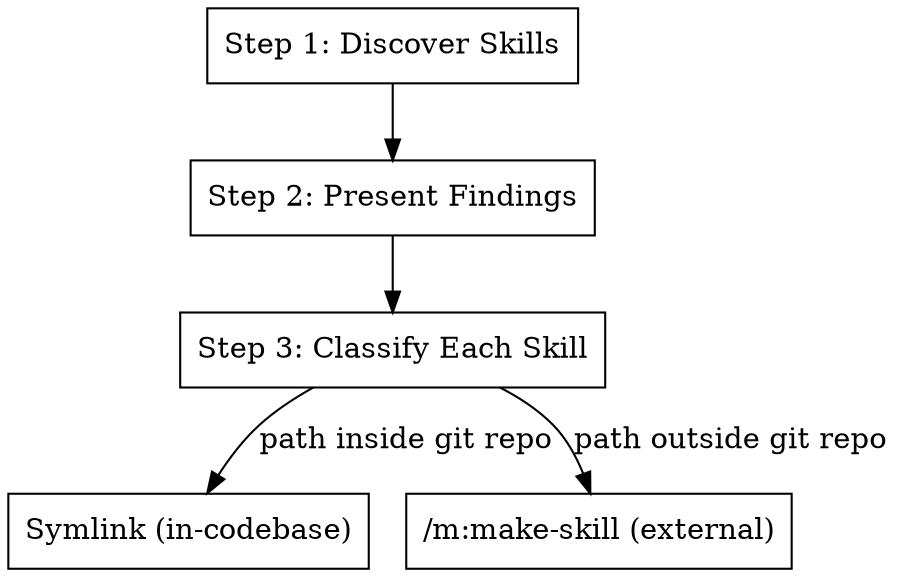

# Learn Skills

Discover skills at a given path and make them available to Claude Code and Cursor.

**Announce at start:** "Scanning `<path>` for skills to learn."

## The Process



## Step 1: Discover Skills

Search the given path for skill files. Look for these patterns:

```bash
TARGET_PATH="$1"

# Find SKILL.md files (directory-based skills)
find "$TARGET_PATH" -name "SKILL.md" -type f

# Find standalone .md files that look like skills (have frontmatter with name/description)
grep -rl "^---" "$TARGET_PATH" --include="*.md" | head -50
```

A valid skill has:

- A `SKILL.md` inside a named directory (e.g., `gt:fix-ci/SKILL.md`), OR
- A standalone `.md` file with YAML frontmatter containing `name:` and `description:`

For each candidate, read the frontmatter to extract name and description.

## Step 2: Present Findings

Show the user what was found:

```
## Skills found at <path>

| # | Name | Description | Type |
|---|------|-------------|------|
| 1 | gt:fix-ci | Fix CI failures... | directory |
| 2 | deploy | Deploy to prod... | standalone |

<N> skills found. Proceed with importing all, or specify which ones?
```

Wait for user confirmation before proceeding.

## Step 3: Classify and Import Each Skill

For each selected skill, determine if it's inside a git repository that the user works in:

```bash
SKILL_REAL_PATH=$(realpath "$SKILL_PATH")
SKILL_GIT_ROOT=$(git -C "$(dirname "$SKILL_REAL_PATH")" rev-parse --show-toplevel 2>/dev/null || echo "")
```

### Case A: In a git repo (symlinkable)

The skill source is version-controlled and can be symlinked directly.

```bash
SKILL_NAME="<name>"
SKILL_SOURCE="<path-to-skill-dir-or-file>"

# Claude Code symlink
CLAUDE_SKILLS="$HOME/.claude/skills"
mkdir -p "$CLAUDE_SKILLS"
rm -f "$CLAUDE_SKILLS/$SKILL_NAME"
ln -s "$SKILL_SOURCE" "$CLAUDE_SKILLS/$SKILL_NAME"

# Cursor: append to .cursor/rules/ in the skill's own repo
SKILL_GIT_ROOT=$(git -C "$(dirname "$SKILL_SOURCE")" rev-parse --show-toplevel)
CURSOR_RULES="$SKILL_GIT_ROOT/.cursor/rules"
mkdir -p "$CURSOR_RULES"
```

For Cursor, append an entry to `$CURSOR_RULES/learned_skills.mdc` (create if missing) with:

- Skill name as heading
- Description from frontmatter
- Path to skill file

### Case B: Outside a git repo or different machine (copy via /m:make-skill)

The skill can't be symlinked reliably. Instead, invoke `/m:make-skill` to recreate it:

1. Read the full content of the source skill
2. Invoke `/m:make-skill <name> "<description>"`
3. Pass the source skill's content as the basis for the new skill
4. Let `m:make-skill` handle placement, symlinking, and README updates

## Step 4: Report

After importing, summarize:

```
## Learned Skills

| Name | Method | Location |
|------|--------|----------|
| gt:fix-ci | symlink | ~/.claude/skills/gt:fix-ci → /path/to/source |
| deploy | copied | skills/deploy/SKILL.md |

<N> skills imported. Use /<name> to invoke them.
```

## Quick Reference

| Step     | Action                                                 |
| -------- | ------------------------------------------------------ |
| Discover | Find SKILL.md files and frontmatter .md files at path  |
| Present  | Show table of found skills, ask user to confirm        |
| Classify | Check if source is in a git repo                       |
| In-repo  | Symlink to ~/.claude/skills/ and update .cursor/rules/ |
| External | Use /m:make-skill to copy the skill over               |
| Report   | Show what was imported and how to use it               |

## Integration

**Uses:** `m:make-skill` (for copying external skills) **Called by:** User directly when discovering new skills **Pairs
with:** `scripts/skills-sync.sh` (bulk symlink of in-repo skills)
